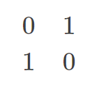
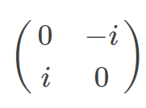
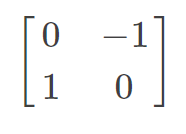
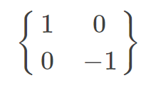
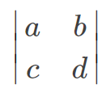
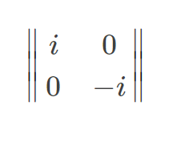

# 使用matrix环境

 

\begin{matrix} 0 & 1 \\ 1 & 0 \end{matrix} 

\begin{pmatrix} 0 & -i \\ i & 0 \end{pmatrix} 

\begin{bmatrix} 0 & -1 \\ 1 & 0 \end{bmatrix}

\begin{Bmatrix} 1 & 0 \\ 0 & -1 \end{Bmatrix}

\begin{vmatrix} a & b \\ c & d \end{vmatrix}

\begin{Vmatrix} i & 0 \\ 0 & -i \end{Vmatrix} 

 

# 使用array环境

 

\left( %左括号 

\begin{array}{ccc} %该矩阵一共3列，每一列都居中放置 

a11 & a12 & a13\\ %第一行元素

a21 & a22 & a23\\ %第二行元素

\end{array} 

\right) %右括号