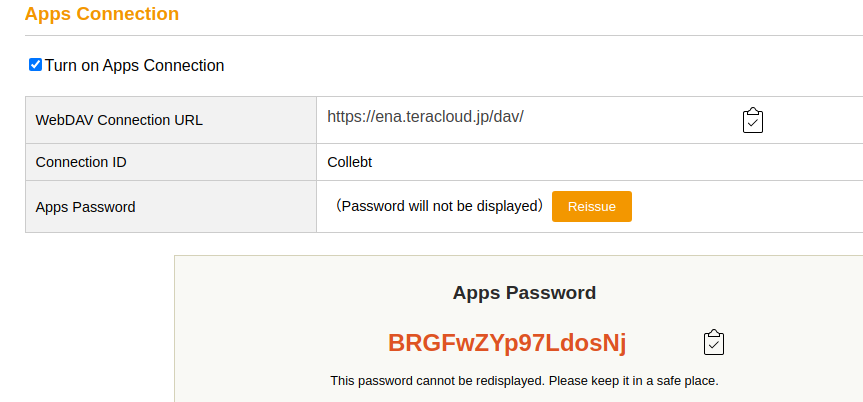

# 基础设施

## 基础设施的搭建

### 硬件设施

- 笔记本：双系统，win10+ubuntu18
- 台式电脑：双系统，win10+ubuntu18
    - 局域网IP：90.0.0.21
    - 校园网IP：202.114.107.125：9990
- 服务器microsoft：ubuntu18
    - 局域网IP：90.0.0.245
    - 校园网IP：202.114.107.125：6671

### 操作系统

#### window10

- 用于office的操作

#### Ubuntu

用于编写代码

- 优点：自定义程度高，灵活性强，可以指定美观的桌面；兼容深度学习和软件开发的各种软件
- 缺点：操作难度较高，安装软件有限制，不支持office系列

### 笔记

#### markdown 

- ==目前专用的笔记文件==，支持全局搜索，公式和代码显示好看。

#### overleaf

Latex在线编译器

- 优点：在线，多人编辑，可用于数模比赛或者合作写论文
- 缺点：有时候网络会断线，自动补全不好，有些库欠缺

#### onenote

microsoft的同步笔记本，目前准备把笔记迁移到markdown中

- 优点：office自动同步，自由度高，可画图
- 缺点：只能在win系统中使用，linux中由于云盘关系无法同步，公式难看，笔记本无法用其他软件打开。


### 编写代码

#### VS code

主要使用的编译器，可以编辑python，cpp，markdown，latex

- 远程使用

#### MATLAB

- 使用MobaXterm远程连接服务器，可以使用远程ui界面。不需要在本机安装matlab也行。

    

####  jupyter noetbook

用于进行轻量级和远程的调试和代码记录，==目前很少用==，不适合高度集成化的应用。

- 远程使用 
    - 局域网(90.0.0.21)
    - 使用校园网(映射到校园网： 202.114.107.124:9989-9990)
    - 公网
        1. 花生壳映射一年100元（xxx）
        2. 使用easyconnect到校园网中（202.114.107.125：9990）==免费==
- 连接内核
- 熟悉使用

---

#### GitHub的版本控制

**个人主页**

**技术记录博客**

- 技术笔记：markdown+坚果云（OneNote的笔记都迁移过来了）
- 论文笔记：markdown+坚果云 


---

### 数据管理

目前所有数据和软件都进行了云端和远程设置，保证数据多处备份和管理。

#### 论文管理

- Zotero+坚果云同步，管理文档√

- 手动保存的论文pdf :[2020,CVPR]xxxxx.pdf√

- teracloud 20GB: URL: https://ena.teracloud.jp/dav/, id: Collebt,  password: BRGFwZYp97LdosNj

- 启动命令

- ```
  rclone mount teracloud: o: --cache-dir D:\Temp --allow-other --vfs-cache-mode writes --allow-non-empty
  
  # --cache-dir D:\Temp 用于在上传之前暂存的地方
  ```

  

- 

#### 笔记管理

- 坚果云：PDF文件，代码，（出现流量不够的情况）
- Overleaf：LaTex文件
- OneNote：笔记（弃用）

#### 代码管理

- vscode sftp插件即时同步数据

- 百度云：保存数据库和大文件

- Github 维护代码

    

    其他：OneDrive，GoolgeDrive

**本地存档**

- 短期内的文件

---

## 算法框架的准备

pytorch环境搭建 √

DataLoader：用来对输入数据有个规范的输入py文件 √

写一份网络搭建的代码规范

评估指标

整理自己的数据库

- 收集数据 √(Pacscl,     willow)
- 记录数据的路径
