# 实验室设备使用指南

[TOC]


# 实验室WIFI

实验室wifi名称：`Redmi_D5FE`

密码：`spluav203`

路由器管理页面： http://192.168.31.1

路由器对应校园网ip地址：`115.156.95.129`


# 打印机

## 打印机网络信息

- 打印机名称：NPIA8AAFF (HP LaserJet Pro MFP **M226dw**)
- 打印机内网ip：`90.0.0.77`
- 打印机内网远程管理地址：在网页输入http://90.0.0.77

## 远程连接打印机

### Windows连接打印机

1. 打开“设置”—“设备”—“打印机和扫描仪”—“添加打印机或扫描仪”， 点击NPIA8AAFF (HP LaserJet Pro MFP **M226dw**)的打印机（步骤1、2）
2. 如果搜索不到设备，点击“我需要的打印机不在列表中”（步骤3）-“使用TCP/IP地址或主机名添加打印机”（步骤4、5）-输入IP地址和端口号（步骤6）。

​				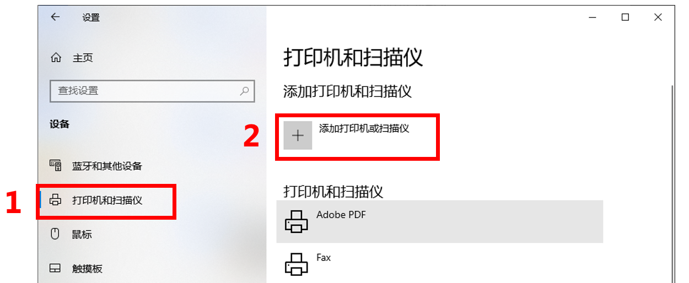	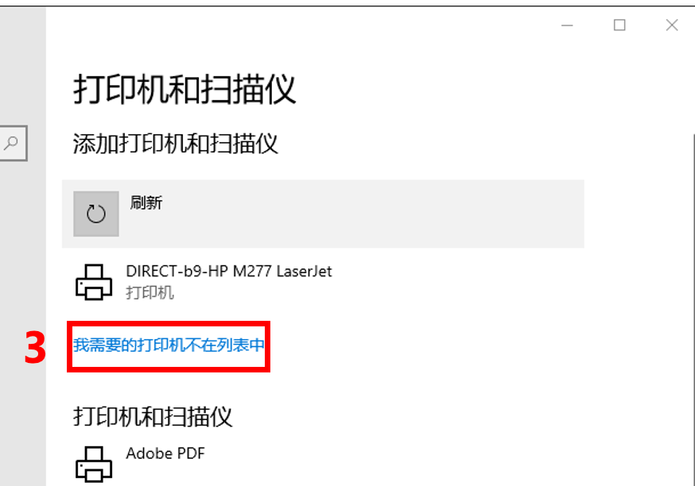
​          
​					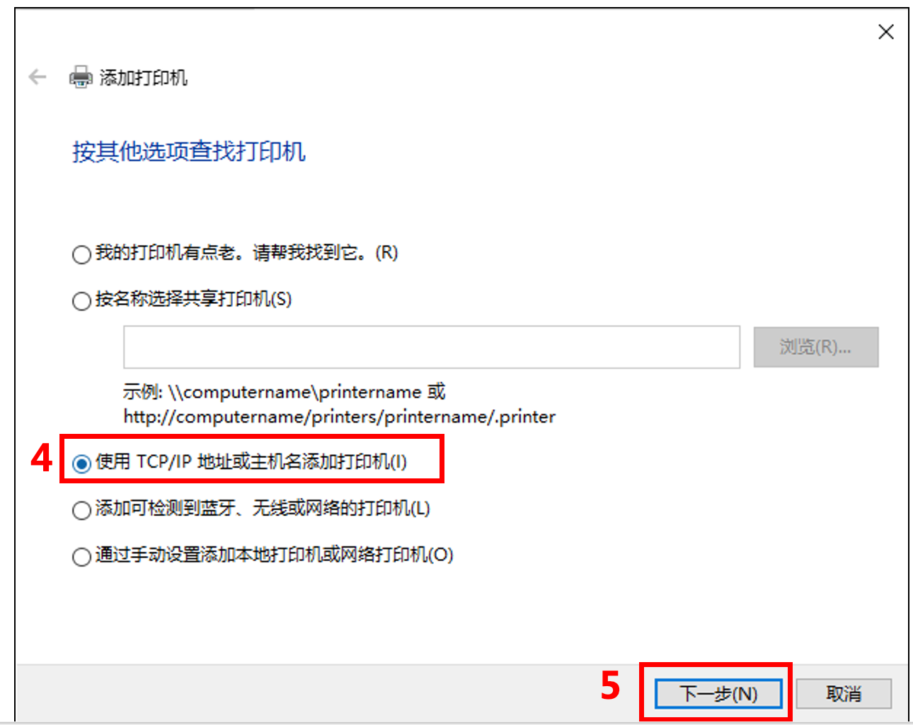     	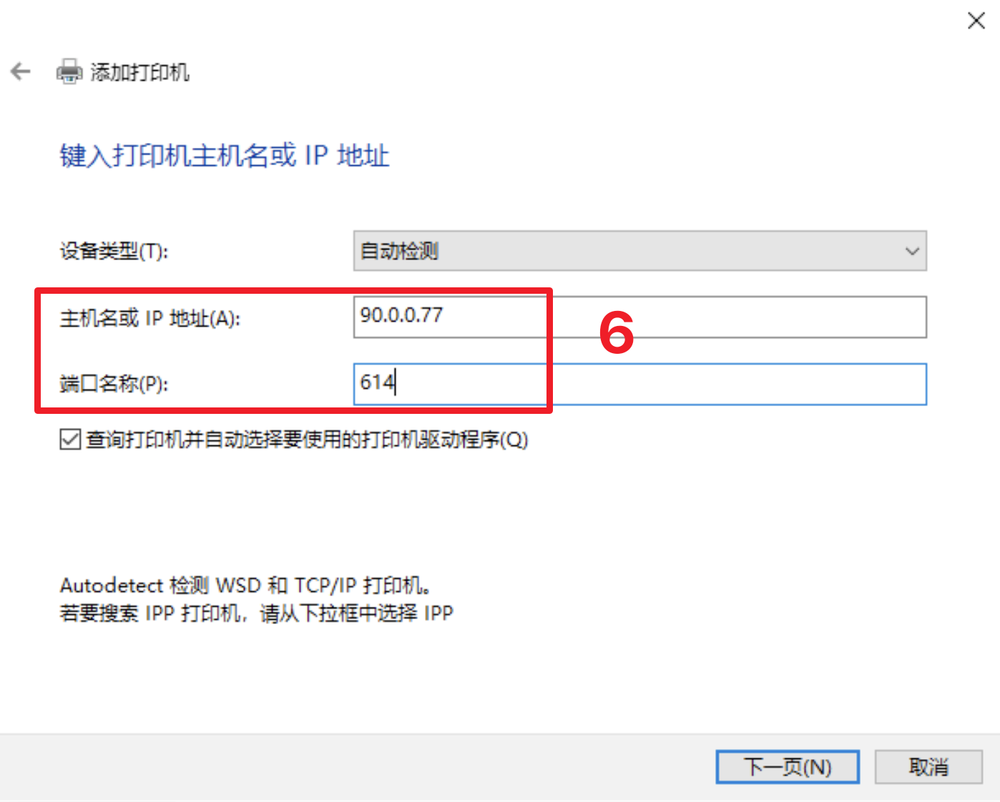   

---

### Ubuntu连接打印机

1. 打开Settings-Printers-Add...（步骤1、2）， 输入打印机ip地址（步骤3），选中实验室打印机（步骤4）。

​							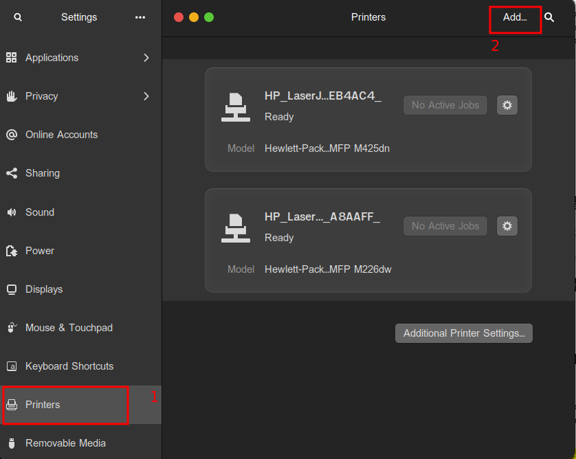    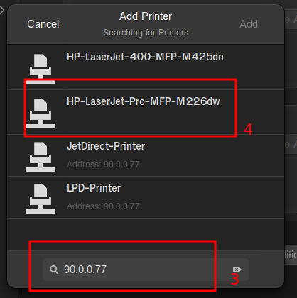

---

### Mac连接打印机

1. 打开设置-“Printers & Scanners”（步骤1），添加打印机（步骤2），输入ip地址并确认（步骤3、4）。
    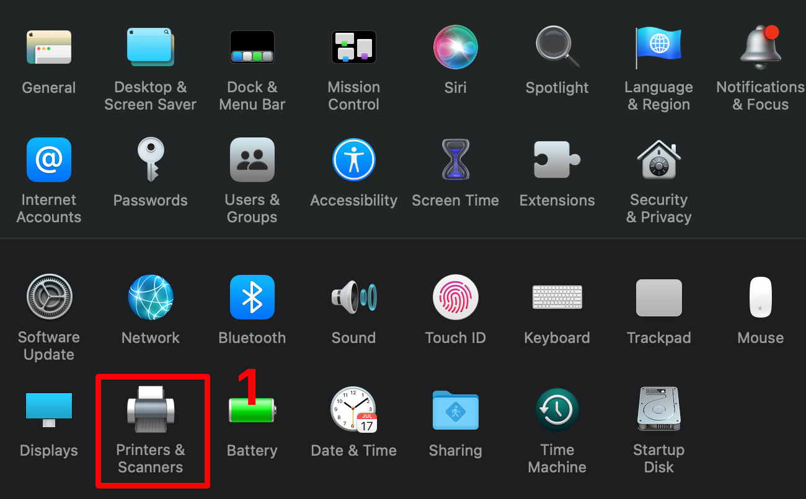    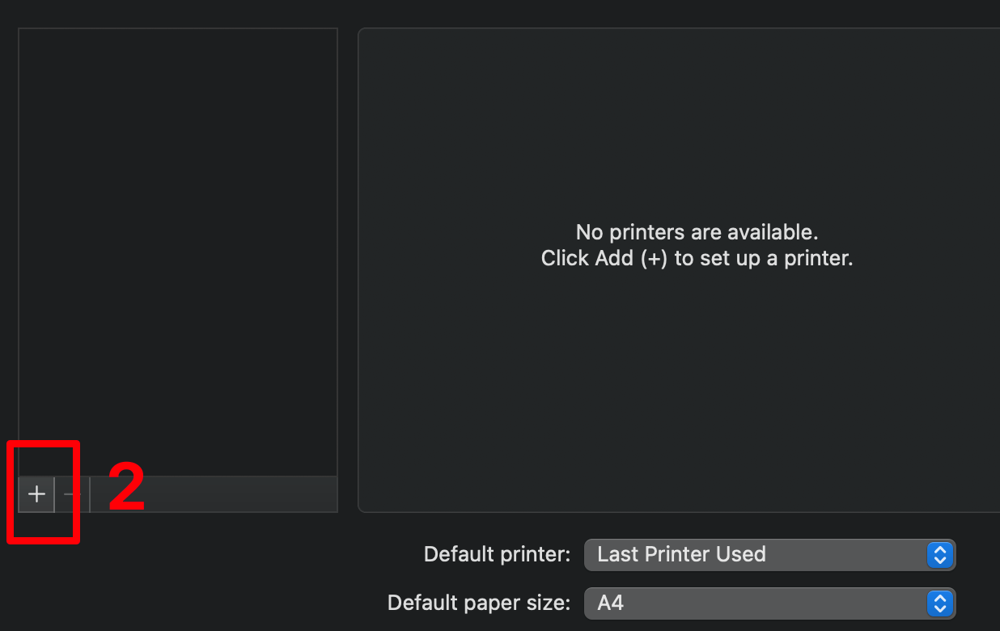    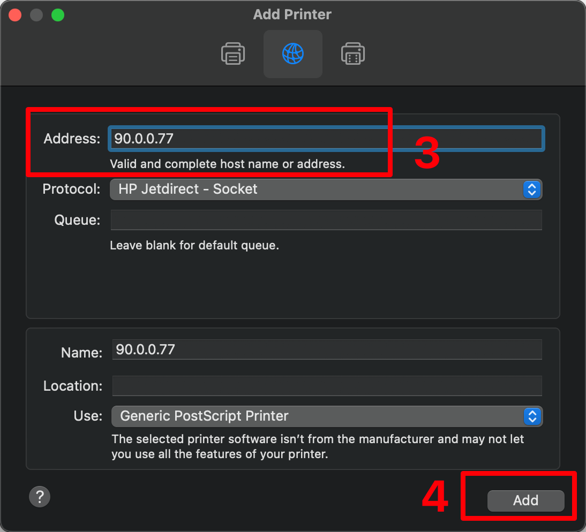       

## 打印机其他操作——（扫描/复印/添加碳粉）

- 扫描
  1. 要扫描的面朝下放在打印机上；
  2. 准备一个U盘，实验室的打印机只支持`FAT32` 格式的，把U盘插在打印机上，选择扫描到U盘，扫描结果在U盘的`HPSCANS`文件夹里。

	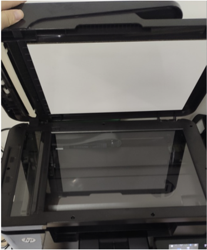    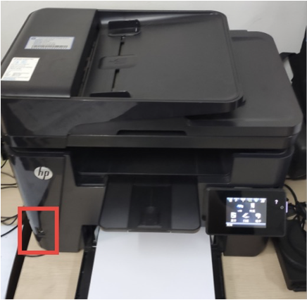   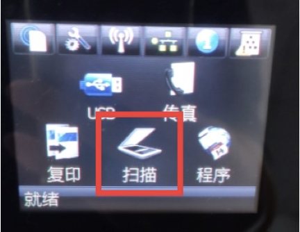
	
- 复印
   1. 把纸张有字的一面朝下，放在打印机上，**纸张的左上角对准打印机的左上角**，选择复印，开始复印即可
   2. 需要复印双面的话，把第一次复印好的纸张，打印好的那面正着朝上，放到打印纸上面，在重复上一步就可以复印在另一面上。

	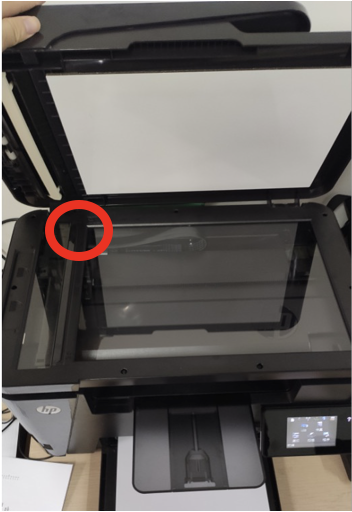   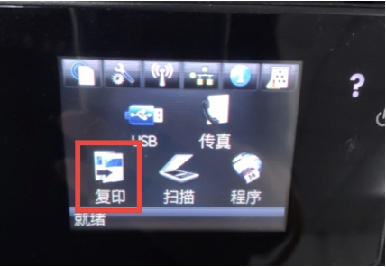

- 打印机添加碳粉

  1. 打印机的一直显示墨粉不足，这个不用管。

  2. 当打印出来的东西有的地方颜色很浅的时候，说明打印机碳粉不足需要加碳粉，如下图操作。

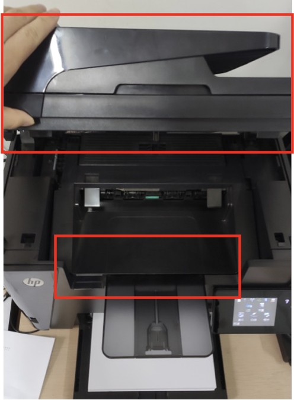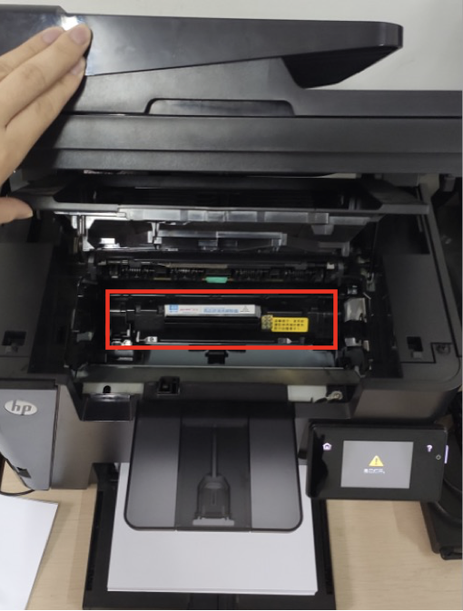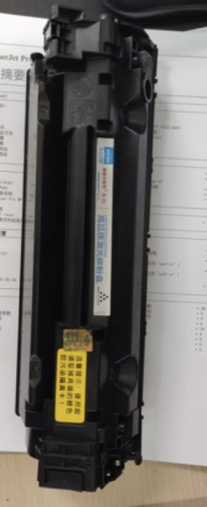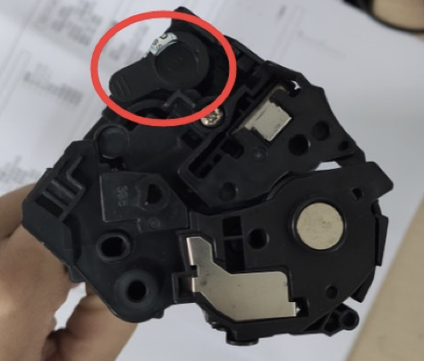 


# 开会相关

## 借会议室

主要使用501会议室（备用会议室：701），需要提前三天借会议室到五楼党政办公室516接会议室。


## 投影仪和组会电脑

每次组会需要用到投影仪和电脑，投影仪，作报告的人要提前15分钟过来布置设备。电脑和投影仪用书包装着放在前面柜子第二层（图一）。

- 组会电脑
	1. 开机密码：`spl203`
	2. 要提前开机，电脑有时候开机会更新系统
	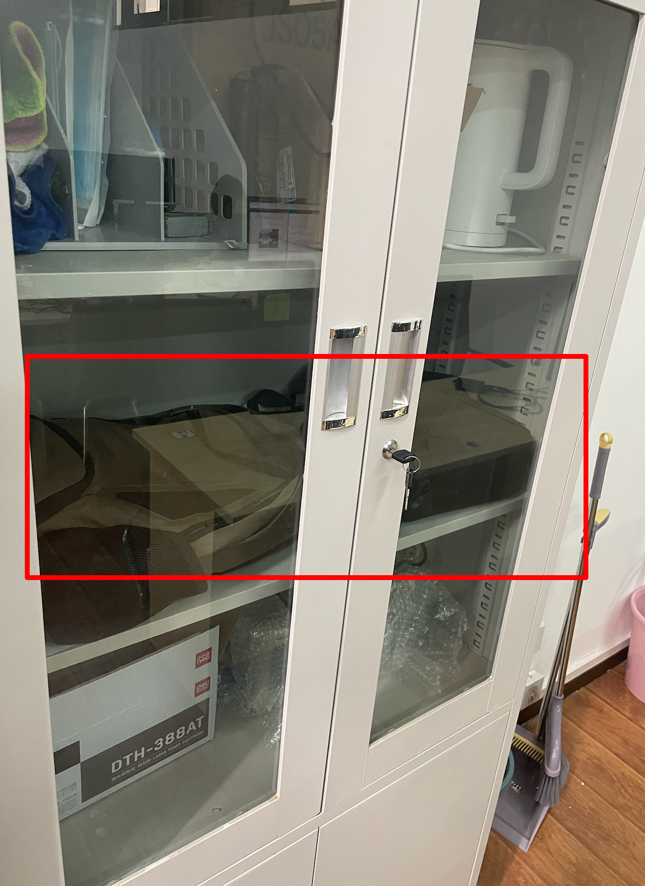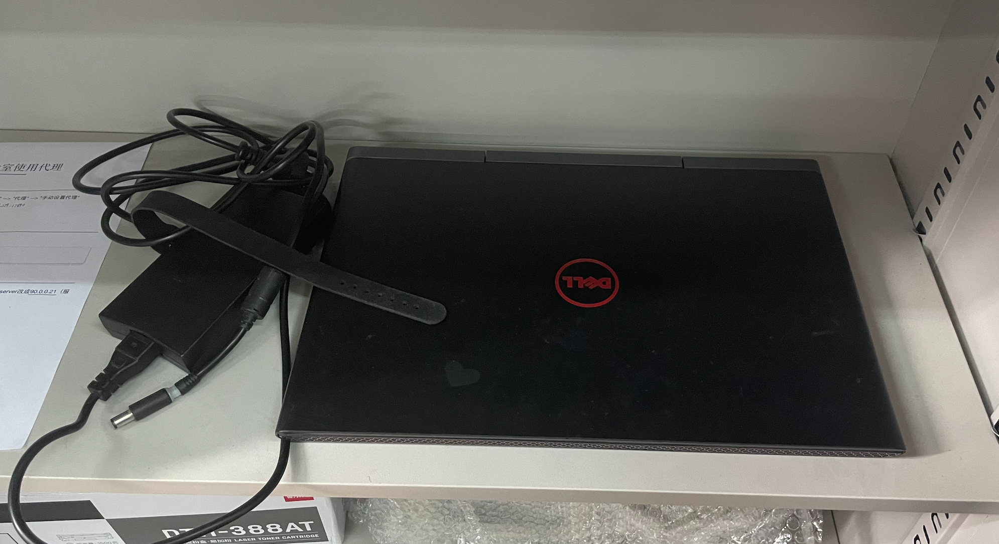
---

- 投影仪

  1. 接电源线和HDMI线；

  2. 打开灯口罩子（步骤1），开机（步骤2），根据投影情况调整投影形变；
  3. 前方支架调节投影高度（右图）。
  
  	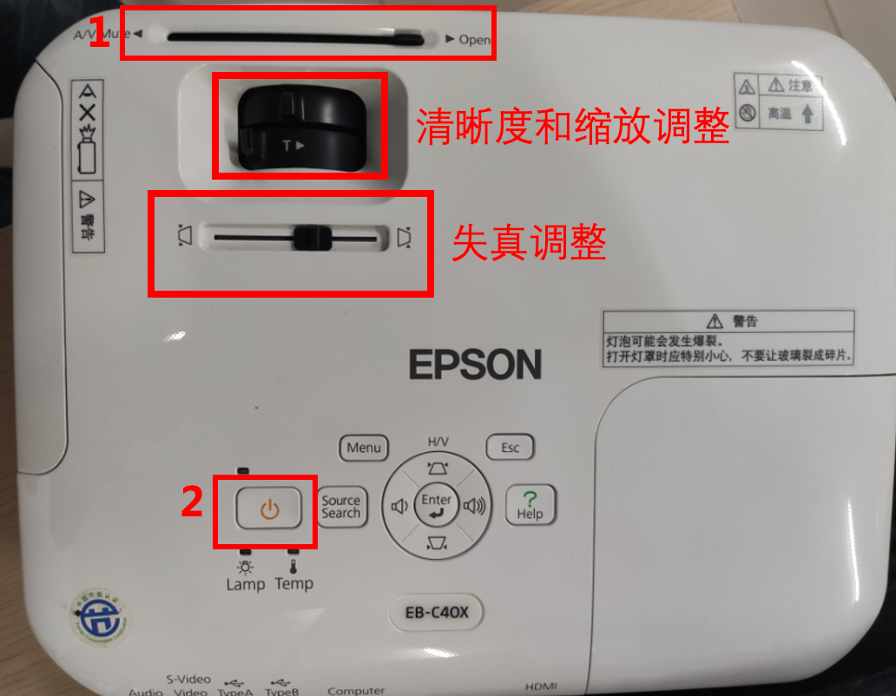  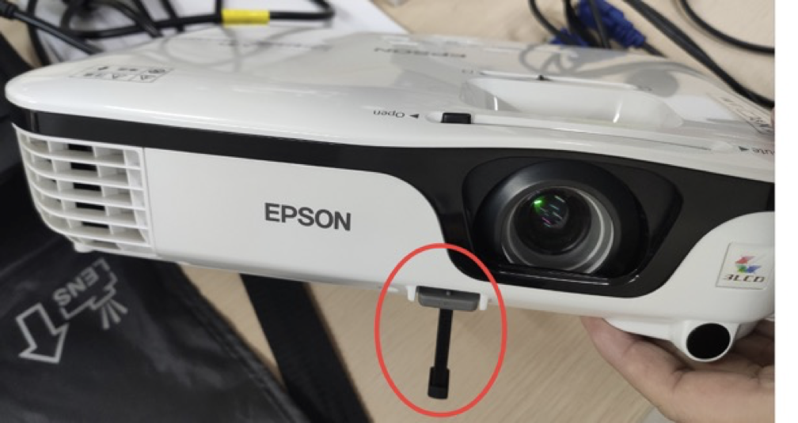


# 服务器

## 服务器地址

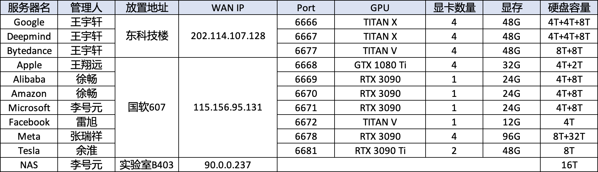

## 服务器远程常用命令
- **ssh连接**

	```bash
	ssh <USERNAME>@<IP> -p <PORT>  # 例：ssh meta@115.156.05.131 -p 6678
  ```
	
- **sftp文件访问**：在ubuntu文件夹标签栏的下方点击`Connect to Server`
  
  ```bash
  sftp://<USERNAME>@<IP>:PORT/PATH 
  #例： sftp://zrx@202.114.107.128:6666/home/zrx
  ```
  
- **Scp文件传输**：scp之前要删除拷贝文件中的软链接，否则会连着链接的数据一起复制。

  ```bash
  scp -P 1234 user@remote.host:/remote/file ./local/path  #远程 -> 本地
  scp -P 1234 /path/to/file user@remote.host:/remote/file #本地 -> 远程
  scp -r /path/to/file user@remote.host:/remote/file #传输文件夹加上 -r
  ```

- **查看显卡**使用情况：需要`pip install gpustat`安装gpustat.

  ```bash
  gpustat -ui
  ```

- 管理员**添加普通用户**

  ```bash
  sudo adduser <USERNAME>
  ```


## 服务器数据管理

1. **数据**和**模型**文件都放在 `/data` 下面（注意是**根目录**下的`/data`）。 `Google`、`Deepmind`放在`/data2` 下面，大家及时清理不用的文件，尤其是跑出来的**大量的模型参数**！

2. 创建**自己的文件夹**，把数据以及一些模型文件放在自己的路径下。原始的数据集、或者整合的数据集，放一份到NAS上。
3. 创建data的快捷方式：`ln -s /data/yourdata/file path/to/symlink`，例如：` ln -s /data/dota /home/zrx/data/dota`


## 注意事项

- Don’t use **sudo apt-get upgrade** at any time！
- Don’t touch **/etc/profile** ！
- Don’t give normal user **sudo** authority


## NAS访问 

NAS 的登录名为 `VIPG` ，密码是 `spl207` ，有以下几种访问方式，外网仅仅只能通过浏览器访问，内网可 以通过 IP 地址访问。

- 浏览器中访问
		内网: 在浏览器中输入 `90.0.0.237:5000`
		外网: 在浏览器中输入 http://QuickConnect.to/SPL-VIPG-NAS 

- Windows 系统资源管理器访问
		在资源管理器中输入 `\\DISKSTATION` 或者` \\90.0.0.237 `
	
- Ubuntu 系统资源管理器访问
		在 Ubuntu 系统资源管理器的 Connect to Server 中，输入` smb://90.0.0.237 `
	
- 手机访问
		下载 DS file APP， QuickConnect ID 输入 `SPL-VIPG-NAS` ，用户名和密码同上

### **NAS注意事项**

- 所有文件均存放在 `home` 目录下，请不要在 `homes` 目录下存放文件。 
- 如果想上传文件，请做好文件分类，并对文件进行有意义的命名，对不明来源和类别的文件，管理员会定期清理。
- NAS 用于存放与课题组相关的公用文件，请不要长期存放任何私人文件，如果想临时存放私人文件，请在 `home\private` 目录下创建以自己名字命名的文件夹，但请不要长期存储私人文件。 
- `VIPG` 用户具有文件删除权限，请不要随意删除 NAS 上的任何文件。
- NAS 的硬盘不支持热插拔，请不要尝试在 NAS 开机的情况下插拔 NAS 上的硬盘。
- NAS 使用 UPS 供电，以防在突然停电的情况下损伤硬盘，请不要更换 NAS 供电电源。
- NAS 硬盘为机械硬盘，请不要在 NAS 通电的情况下移动、敲击 NAS。
- NAS 上有 USB 3.0 的接口，如果嫌弃网络传输速度太慢，可以使用 USB 拷贝，在浏览器界面中操作。


### **目录结构**

- data: 存放数据集，尽量以数据集的名字命名文件夹
- Drive: 系统自带文件夹，不使用
- images: 存放课题组相关图片，例如项目、竞赛等，请不要放数据
- papers: 存放主流会议和期刊论文集，请按照`会议名/年份` 的目录结构存放，例如 `CVPR/CVPR2018` 
- private: 存放临时私人文件
- software: 存放软件，包括 Windows Ubuntu等软件，请做好分类，Windows 和 Ubuntu 软件分开
- videos: 存放视频，请不要放数据


# VPN

## VPN的IP地址

- 内网ip地址：`90.0.0.179:7890`
- 外网ip地址：`115.156.95.129:17890`

## 实验室电脑设置代理

### Windows系统使用代理

- <kbd>WIN</kbd>+<kbd>I</kbd>打开**设置**, 选择"网络和Internet" --> "代理" --> "手动设置代理"。外网电脑则将对应ip地址改为外网地址`115.156.95.129:17890`。

- 输入地址: `90.0.0.179`

- 端口: `7890`

---

### Ubuntu系统使用代理

命令行配置代理（使用内网地址），外网电脑则将对应ip地址改为外网地址`115.156.95.129:17890`。

```
export http_proxy="http://90.0.0.179:7890"
export https_proxy="http://90.0.0.179:7890"
```
---


### MAC系统使用代理

打开`设置`-`wifi`-`高级`，如图所示，将打勾的选项中的web proxy server改成`90.0.0.179:7890`（服务器内网地址，外网电脑则将对应ip地址改为外网地址`115.156.95.129:17890`）。

 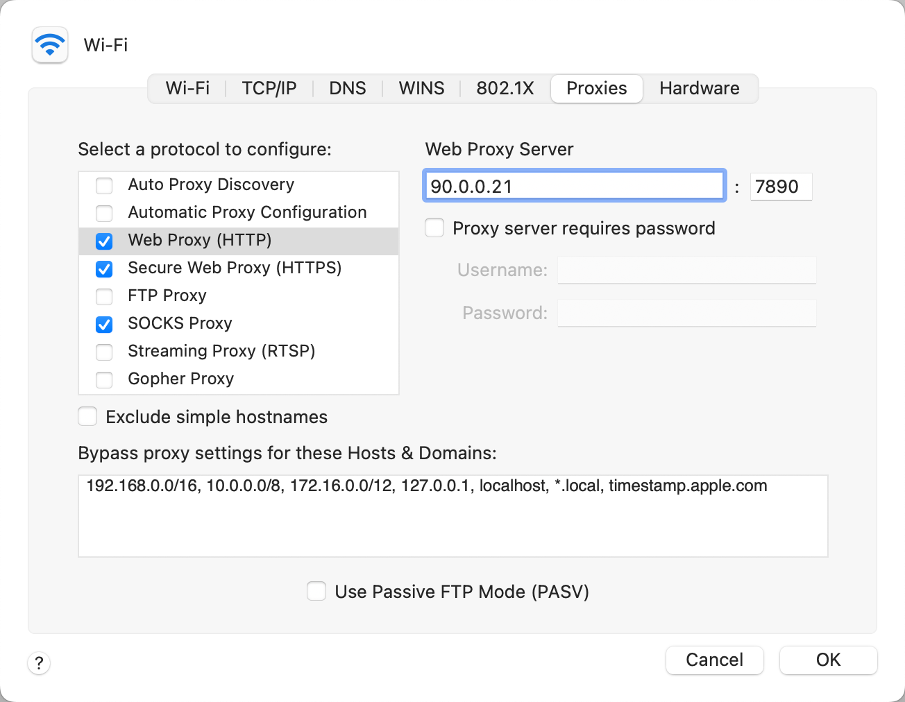


## **注意事项**

- 在系统使用的代理为全局代理，使用该代理可能会无法访问一些国内镜像源以及内网服务器，出现这种情况需要手动关闭代理。

- 服务器远程管理VPN：

  1. 需要在服务器下载远程交互的页面

  ```
  git clone -b gh-pages --depth 1 https://github.com/Dreamacro/clash-dashboard /home/wh/.config/clash/dashboard #/home/xxx/.config/clash是放置clash的配置文件位置
  ```

  2. 修改配置文件`/home/wh/.config/clash/config.yaml`，并重启clash

  ```
  # 在配置文件中修改或增加以下内容；
  external-controller: 0.0.0.0:9090 # 修改ip地址和端口；
  external-ui: /home/wh/.config/clash/dashboard # clash-dashboard的路径；
  ```

  3. 输入http://90.0.0.21:9090/ui/#/proxies进入远程控制界面（需要关闭系统代理）。其中`90.0.0.21`代替成挂vpn的电脑的内网IP地址。

