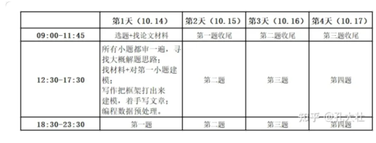
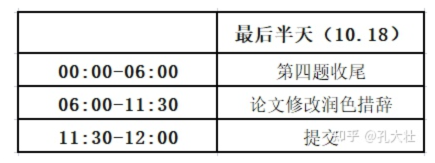

# 2022 数模准备

## 大体分工

论文：曾岚馨

代码：李号元

建模：潘一达


## 时间安排

10-6: 分析选题，调研论文，在中午前确定选题；下午主要搜集论文，代码做初步数据处理。

10-7: 论文部分**写相关工作**，代码和建模确定**初步的数学模型**，代码完成**模型的简单实现**。

10-8: 论文写主要**算法流程**，建模**提升模型细节**，代码完成**后续题目和优化代码**。

10-9: 论文检查和修改，**摘要和总结**， 建模**检查论文算法思路**， 代码**出实验结果和图表**。

10-10上午: **检查论文**，**提交代码（附录）**，检查最后提交文件。


往年比赛进度参考：



## 数模题目类型

数据统计预测类：遗传算法、随机森林、网络训练

物理建模类：难度在于现实模型的构建，如热传导、神经传导、电磁波传导模型建模

整数规划类：切料、航班排班

优化类： 能量最小、多目标优化、梯度更新、FW迭代。


## 论文搜索

曾岚馨： 数据集+论坛（官方消息）

李号元-潘一达： 中外论文，学位论文（中文+相关工作）、会议论文（深入方法）

数据汇总：

​	github往年资料：https://github.com/zhanwen/MathModel

​	官方答疑论坛：https://www.shumo.com/home/html/4498.html#more-4498

## 前期准备

编程可视化：PCA、tsne

优秀论文的代码复现和收集

d、e、f三道2021优秀论文的学习

编程环境：numpy 、 pandas、 matplotlib、scipy、shutil、pytorch

##  常用模版

### 论文模版latex

如果线上的overleaf经常断线，可以考虑用实验室内网overleaf  http://90.0.0.21:8888/2356164594bsykdqqvzxvw（需要关闭代理）

内网登陆账号： zlx@spl.com, pyd@spl.com , 密码都是空格


### 数据格式读取模版

主要思路是将数据转换成numpy格式的矩阵（或者torch）

- mat： 先用matlab读取mat文件输出txt，再用python读取矩阵

  ```matlab
  load('test.mat') #get mat
  [M, N] = size(mat)
  file = fopen( 'output.txt', 'wt' );
  for i =1:M
      lines = mat(:,i);
      for j = 1: N #逐个元素读取
          fprintf(file, '%f\t', lines(j));
      end
      fprintf(file, '\n');
  end
  ```


- 将txt转换成numpy

  ```
  with open(dirName + '/Encodings' + str(i) + '.txt', 'r') as f:
                      f.read(str(self.Encodings[i]))
                      f.close()              
  ```

  ```
  def print_pos(sch, name): #输出txt
      with open(name+'.txt', 'w') as f:
          for path in sch:
              n = path.num + 1
              for x, y in zip(path.x, path.y):
                  f.write(f'x{n} {x}  y{n}  {y}')
              f.write('\n')
  ```

- csv：用pandas读取矩阵,https://pythonbasics.org/read-csv-with-pandas/

  ```
  df = pd.read_csv('sample.csv', index_col=0)
  #    11  12  13  14
  # 0  21  22  23  24
  # 1  31  32  33  34
  ```

- xlsx：用pandas读取转换成numpy矩阵

  ```
  df = pd.read_excel(file_name, thousands=",",  index_col=None)
  A = df.to_numpy()
  ```

  ```
  def read_data_from_xlsx(path: str, rows_v: list, rows_e: list):
      df1 = pd.read_excel(path, sheet_name='Sheet1' ,engine='openpyxl')
      df2 = pd.read_excel(path, sheet_name='Sheet2' ,engine='openpyxl')
      #  读取多行数据（这里是第1行和第2行）
      data_v = df1.loc[rows_v[0]:rows_v[1]].values
      data_e = df2.loc[rows_e[0]:rows_e[1]].values
  ```

- 输出data到excel：

  ```
  def write_data_to_xlsx(src_path:str, tgt_path:str, y, q):
    df1 = pd.read_excel(src_path, sheet_name='Sheet1' ,engine='openpyxl')
    df2 = pd.read_excel(src_path, sheet_name='Sheet2' ,engine='openpyxl')
    x = df2.copy()
    for idx,item in enumerate(y):
      if item != 0:
        x['const'][(x['idx'] == idx) & (x['type'] == item)] = q
    writer = pd.ExcelWriter(tgt_path,engine='openpyxl')
    df1.to_excel(excel_writer=writer, sheet_name='Sheet1', encoding="utf-8", index=False)
    x.to_excel(excel_writer=writer, sheet_name='Sheet2', encoding="utf-8", index=False)
    # pd.DataFrame(df1).to_excel(tgt_path, sheet_name='Sheet1', index=False, header=True) #numpy to df 
    # pd.DataFrame(x).to_excel(tgt_path, sheet_name='Sheet2', index=False, header=True) #numpy to df 
    writer.save()
    writer.close()
  ```


### 算法模版

-  遗传算法：geatpy

- 求根法（牛顿matlab）：

  ```
  function x0 = fpiroot(f, x0)
      i = 0;
      eps = 1e-5;
      err = 1;
      err_abs = 1;
      fprintf('iteration, xi, Approximate Relative Error, Approximate Absolute Error\n')
      while(abs(err)>eps)
          fprintf('%d,\t %.3f,\t  %.3f,\t  %.3f\n', i, x0, err, err_abs)
          x_new = feval(f, x0)  ;
          i = i + 1;
          err_abs = abs(x_new - x0);
          err = (x_new - x0) / x_new;
          x0 = x_new;
      end
  end
  ```

- 求解微分方程（Runge_kutta，Euler） ：

  ```
  import numpy as np
  import matplotlib.pyplot as plt
  
  def Euler(fname, fnums, x0, y0, delta, iters):
      #initial
      x = x0 
      y = y0 
  
      x_rcd = np.zeros((iters,1)) 
      y_rcd = np.zeros((iters, fnums)) 
  
      for i in range(iters):
          #record output
          x_rcd[i] = x 
          y_rcd[i,:]= y 
          #iteration
          dy = feval(fname, x, y) 
          #update 
          y = y - delta * dy 
          x = x + delta 
      return x_rcd, y_rcd
  
  def Runge_kutta(fname, fnums, x0, y0, delta, iters):
      #initial
      x = x0
      y = y0
  
      x_rcd = np.zeros((iters,1)) 
      y_rcd = np.zeros((iters, fnums)) 
  
      for i in range(iters):
          #record
          x_rcd[i] = x 
          y_rcd[i,:] = y 
  
          #iteration
          dy1 = delta * feval(fname, x, y) 
          dy2 = delta * feval(fname, x+delta/2, y+dy1/2) 
          dy3 = delta * feval(fname, x+delta/2, y+dy2/2) 
          dy4 = delta * feval(fname, x+delta, y+dy3) 
  
          #update
          y = y - (dy1 + 2*dy2 + 2*dy3+ dy4)/6 
          x = x + delta 
      return x_rcd, y_rcd
	'''
  
  def feval(funcName, *args):
    '''
    This function is similar to "feval" in Matlab.
    Example: feval('cos', pi) = -1.
    '''
    return eval(funcName)(*args)
  
  def func(x, y, k=1, N=1):
      dy = k * y * (N -y)
      return dy
  
  if __name__ == '__main__':
      fname = 'func'
      fnums = 1
      x0=1
      y0=1/(1-np.exp(x0))
      delta=1e-1
      iters=10
      x_rcd1, y_rcd_R = Runge_kutta(fname, fnums, x0, y0, delta, iters)
      x_rcd2, y_rcd_E = Euler(fname, fnums, x0, y0, delta, iters)
      x_rcd = np.linspace(np.min(x_rcd1),np.max(x_rcd1),x_rcd1.size)
      y_ana = 1/(1-np.exp(x_rcd))
      plt.plot(x_rcd,y_ana)
      plt.plot(x_rcd1,y_rcd_R)
      plt.plot(x_rcd2,y_rcd_E)
      plt.legend(['analogy','Runge_kutta','Euler'])
      plt.savefig('Runge_kutta')
      plt.close()
  
  ```


- 信号调制解调+绘图

  ```
  % config
  fre = 6e6; %频率间隔为6MHz
  n = 1e6;  %仿真点数

  F0 = 500* 1e3;
  Fs = 500 *1e3; %滤波器采样频率
  F1 = 2310 * 1e3;
  F2 = 3750 ;
  F3 = 4960;

  fpass = 100e3; %滤波器截止频率
  t = 0:1/fre:(n-1)/fre;

  %% 复合信号生成
  mt = cos(2*pi*F1*t) + 1.8 * cos(2*pi*F2*t) + 0.9*cos(2*pi*F3*t);
  ym = fft(mt); %fft傅立叶变换
  ym = fftshift(ym); %频域平移
  fshift = (0:n/2-1)*(fre/n); %x轴取正频率

  %画图
  figure
  set(0,'defaultfigurecolor','w')
  subplot(2,1,1)
  plot(t, mt)
  title('复合型号m(t)时域波形')
  xlabel('time/s')
  subplot(2,1,2)
  semilogx(fshift,abs(ym(n/2+1:end)))
  title('复合型号m(t)频谱图')
  xlabel('f/Hz')

  %% 调制
  xt = mt .* cos(2*pi*F0*t);
  yx = fft(xt); %fft
  yx = fftshift(yx); %shift

  %画图
  figure
  subplot(2,1,1)
  plot(t, xt)
  title('调制信号x(t)时域波形')
  xlabel('time/s')
  subplot(2,1,2)
  semilogx(fshift,abs(yx(n/2+1:end)))
  title('调制信号x(t)频谱图')
  xlabel('f/Hz')

  %% 解调
  dt = xt .* cos(2*pi*F0*t); %解调
  output =lowpass(dt,fpass,Fs);  %低通滤波
  youtput = fft(output); %fft
  youtput = fftshift(youtput); %shift

  %画图
  figure
  subplot(2,1,1)
  plot(t, output)
  title('调解调号y(t)时域波形')
  subplot(2,1,2)
  semilogx(fshift,abs(youtput(n/2+1:end)))
  title('调解调号y(t)频谱图')
  xlabel('f/Hz')

  ```

- 涡流函数

  ```
  clear;
  %上下边界条件
  T_H = 0.5;
  T_C = -0.5;
  
  %% 参数设置
  Pr=0.71;  
  Ra = 1e4;
  L=1;                          
  n=64; %网格数
  
  %% 迭代
  dt = 0.00006;
  dh=L/n;
  psi=zeros(n+1,n+1); %流函数
  w=zeros(n+1,n+1); %涡量
  T = rand(n+1,n+1);
  % T = repmat((1:n+1)/n-0.5,n+1, 1);
  rho=1.0;   
  for k=1:100000    %迭代
  %初始化边界条件
  %左边界
  i=2:n;
  j = 2:n;
  psi(1, j) = 0;
  w(1, j) = - 2*(psi(2,j)-psi(1,j))/(dh^2);
  T(1,j) = T(2,j);
  
  %上边界
  psi(i, n+1) = 0;
  w(i, n+1) = - 2*(psi(i,n)-psi(i,n+1))/(dh^2);
  T(i,n+1) = T_H;
  
  %右边界
  psi(n+1,j) = 0;
  w(n+1, j) = - 2*(psi(n, j)-psi(n+1, j))/(dh^2);
  T(n+1,j) = T(n,j);
  
  %下边界
  psi(i, 1) = 0;
  w(i, 1) = - 2*(psi(i,2)-psi(i,1))/(dh^2);
  T(i,1) = T_C;
  
  u = (psi(i,j+1)-psi(i,j-1))/(2*dh);
  v = -(psi(i+1,j)-psi(i-1,j))/(2*dh);
  
  %涡量控制方程
  dw = -dh/2*(u.*(w(i+1,j)-w(i-1,j)) + v .* (w(i,j+1)-w(i,j-1)))+ ...
  (w(i+1,j)+w(i-1,j)+w(i,j+1)+w(i,j-1)-4*w(i,j))/sqrt(Ra/Pr) +...
  dh/2*(T(i+1,j)-T(i-1,j));
  
  %流函数控制方程
  dpsi = (psi(i+1,j) + psi(i-1,j) + psi(i,j+1) + psi(i,j-1) + w(i,j) * dh^2)/4 - psi(i,j);
  
  %温度控制方程
  dT = -dh/2 * (u .* ( T(i+1,j)-T(i-1,j)) + v .* ( T(i,j+1)-T(i,j-1))) ...
  + (T(i+1,j) + T(i-1,j) + T(i,j+1) + T(i,j-1) - 4*T(i,j))/sqrt(Pr*Ra);
  
  %更新变量
  
  w(i,j) = w(i,j)+dt/(dh^2)*dw;
  psi(i,j) = psi(i,j)+ dpsi;
  T(i,j) = T(i,j)+dt/(dh^2) * dT;
  
  err = sum(sum(abs(dt/(dh^2) * dT)));
  
  if err<1e-6    
  break;
  end
  end
  % k
  %psi
  figure
  contourf(T',10);
  xlabel('x')
  ylabel('y')
  title('温度分布')
  %速度场
  ```

