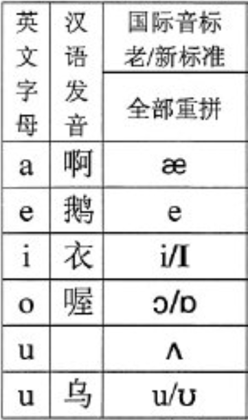

## 用于记忆读音发生规则

## 短元音/长元音/轻元音

## 长元音

|      |      |      |      |
| ---- | ---- | ---- | ---- |
|      | æ    |      |      |
|      | e    |      |      |
|      | I    |      |      |
|      |      |      |      |
|      |      |      |      |

[自然拼读法Phonics发音规则之元音 - 知乎 (zhihu.com)](https://zhuanlan.zhihu.com/p/22849621)

