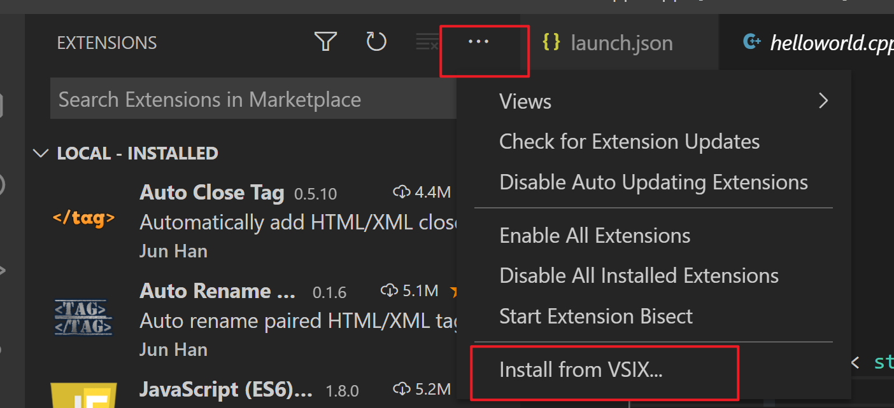

# vscode Downloading package 'C/C++ language components (Windows)' Failed.问题解决


------------------------------------------------


```
Downloading package 'C/C++ language components (Windows)' Failed. Retrying... Failed. Retrying...
```

**解决方案**：在官网下载离线安装包：https://github.com/Microsoft/vscode-cpptools/releases上下载c++extension，然后打开vscode，打开扩展，点击右上角三个点，选择Install form VSIX。然后选择下载好的文件。安装完成后重启即可




原文链接：https://blog.csdn.net/fuyuande/article/details/103449168