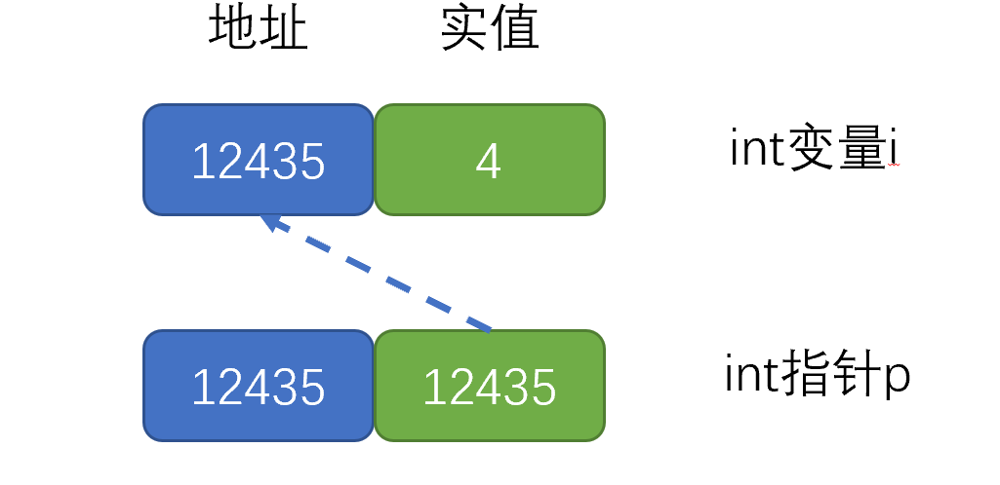

## \*和\&作为类型修饰符

引用(reference)和指针(pointer)是两种主要的复合类型。


定义指针类型：将声明符写成`*d`的形式，其中`d`为变量名

声明指针：

```c++
int *p;//声明指针
p = &i; //将变量i的地址赋值到p
    
int *p = &i; //声明并定义指针
    
//以上两种方式等价

```

注意：指针需要定义类型。原因：需要确定指针指向对象所进行的操作。

==赋值永远改变的是等号左侧的对象==

```c++
int *p; 

p = &i; //左侧对象为p，操作为对p赋（地址）值，相当于将p指向i变量
*p = 1; //左侧对象为p指向的变量i，对i赋值1
```


## \*和\&作为操作

变量在硬件上的表现



- \*为**解引用符**，表示获得输入地址的实值。

- ```c++
    int k = *p ; //取p储存的地址对应的数值，赋值给k
    ```

    

- \&为**取地址符**，表示获得操作对象的地址。

- ```c++
    p = &i; // 取i的地址，赋值给p
    ```

      