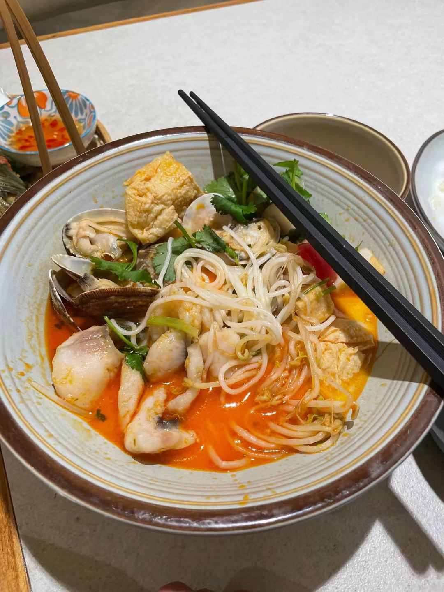

## 今天接ky阿妹回去

早上7点多就醒了然后去接Ky妹回学校。

然后就去KFC玩塞尔达了，在那里吃了一些早餐。KFC的沙发还挺舒服的，就是洗手间有一些冲不干净的。。好恶心。

中午去了十字路口保险对面的泰式西菜吃，感觉挺好的，挺多人光顾，小吃做的有特色而且口味很协调。

然后下午去了buways继续玩塞尔达，buways的网速还是快啊，比家里的2M/s快多了。

晚上就继续去buways曾网络+写本子。

写本子好麻烦啊，周围有很吵，根本沉不下心来写，还不如看看一些英文文章。。