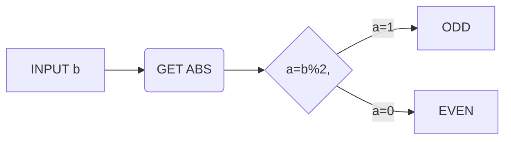
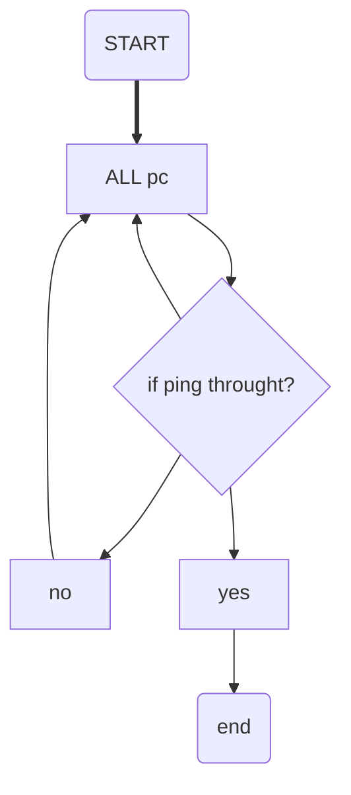

# MathTex CookBook


## Symble


|    to get    | type       | to get        | type             |
| :----------: | ---------- | ------------- | ---------------- |
|   $\infty$   | \infty     | $\to$         | \to, \rightarrow |
|   $\imath$   | \imath     | $\leftarrow$  | \leftarrow       |
|   $\jmath$   | \jmath     | $\Rightarrow$ | \Rightarrow      |
|  $\int^a_b$  | \int       | $\Leftarrow$  | \Leftarrow       |
|  $\Uparrow$  | \Uparrow   | $\ldots$      | \ldots           |
| $\downarrow$ | \downarrow | $\cdots$      | \cdots           |
| $\Downarrow$ | \Downarrow | $\vdots$      | \vdots           |
|  $\uparrow$  | \uparrow   | $\ddots$      | \ddots           |
|   $\oint$    | \oint      |               |                  |

## Preliminaries

|   $a,b,...,z,+,- * / =()[]$   | a,b,...,z,+,- * / =()[]     |
| :---------------------------: | --------------------------- |
|         $\backslash$          | \backslash                  |
|       $\sqrt{a^2+b^2}$        | \sqrt{a^2 +b^2}             |
|         $\frac \pi 2$         | \frac \pi 2                 |
|     $\left( ... \right)$      | \left(   ...   \right)      |
|     $\left[ ... \right]$      | \left[    ...    \right]    |
|     $\lbrace ... \rbrace$     | \lbrace   ...   \rbrace     |
|     $\left| ... \right|$      | \left\| ... \right \|       |
|    $\left\| ... \right\|$     | \left\\|
|  $\left\{{a \atop b}\right.$  | \left\{{a \atop b}\right.   |
| $\left. {a \atop b} \right\}$ | \left. {a \atop b} \right\} |
|  |  |

## Logical

|        to get        | type               |
| :------------------: | ------------------ |
|      $>, <, =$       | \>,<,=             |
|     $\leq, \geq$     | \leq, \geq         |
| $\nleq, \ngeq, \neq$ | \nleq, \ngeq, \neq |
|      $\approx$       | \approx            |
|       $\equiv$       | \equiv             |
|       $\doteq$       | \doteq             |
|     $\triangleq$     | \triangleq         |

## Set 

|      to get       | type        | to get | type |
| :---------------: | ----------- | :--: | ---- |
|     $x \in y$     | \in         | $x \not\subset y$ | \not\subset |
|   $x \notin y$    | \notin      | $x \not\supset y$ | \not\supset |
|   $x \not\in y$   | \not\in     |    $x \cup y$     | \cup        |
|   $x \subset y$   | \subset     |    $x \cap y$     | \cap        |
|   $x \supset y$   | \supset     |  $x \setminus y$  | \setminus   |
|  $x \subseteq y$  | \subseteq   |  $x \bigodot y$   | \bigodot    |
| $x \subsetneq y$  | \subsetneq  | $x \bigotimes y$  | \bigotimes  |
|  $x \supseteq y$  | \supseteq   |   $\mathbb{R}$    | \mathbb{R}  |
| $x \supsetneq y$  | \supsetneq  |    $\emptyset$    | \emptyset   |
|  |  |  |  |


 ## Hat

|    to get     | type        |     to get     | type         |
| :-----------: | :---------- | :------------: | :----------- |
|   $\vec{x}$   | \vec{x}     |  $\acute{x}$   | \acute{x}    |
|   $\hat{x}$   | \hat{x}     |  $\grave{x}$   | \grave{x}    |
| $\widehat{x}$ | \widehat{x} | $\mathring{x}$ | \mathring{x} |
|  $\tilde{x}$  | \tilde{x}   |  $\check{x}$   | \check{x}    |
|  $\breve{x}$  | \breve{x}   |   $\dot{x}$    | \dot{x}      |
|   $\bar{x}$   | \bar{x}     |   $\ddot{x}$   | \ddot{x}     |
|               |             |                |              |

## Not symbal

|               to get                | tpye                               |
| :---------------------------------: | ---------------------------------- |
| $\not{a} , \not=, \not\in,\not\leq$ | \not{a} , \not=，\not\in, \not\leq |
|           $\cancel{ABC}$            | \cancel{ABC}                       |
|               ~~ABC~~               | \~\~ABC\~\~                        |
|          $\overline{ABC}$           | \overline{ABC}                     |
|          $\underline{ABC}$          | \underline{ABC}                    |


## Alphabet

|    type    | to get                                 |
| :--------: | -------------------------------------- |
|    a-z     | abcdefghijklmnopqrstuvwxyz             |
|    a-z     | $abcdefghijklmnopqrstuvwxyz$           |
|  \text{}   | $\text{abcdefghijklmnopqrstuvwxyz}$    |
|    A-Z     | $ABCDEFGHIJKLMNOPQRSTUVWXYZ$           |
| \mathbb{}  | $\mathbb{ABCDEFGHIJKLMNOPQRSTUVWXYZ}$  |
| \mathcal{} | $\mathcal{ABCDEFGHIJKLMNOPQRSTUVWXYZ}$ |
| \mathscr{} | $\mathscr{ABCDEFGHIJKLMNOPQRSTUVWXYZ}$ |
|            |                                        |

## Underscore

| **\arccos**  | **\arcsin** | **\arctan** | **\arg**  | **\cos**     |
| ------------ | ----------- | ----------- | --------- | ------------ |
| **\cosh**    | **\cot**    | **\coth**   | **\csc**  | **\deg**     |
| **\det_**    | **\dim**    | **\exp**    | **\gcd_** | **\hom**     |
| **\inf_**    | **\ker**    | **\lg**     | **\lim_** | **\liminf_** |
| **\limsup_** | **\ln**     | **\log**    | **\max_** | **\min_**    |
| **\Pr_**     | **\sec**    | **\sin**    | **\sinh** | **\sup_**    |
| **\tan**     | **\tanh**   |             |           |              |
|              |             |             |           |              |

## Greek

|         to get          |         type          | to get     | type     | name    |
| :---------------------: | :-------------------: | :--------- | :------- | ------- |
|        $\alpha$         |        \alpha         | $\Alpha$   | \Alpha   | alpha   |
|         $\beta$         |         \beta         | $\Beta$    | \Beta    | beta    |
|        $\gamma$         |        \gamma         | $\Gamma$   | \Gamma   | gamma   |
|        $\delta$         |        \delta         | $\Delta$   | \Delta   | delta   |
| $\epsilon, \varepsilon$ | \epsilon, \verepsilon | $\Epsilon$ | \Epsilon | epsilon |
|         $\zeta$         |         \zeta         | $\rm Z$    | \Eeta    | zeta    |
|         $\eta$          |         \eta          | $\Eta$     | \Eta     | eta     |
|  $\theta, \vartheta $   |   \theta, \vartheta   | $\Theta $  | \Theta   | theta   |
|        $\iota $         |         \iota         | $\Iota$    | \Iota    | iota    |
|        $\kappa $        |        \kappa         | $\Kappa$   | \Kappa   | kappa   |
|       $\lambda $        |        \lambda        | $\Lambda$  | \Lambda  | lambda  |
|         $\mu $          |          \mu          | $\Mu$      | Mu       | mu      |
|         $\nu $          |          \nu          | $\Nu$      | \Nu      | nu      |
|         $\xi $          |          \xi          | $\Xi$      | \Xi      | xi      |
|       $\omicron$        |       \omicron        | $\Omicron$ | \Omicron | omicron |
|     $\pi，\varpi $      |      \pi, \varpi      | $\Pi $     | \Pi      | pi      |
|         $\rho $         |         \rho          | $\Rho$     | \Rho     | rho     |
|        $\sigma $        |        \sigma         | $\Sigma$   | \Sigma   | sigma   |
|         $\tau$          |          tau          | $\Tau$     | \Tau     | tau     |
|       $\upsilon$        |       \upsilon        | $\Upsilon$ | \Upsilon | upsilon |
|     $\phi,\varphi$      |    \phi,  \varphi     | $\Phi$     | \Phi     | phi     |
|         $\chi$          |         \chi          | $\Chi$     | \Chi     | chi     |
|         $\psi$          |         \psi          | $\Psi$     | \Psi     | psi     |
|        $\omega $        |        \omega         | $\Omega$   | \Omega   | omega   |


## Functional

$$
\left[
\begin{matrix}
a1,1	&	a1,2	&	. . .	&	a1,n	    \\
a2,1	&	a2,2	&	. . .	&	a2,n	    \\
... &	. . .	 &. . .	 &. . .	\\
am,1	&	am,2	&	. . .	&	am,n	 
\end{matrix}
\right]
$$

```
\left[
\begin{matrix}
a1,1	&	a1,2	&	. . .	&	a1,n	    \\
a2,1	&	a2,2	&	. . .	&	a2,n	    \\
... &	. . .	 &. . .	 &. . .	\\
am,1	&	am,2	&	. . .	&	am,n	 
\end{matrix}
\right]
```


$$
\begin{array}{rcl}
a + b + c + d	&	=	&	4 \\
2a - d	&	=	&	b + c     \\
2b	&	=	&	c + d - a     \\
c - d	&	=	&	b - 2a
\end{array}
$$

```
\begin{array}{rcl}
a + b + c + d	&	=	&	4 \\
2a - d	&	=	&	b + c     \\
2b	&	=	&	c + d - a     \\
c - d	&	=	&	b - 2a
\end{array}
```


# Keyboard  

<kbd>Ctrl</kbd>+<kbd>C</kbd>

```
<kbd>Ctrl</kbd> +  <kbd>C</kbd>
```


# Graph






