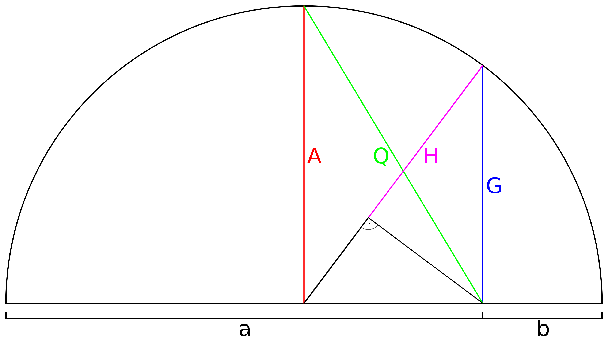
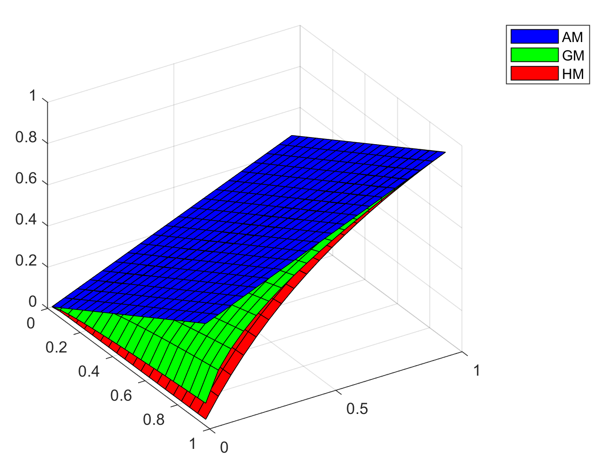

# 几种常用的平均

https://en.wikipedia.org/wiki/Pythagorean_means

- [arithmetic mean](https://en.wikipedia.org/wiki/Arithmetic_mean) (AM)： 算数平均
- [geometric mean](https://en.wikipedia.org/wiki/Geometric_mean) (GM)：几何平均
- [harmonic mean](https://en.wikipedia.org/wiki/Harmonic_mean) (HM)：调和平均
- [root mean square](https://en.wikipedia.org/wiki/Root_mean_square)(QM):二次项平均

### formulation

1. 算数平均，最常用的平均方式
    $$
    AM(x_1,x_2...,x_n) = \frac{1}{n}(x_1+x_2+...+x_n)=\frac{1}{n}\sum_i^n x_i
    $$
    
2. 几何平均
    $$
    GM(x_1,x_2...,x_n) = \sqrt[n]{(x_1\cdot x_2\cdot ...\cdot x_n)}=\sqrt[n]{x_n}
    $$
    

3. 调和平均

$$
HM(x_1,x_2...,x_n) = \frac{n}{(\frac{1}{x_1}+ \frac{1}{x_2}+ ...+\frac{1}{x_n})}
$$

### 几何解释

