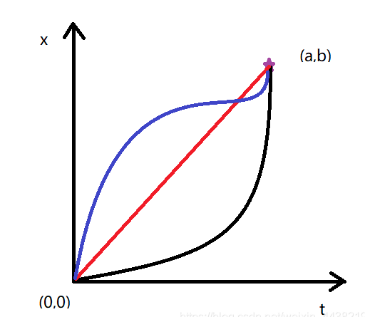
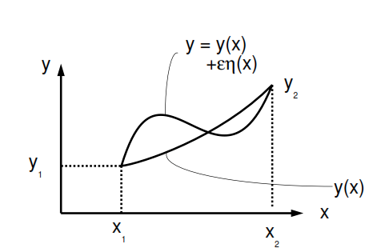

## 投影定理

设$H$是Hibert空间， $M$是其闭子空间。给定一个向量$x\in H$，则$V=x+M$就是$H$中的一个线性流形。那么根据投影定理：$V$中存在一个最小范数向量$x^*$使得$x^* \bot M$

解决最优控制问题：

求解最小：

$$
\min_u \int^1_0 u^2(t)dt\\
\begin{array}{rrl}
s.t. & \frac{dw}{dt} + w(t) &= u(t)\\
 & \frac{d\theta}{dt} &= w(t)

\end{array}
$$

初始条件：

$$
w(0)=0\\
\theta(1)=1\\
w(1)=0
$$

1. 改写约束条件1（通解）

$$
w(t) = e^{-t}(k + \int^t_0 u(t)e^t dt)
$$

由$w(0)=0$得到$k=0$: $w(t) = e^{-t}\int^t_0u(t)e^tdt$

$$
w(1) = e^{-1}\int^1_0 u(t)e^tdt \\
\underline{w(1) = \int^1_0u(t)e^{t-1}dt = 0}
$$

2. 结合约束1&2得到：

$$
\frac{dw}{dt} + \frac{d\theta}{dt} = u(t)\\
   \theta(t) = \int^t_0u(t)dt-dw\\
   \theta(t)  = \int^t_0 u(t)(1-e^{t-1})dt\\
   \underline{\theta(1)  = \int^1_0 u(t)(1-e^{t-1})dt = 1}
$$
3. **映射到函数空间**

   定义$y_1 = e^{t-1}, y-2 = 1-e^{t-1}$

   得到两个内积：
$$
   \left< y_1,u\right> = 0 \\
   \left< y_2,u\right> = 1 \\
$$
4. 空间的理解

   1. $Y=(y_1,y_2)^\top$ 张成一个$H$中的子空间，是空间中两个基。对应投影定理中的$M$。
   2. 求解的$u$存在于$V=x+M$,是按照向量$x$方向移动$(0,1)$的解空间。
   3. 最小范数解为解空间$V$和子空间$M$的最短距离的解$x^*$，即为投影。
   4. 所以得到$u^*$ 垂直于子空间$M$

## 绪论

1. 函数$\Rightarrow$映射
   1. $x \in X \to f(x) \in Y$
   2. 从一个空间X到另一个空间Y的映射
2. 更广泛的运算（算子）
3. 泛函研究的方法：
   1. 变分法
   2. 微分方程
   3. 积分方程
   4. 函数论
   5. 量子物理
4. 线性代数研究有限维度空间
   1. 泛函分析无穷维空间：无穷维空间映射到无穷维空间
5. 相同：空间的结构和
6. 特别关注：收敛性问题

- 建立一个新的空间框架
  - $x \to f(x)$
  - $X \to Y$
  - $A_{n\times n}: X \to Y\\x \in X, x\to Ax\in Y$

空间的结构和关系

**无穷维空间**

- 是否存在坐标系
- 是否具有正交性
- 无穷维空间中的元素$x$能不能分解

分解特征值？

线性算子能不能分解？

函数的坐标分解

- Taylor展开
- 一个函数和一个无穷数列一一对应
$$
f(x) = f(0) + f'(0)x + \frac{f''(0)}{2!}x^2+...+\frac{f^n(0)}{n!} x^n
$$
和一个向量在n维空间的展开完全类似：
$$
\vec{x} = x_1e_1+x_2e_2+...x_ne_n\\
f(x) = a_0x^0+ a_1x^1+a_2x^2...+a_nx^n
$$
区别在于$(x^0, x^1,x^2...x^n)$不是”正交系“

- Fourier是在正交系中的展开：
- $f(x) = \frac{a0}{2} +\sum^\infin_{k=1}(a_k \cos kx+b_k\sin kx)$
- $(f,g) = \int^\infin_{-\infin} f(x)g(x)dx = 0\to 正交  $

## 距离空间

连续函数空间$C[a,b]$距离的定义：

考虑闭区间$[a,b]$上全体连续函数，定义：
$$
d(x,y)=\max_{a\leq t\leq b}|x(t)-y(t)|
$$

$$
d(x,y) = \int^b_a|x(t)-y(t)|dt
$$

$$
d(x,y) = (\int^b_a | x(t)-y(t)|^2 dt)^{1/2}
$$
研究问题不同，使用不用的距离

**有得距离空间下完备有得空间中不完备。**

例子：

$X$是非空集合， $x,y\in X$，定义
$$
d(x,y) = \left\{ 1,  x\neq y \atop 0, x=y\right.
$$
是一个距离：离散距离空间

## 变分法求解最短路径

**泛函数是函数的函数**，即**它的输入是函数**，**输出是实数**。而这个输出值取决于一个或多个函数（输入）在一整个路径上的积分而非像一般函数一样取决于离散的变量。

https://zhuanlan.zhihu.com/p/20718489

通常在变分法中，泛函数是一个积分，记做$J$,其中$F$称为拉格朗日函数
$$
J(x) = \int^{t1}_{t0} Fdt
$$
$F$的输入可以使函数$x$及其各阶导数,在本问题中,可以写成函数$x$和一阶函数$\dot x$和输入$t$
$$
J = \int^{t_f}_{t_0} F[x(t), \dot x(t), t)]dt
$$
求在二维空间中连接两点的最短曲线

曲线的弧长微元为:
$$
dJ = \sqrt{(dx)^2 + (dt)^2} = \sqrt{(\dot x)^2 + 1} dt
$$
积分为弧长
$$
J = \int _{0} ^{a} \sqrt{(\dot x)^2 + 1 } dt
$$
如图所示,边界条件为$x(0)=0,x(a)=b$

使用变分法求解:
$$
J(x) = \int_0^a\sqrt{(\dot x ^*(t)+\delta x(t))^2 + 1} dt
$$
这里用$x(t) = x(t) + \delta x(t)$表示$x(t)$的变分

引入微量$\varepsilon \ll 1$和任意微分函数$\eta(x)$,用两者表示为$x(t)$的增量
$$
\tilde x(t) = x(t) + \varepsilon \eta(t)
$$
对于任意$\varepsilon$可以获得$x(t)$的任意路径.

> 变分和微分的区别:  变分在上图的直观解释是$\tilde y(x)$和$y(x)$在竖直方向上的距离，称之为$\delta y$，所以这个差是在同一个x上计算的。而微分则是由于x的微小变动引起的y的变动。

