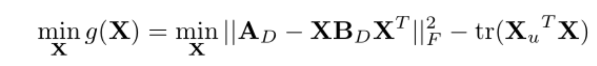

# 矩阵求梯度

阅读2021CVPR的deep graph matching under quadratic constraint

## 矩阵导数和微分的联系

$df =\sum_i \sum_j \frac{\partial f}{\partial X_{ij}} dX= tr(\frac{\partial f}{\partial X}^\top dX) $

$\nabla f(X) = \frac{df}{dX}$

##  重要的规则

1. 加减法: $d(X +- Y)= dX + dY$
2. 矩阵乘法:$d(XY)=(dX)Y+XdY$
3. 转置:$d(X^\top) = (dX)^\top$
4. trace： $d(tr(X))=tr(dX)$
5. 逆： $dX^{-1}=-X^{-1}dXX^{-1}$
6. 行列式:$d|X|=tr(X^\#dX)$，其中$X^\#$表示伴随矩阵

## trace技巧

可以利用矩阵导数和微分的联系$df = tr(\frac{\partial f}{\partial X}^\top dX)$套上迹

1. 变量套迹：$a = tr(a)$

2. 转置：$tr(A^\top) = tr(A)$
3. 线性：$tr(A+B)=tr(A)+tr(B)$
4. 乘法交换：$tr(AB) = tr(BA)=\sum_{ij}A_{ij}B_{ij}$，$A,B^\top$尺寸相同
5. 矩阵乘法/逐元素乘法交换：$tr(A^\top (B\odot C))=tr(A\odot B\odot C)=tr(B^\top (A\odot C)) = \sum_{ij}A_{ij}B_{ij}C_{ij}$

> 注意：套trace要整块公式套

## 例子

https://zhuanlan.zhihu.com/p/24709748

## 2021CVPR

目标方程：
$$
g(X)=||A-XBX^\top||^2_F-tr(X_u^\top X)
$$

对$g(X)$求梯度：

使用方法：设$U=A-XBX^\top$,

得到：
$$
g(X) =||U||^2_F-tr(X_u^\top X)\\
$$

对后一项求导
$$
\begin{array}{rl}

dg(X) 	&= d(||U||^2_F)-d(tr(X^\top_uX))\\
	&= d(||U||^2_F)-tr (X^\top_udX)\\
	&= d(||U||^2_F)-tr (X^\top_udX) 
\end{array}
$$
接着对第一项求导
$$
\begin{array}{rl}
||U||^2_F		& = \sum_{ij} U_{ij}^2 = tr(U^\top U)\\
d(tr(U^\top U))	& = tr(d(U^\top U))&求导中的trace交换\\ 
& = tr(dU^\top U + U^\top d U )\\
& = tr(U^\top dU+U^\top dU)& 套tr的转置\\
&=2tr(U^\top dU )
\end{array}
$$
对$dU$求$\frac{dU}{dX}$：
$$
\begin{array}{rl}
dY&= d(A-XBX^\top)\\
& = -dXBX^\top - XBdX^\top\\
\end{array}
$$
将（5）带入（4）中：
$$
\begin{array}{rl}
2tr(Y^\top dY )&=-2tr(Y^\top (dXBX^\top + XBdX^\top))\\
& = -2tr(Y^\top dXBX^\top + Y^\top XBdX^\top))&由于矩阵尺寸满足交换条件\\ 
& = -2tr(BX^\top Y^\top dX + Y^\top XBdX^\top))&第一项进行交换\\ 
& = -2tr(BX^\top Y^\top dX + B^\top X^\top Y dX))&第二项进行转置和交换\\
& = -2tr((BX^\top Y^\top +B^\top X^\top Y )dX)\\
\end{array}
$$
整理公式将(6)带入(3)中
$$
\begin{array}{rl}
dg(X) &=d(||Y||^2_F)-tr (X^\top_udX)\\
& = -2tr((BX^\top Y^\top +B^\top X^\top Y )dX) - tr (X^\top_udX)\\
& = tr((-2(BX^\top Y^\top +B^\top X^\top Y)-X^\top_u)dX)\\
& = tr((-2(YXB^\top+Y^\top XB)-X_u)^\top dX)

\end{array}
$$
由公式$df = tr(\frac{\partial f}{\partial X}^\top dX) $

得到
$$
\nabla g(X) = \frac{df}{dX} = \frac{\partial f}{\partial X} =-2(YXB^\top+Y^\top XB)-X_u
$$

