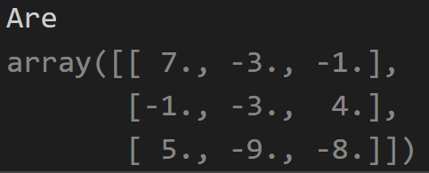

# 第一次作业（矩阵分解）

​																							李号元

​																					2020102120042


## 奇异值分解SVD

### matlab实现

实验中使用matlab自带的函数eig()进行特征分解。

```matlab
function [U,D,V] = SVD_decomp(A)
    r = rank(A);
    [V, lambda] = eig(A'*A);
    D = lambda.^0.5;
    V1 = V(:,1:r);
    U1 = A * V1 * D^-1;
    [m, n]=size(U1);
    if n < r
        U2 = null(U1');%利用求解零空间得到其余的正交向量
        U2_len = sum(U.^2).^-0.5; %计算长度进行归一化
        U2_norm = U2 * diag(U2_len); %归一化成单位向量
        U = [U1,U2]; 
    else
        U = U1;
    end

end
```

得到分解的正交向量和奇异值U，V，D：


得到重组结果与输入的A一致：


### python实现

在利用python编程时，可直接使用面向对象的方法，在初始化矩阵类时，设定好各种分解方法，以便后续计算：

```python
class RandomMatrix:
    def __init__(self, preset_matrix=None, size=(3, 3)):
        if preset_matrix is not None:
            self.matrix = preset_matrix
        else:
            self.matrix = np.random.randint(size=size)
        self.M, self.N = preset_matrix.shape #calculate the size of matrix A
        u, s, vh = np.linalg.svd(self.matrix) #svd A
        self.rank = np.linalg.matrix_rank(self.matrix) #rank(A)
        full_rank_matrix = self.matrix[0:self.rank, :] #calculate the full rank of A
        rol_con = np.concatenate([full_rank_matrix, np.eye(n-self.rank)], axis=1)
        e_con = np.concatenate([np.eye(n), np.zeros((n,self.rank))], axis=1)
        self.QAP = np.concatenate([rol_con, e_con], axis=0)
        self.full_rank_decomple()
        print()
```


利用矩阵内积为半正定矩阵的性质，得到归一化的实现：

```python
def generate_affinity(node_num:int):#输入矩阵的大小
    '''生成随机仿射矩阵并进行特征分解
    '''
    A = np.random.randint(0,  3, size=(node_num, node_num))
    A = A.T @ A - node_num * np.eye(node_num)
    A = np.where(A>0, 1, 0)
    D_norm = np.diag(np.sum(A, axis=0)**-0.5)
    L = np.eye(node_num) - D_norm @ A @ D_norm
    return A, D_norm, L
```


## LU分解

并非所有矩阵都能进行LU分解，能够LU分解的矩阵需要满足以下三个条件：

1. 矩阵是方阵（LU分解主要是针对方阵）；

2. 矩阵是可逆的，也就是该矩阵是满秩矩阵，每一行都是独立向量；

3. 消元过程中没有0主元出现，也就是消元过程中不能出现行交换的初等变换。

    ### 需要行交换的情况

    对于A = LU，我们之前限制了行的互换，但如果不可避免的必须进行行互换，只需要把A = LU变成 PA = LU就可以了，其中P是置换矩阵。实际上所有的A = LU都可以写成PA = LU的形式，当A没有行互换时，P就是单位矩阵。

### matlab实现

- 使用函数`lu(A)`进行分解得到下三角矩阵。

- ```matlab
    A = pascal(5)%生成矩阵
    [L,U]=lu(A)
    
    ```

- 输入矩阵A:


- 输出结果L,U

由于A存在主元为0的情况，因此没有得到下三角矩阵


### python实现

- 生成随机矩阵

    ```python
    A = np.random.randint(0,  3, size=(node_num, node_num))
    ```

    在代码实现中，使用折半搜索法迭代计算，由于初始默认没有0主元的出现，因此直接建立变换矩阵$L_n$进行计算。

- 进行LU分解函数代码

```python
def LU(A):
    m, n = A.shape
    Anew = A
    L0=np.eye(n)
    D=np.zeros((n,n))
    for i in range(n):
        L= np.eye(n)
        for j in range(n-i-1):
            L[i+j+1, i]=Anew[j+i+1,i] / Anew[i,i]
        Anew = np.linalg.inv(L) @ Anew
        L0 = L0 @ L
        D[i,i]= Anew[i,i]
    U = np.linalg.inv(D) @ Anew
    return L0,D,U
```


- 输入满秩矩阵A

```python
Afull = np.array([  [7,-3,-1],
                    [-1,-3,4],
                    [5,-9,-8]])
```


- 输出L，D, U分别为下三角矩阵，对角矩阵，上三角矩阵


- 重组A与输入一致



## 满秩分解

### 满秩分解的性质

1. 满秩分解不唯一
2. 任何非零矩阵一定存在满秩分解

### 满秩分解步骤

1. 对$A（R(A) = r）$施行初等行变换化为行最简形矩阵$B$
2. 取矩阵$B$前$r$行，构成矩阵$G$
3. 对$G$矩阵前r行第一个非零元所在的列号，按此列号取矩阵对应的列组成矩阵$F$。
4. 最后矩阵A分解为$A=FG$

### matlab实现

```mtalab
function [F, G] = full_rank_decmop(A)
    A0 = A;
    [M, N] = size(A);  %A[M,N]
    r = 0; %初始化计算的rank
    for i=1:N
        if r == N && r == M %检查满秩的情况
            break
        end
       for j = i:M %查找piovt不为0的
           if abs(A(j,i)) > 1e-15 %找到开头绝对值不为0的元素
                r = r+1; %更新rank
                %交换行
                tamp = A(j,:);
                A(j,:) = A(r,:);
                A(r,:) = tamp;
                %开头元素为1
                A(r,:) = A(r,:)/A(r,i);
                %减去其他行
                coeff = A(:,i)/A(r,i);%构建系数列,coeff[M,1]
                coeff(r)=0;%自己行的系数为0 
                A = A - coeff * A(r,:); %更新A_cat
                break
           end
       end
    end
    G = A(1:r,:);
    
    %确定F
    F=zeros(M, r);
    i = 1;
    j = 1;
    while i <= r
            if G(i,j) == 1
                F(:,j) = A0(:,j);
                i = i + 1;
                j = i;
            end
    end
end

```

### python实现

```pyhton
def full_rank_decmop(A):
    A0 = A
    M, N = A.shape
    r = 0
    for i in range(N):
        if r==N and r==M:
            break
        for j in range(i, M):
            if np.abs(A[j,i]) > 1e-15:
                r += 1
                temp = A[j] #交换行
                A[j] = A[r-1]
                A[r-1] = temp
                #开头元素设置为1
                A[r-1] = A[r-1]/A[r-1,i]
                #计算其他行的相减系数
                coeff = A[:,i] / A[r-1,i]
                coeff[r-1]=0
                A = A - np.einsum('i,j->ij',coeff, A[r-1])
                break
    G = A[0:r, :]

    F=np.zeros((M,r))
    i,j = 0,0
    while i <r:
        if G[i,j] == 1:
            F[:,j]=A0[:,j]
            i += 1
            j = i

    return F, G
    
```

- 输入矩阵

```python
A = np.array([  [1,1,-3,-1],
                    [3,-1,-3,4],
                    [1,5,-9,-8]])
```

- 输出分解$A=FG$


- 输出复原后的$A$结果,与输入一致。


## 用于pyhton的矩阵乘法函数einsum()

在计算矩阵中，在python编程中要使用多种矩阵乘法进行运算，如矩阵方程法`@` , 点乘dot()等，可以同一使用einsum函数实现几乎所有矩阵乘法。

einsum全称Einstein summation convention（爱因斯坦求和约定），又称为爱因斯坦标记法。einsum的写法省去了求和符号，显得更加简洁。

``result = torch.einsum('bdhn,bdhm->bhnm',query, key)``

 

### 例子：

转置：

`B = torch.einsum('ij->ji',A)`

求和

`b = torch.einsum('ij->',A)#标量不需要填下标`

列求和 

`b = torch.einsum('ij->j', A)`

行求和 

`b = torch.einsum('ij->i', A)`

矩阵-向量相乘

`c = torch.einsum('ik,k->i ',[A,b])`

矩阵-矩阵相乘 

`c = torch.einsum('ik,kj->ij ',[A,B])`


点积：

向量点乘

c = torch.einsum('I,i-> ',[a,b])

 

矩阵点乘

C = torch.einsum('ij,ij->ij ',[A,B])

 

外积 

C = torch.einsum('i,j->ij ',[a,b])


### numpy 和 torch 的einsum比较


numpy的einsum速度要快很多，即使先将tensor转换成array进行einsum再转换回去，速度也很快

- 速度比较：numpy快两个数量级

( numpy-0.05 ;  torch-5.904)

在大张量的情况下更加明显,但有一个问题就是如果要经常用，不断切换格式也会很麻烦。

 

- 输入参数：都是(equation, operands)

numpy的operands是变长参数列表

torch的operands是列表


## 结论

本次实验主要在Matlab平台和python平台上实现了矩阵的LU分解，奇异值分解，满秩分解，并比较了语言的特点，经过验证，分解后的矩阵能重新组合得到原矩阵，并且熟悉了python的矩阵乘法函数`einsum()`。