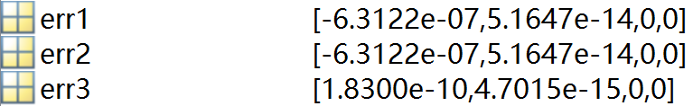
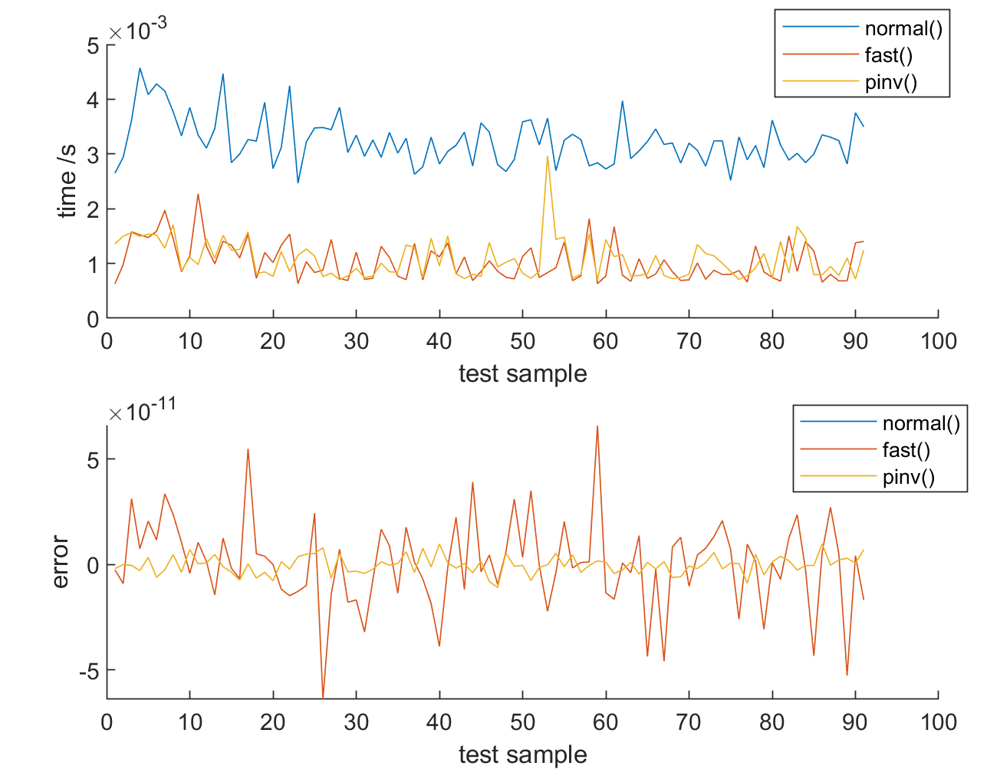
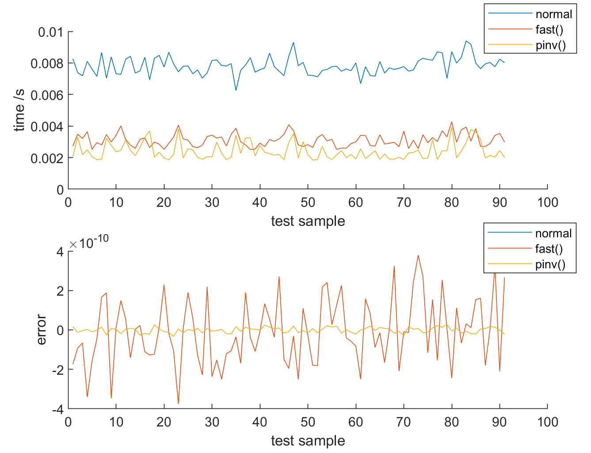

# 第二次编程作业
​																										李号元
​																								2020102120042


## 广义逆的定义以及推导
### 满秩方阵的逆

​	在矩阵空间中，假设矩阵$A\in R^{n\times n}$为满秩矩阵，其秩$r(A)=n$，其张成的列向量空间充满整个矩阵空间。对于列向量$x\in R^n$，矩阵$A$对$x$进行变换$Ax=b$，变换后的向量$b$依然在$A$的列空间中。


​	对于一个可逆方阵$A$来说，$A$是满秩的，所以任何在$A$列空间中的向量$x$经过$A$的变换后依然在$A$的列空间中，向量$x$的信息是无损的，没有被压缩的。因此可以完全复原。这个复原的操作就是$A$的逆变换$A^-$。

$A$变换公式如下：
$$
Ax=b
$$
其中$x\in R^n, b\in R^n$，假设其逆变换为$G\in R^{n\times n}$，逆变换公式如下：
$$
Gb=x
$$
分别对公式$(1)$左乘$G$和对公式$(2)$左乘$A$可以得到以下结论
$$
GAx=Gb=x \rightarrow GA=I \\
AGb=Ax=b \rightarrow AG=I
$$
则定义$G$为可逆方阵$A$的逆矩阵，可以得到以下性质：
$$
AGA=A\\
GAG=G\\
(GA)^H=GA\\
(AG)^H = AG
$$


### 列满秩矩阵的逆

于列满秩矩阵$A\in R^{m \times n}, (m>n)$， $r(A)=n$，因此矩阵$A$张成的列空间维度为$R^n$，其属于矩阵空间$R^m$的子空间，对于$A$的列空间$R(A)$，存在正交补空间$N(A^T)$，两个空间共同“构成”矩阵空间$R^m$，定义如下：
$$
\mathcal{R}^m = R(A) \oplus N(A^T)
$$


此时由于列向量线性无关，$A^HA$为n阶满秩矩阵，因此存在n阶逆变换矩阵$(A^HA)^{-1}$满足$(A^HA)^{-1}A^HA=I$ 令
$$
G = (A^HA)^{-1}A^H
$$
使得
$$
GA = I,G\in R^{n \times m}
$$
由此可以得到列满秩矩阵的逆的性质
$$
AGA=A\\
GAG=G\\
(GA)^H=GA
$$
同理可得行满秩矩阵同样存在矩阵$G$。

​	由以上两个例子可以看出，对于一个变换矩阵$A$来说，即使$A$变换将向量从高维信息$R^m$压缩到低纬空间$R^n$，但存在变换$G$使向量$\textbf{x}\in R^m$在低维空间的投影$x_p \in R^n$将$A$变换对低维空间的操作复原。在一般情况下$G$矩阵并不唯一，因为$G$的效果只需要将$A$在低维空间$R^n$的操作复原即可，而对其在$R^{m-n}$正交补空间的操作没有限制。

### 总结

将矩阵$A$看成是对矩阵空间中向量的线性变换操作，逆矩阵$G$可以认为是对线性变换的复原。

1）如果$A$是可逆矩阵，$G=A^{-1}$则是将$A$对整个矩阵空间的变换进行还原，其中信息没有损失。

2）如果$A$是不可逆矩阵，$A$变换本身会造成空间维度减少，向量信息的压缩。此时$G$表示为对$A$在没有降维的子空间上操作的复原。

- 若$A$为列满秩矩阵，$GA=I$表示$G$对列空间中$A$变换的无损复原，而$AG=P_A $则代表将$A$行空间$R(A^T)$的向量投影到列空间中，上面的$GA$变换也可以看成是将$A$的列空间$R(A)$投影到列空间，由于$A$是列满秩的，满秩空间的投影就是向量自身，也就解释了为什么$GA=I$。
- 若$A$为行满秩矩阵，$AG=I$表示$G$对行空间中$A$变换的无损复原，而$GA=P_A $则代表将$A$行空间$R(A^T)$的向量投影到列空间中，这与列满秩矩阵的变换顺序相反。
- 若$A$为行列都不满秩矩阵，则不存在$G$可以令$A$变换在行空间或列空间上的变换无损复原，但是可以在$A$没有压缩的部分维度中部分还原操作，这时$GA=P_A$ 和

## 引出广义逆的定义

### Moor-Penrose逆矩阵的定义

$m$ 个方程$n$个未知量的线性方程组可以表示为
$$
Ax=b
$$
其中，$A$为$m \times n$型矩阵，$b$为$m$维向量，$x$为未知的$n$维向量。

设$A$为任意$m \times n$ 型矩阵，称矩阵$G$是$A$的Moore-Penrose逆矩阵，若存在$n \times m$矩阵$G$满足以下四个条件中的部分或全部条件，则称矩阵$G$为矩阵$A$的广义逆矩阵：
$$
1) AGA=A\\
2) GAG=G\\
3) (GA)^H=GA\\
4) (AG)^H=AG
$$
按照定义，如果$G$满足第$i$个条件，就记为$A^{\{i\}}$，如果$G$满足四个条件的广义逆矩阵，就记为$A^{\{1,2,3,4\}}$ 。除了$A^{\{1,2,3,4\}}$ 是唯一确定之外，其余各类广义逆矩阵都不是唯一确定的，每一类广义逆矩阵都包含着一类矩阵，为了表示这种情况，把满足前面所述相应条件的一切Moore-Penrose广义逆矩阵分别记为
$$
A^{\{i\}} , \space  A^{\{i,j\}}, \space A^{\{i,j,k\}}
$$
上述共有15类Moore-Penrose广义逆矩阵分别记为以下5种：

(a) $A\{1\}$，其中任意一个固定广义逆矩阵记为$A^-$；
(b) $A\{1, 2\}$，其中任意一个固定广义逆矩阵记为$A^-_r$ ；
(c) $A\{1，3\}$，其中任意一个固定广义逆矩阵记为$A^-_m$；
(d) $A\{1，4\}$，其中任意一个固定广义逆矩阵记为$A^-_i$;

其中$A^+$满足全部四个条件，显然有$A^+ \in A\{1\},A^+ \in A\{1, 2\},A^+ \in A\{1, 3\},A^+ \in A\{1, 4\}$

## 用Moore-Penrose广义逆矩阵求解线性方程组

### 求解线性方程组常用Moore-Penrose广义逆矩阵的四种情形

1）满足第一个条件，即$AGA=A$的广义逆矩阵$G$, 记作$A^-$, 称为矩阵A的减号逆。对于任意矩阵A，减号逆A一总存在，不唯一．它的求法也很多。最简单的是初等变换法，只要求得可逆矩阵$P$、$Q$，使$PAQ$成为$A$的等价标准形式
$$
A \rightarrow PAQ= \begin{bmatrix} E_r & O\\ O & O \end{bmatrix}
=B
$$
$r$为矩阵A的秩$R(A)$，$E_r$为$r$阶单位矩阵，由此可以得到矩阵$A$的减号逆
$$
A^-=QB^TP
$$
2）满足第一个、第三个条件，即$AGA=A,(GA)^H=GA$的广义逆矩阵
$G$，记作$A^-_m$，称为矩阵$A$的最小范数逆。对于任意矩阵$A$，最小范数逆$A^-_m$总是存在，不唯一，按照下式可以求得一个最小范数逆。

3）满足第一个，第四个条件，即即$AGA=A$、$(AG)^H=AG$广义逆矩阵$G$，记作$A^-_l$。称为矩阵$A$的最小二乘逆，它也对于任意矩阵A都存在，不唯一。

4）满足全部4个Moore-Penrose条件，即$AGA=A$、$GAG=G$、$(GA)^H=GA$、$(AG)^H=AG$的广义逆矩阵G，记作A+，称为矩阵A的加号逆．它对于任意矩阵A都存在，而且是唯一的。


### $A^+$的求法

1）求出$A^-_m$和$A_l^-$，通过矩阵乘法得到$A^+$，公式如下所示：
$$
A^+ = A^-_m AA^-_t
$$
2）利用满秩分解法：先对矩阵$A$作初等变换，求得可逆矩阵$P$、$Q$ ,使得：
$$
PAQ=B=\begin{bmatrix} E_r & O\\ O&O\end{bmatrix}
$$
解得$A=P^{-1} \begin{bmatrix} E_r \\ O\end{bmatrix} \begin{bmatrix} E_r & O\end{bmatrix}Q^{-1}$

记$p^{-1}\begin{bmatrix} E_r \\ O\end{bmatrix}=C,\begin{bmatrix} E_r & O\end{bmatrix}Q^{-1}=D$


可以得到矩阵$A$的满秩分解得到
$$
A=CD
$$
其中，$C$是$m \times r$型满秩矩阵，$D$是$r \times n$型行满秩矩阵。$r=R(A)$，然后，由下式求得矩阵$A$的加号逆
$$
A^+=D^H(DD^H)^{-1}\cdot (C^HC)^{-1}C^H
$$

当$A$为满秩矩阵时，此时公式(17)为
$$
A^+ =A^{-1}
$$
因此当矩阵满秩的时候，最小范数逆$A_m^-$，最小二乘逆$A_l^-$，加号逆$A^+$都是$A^{-1}$。

### 线性方程方程组解的广义逆矩阵表达形式

1)齐次线性方程组
$$
Ax = O
$$

其通解为
$$
x_o = (E-A^-A)\xi
$$
其中，$A \in R^{m \times n}, x \in R^n, O \in R^m$是

## 利用满秩分解求解广义逆矩阵$A^+$

将矩阵进行满秩分解，可得到列满秩矩阵$F$和行满秩矩阵$G$
$$
A = FG\\
A = G^+F^+
$$
其中

$F^+= (F^HF)^{-1}F^H$

$G^+=G^H(GG^H)^{-1}$

分别为满秩矩阵的广义逆矩阵，由于广义逆矩阵$A^+$唯一，因此可以通过快速搜索矩阵的主元来分解矩阵，并计算广义逆矩阵。

## 广义逆矩阵的代码实现


### Matlab 编程

- 首先利用满秩分解得到$F,G$利用$A^+=G^+F^+$求的广义逆
- 计算复杂度为$O(n \times m)$

```matlab
function [A_pinv, err] = full_rank_decmop(A)
    [M, N] = size(A);  %A[M,N]
    I_n = eye(M); %构建Q矩阵
    A_cat = [A, I_n]; %A_cat[M,N+M]
    %行变换到[B;Q]矩阵
    r = 0; %初始化计算的rank
    for i=1:N
       for j = i:M %查找piovt不为0的
           if abs(A_cat(j,i)) > 1e-15 %找到开头绝对值不为0的元素
                r = r+1; %更新rank
                %交换行
                tamp = A_cat(j,:);
                A_cat(j,:) = A_cat(r,:);
                A_cat(r,:) = tamp;
                %开头元素为1
                A_cat(r,:) = A_cat(r,:)/A_cat(r,i);
                %减去其他行
                coeff = A_cat(:,i)/A_cat(r,i);%构建系数列,coeff[M,1]
                coeff(r)=0;%自己行的系数为0 
                A_cat = A_cat - coeff * A_cat(i,:); %更新A_cat
                break
           end
       end
    end
    G = A_cat(1:r,1:N);
    
    %确定F
    F=zeros(M, r);
    for i = 1:r
        for j = 1:N
            if G(i,j) == 1
                F(:,j) = A(:,j);
                if j ~= i % 交换P的列
                    temp = P(:,j);
                    P(:,j) = P(:,i);
                    P(:,i) = temp;
                end
                break
            end
        end
    end
    F_pinv = (F'*F)^-1 * F';
    A_pinv = G_pinv * F_pinv;

end
```


- **优化搜索速度**

- 主要在于

    ```matlab
    %确定F
        F=zeros(M, r);
        i = 1;
        j = 1;
        while i <= r
                if G(i,j) == 1
                    F(:,j) = A0(:,j);
                    i = i + 1;
                    j = i;
                end
        end
        F_pinv = (F'*F)^-1 * F';
        G_pinv = G' * (G *G')^-1;
        A_pinv = G_pinv * F_pinv;
    ```

    

- 使用Matlab自带库函数

    ```matlab
    A = pinv(A)
    ```

    

- 进行广义逆的误差估计

    ```matlab
    err1 = sum(sum((A*A_pinv*A) - A));
    err2 = sum(sum((A_pinv*A*A_pinv) - A_pinv));
    err3 = sum(sum((A*A_pinv)' - (A*A_pinv)));
    err4 = sum(sum((A_pinv*A)' - (A_pinv * A)));
    ```

    

### 实验结果

1. **误差比较**

- err1为初版实现代码， err2为加速版代码，err3为自带库函数

由图中可以看出手动实现的代码精度已经接近自带库函数的代码。



2. **计算时间比较**

- 随机生成100个矩阵$A\in R^{200\times 20}$, 可以看到快速算法在时间复杂度接近自带pinv()函数，平均时间比自带函数要少，且错误率在$10^{-11}$以内



- 随机生成100个矩阵$A\in R^{200\times 50}$, 可以看到快速算法在时间复杂度接近自带pinv()函数，且错误率在$10^{-10}$以内



### 

### 结论

本次实验使用编程设计求解广义逆的快速算法，主要运用了Matlab的矩阵运算代替循环，加速求解速度，同时利用行变换简化列满秩矩阵$F$的搜索，并且使用判断是否满秩提前终止搜索，在规模较小和不满秩的矩阵中可以达到较高的速度。