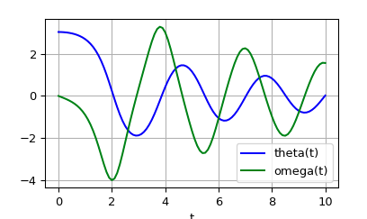
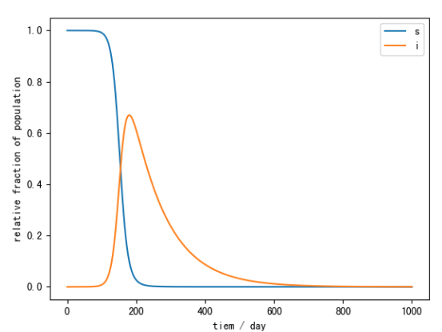

# 计算微分方程

使用scipy的integrate函数


odeint用于计算偏微分方程:

输入

```
sol = odeint(func, y0, c, args=(b, c))
```

其中`func`为函数

```
def fim(y, x, b, c)
```

x为自变量,y为因变量, bc是常数


例子:

- 二阶方程

$$
\theta''(t) + b\theta'(t) + c\sin(\theta(t)) = 0
$$

变换为一阶多元函数
$$
\left\{
        {\theta'(t) = \omega(t) \atop
        \omega'(t) = -b\omega(t) - c\sin(\theta(t))}
	\right.
$$


```python
def pend(y, t, b, c):
    theta, omega = y
    dydt = [omega, -b*omega - c*np.sin(theta)]
  	return dydt

y0 = [np.pi - 0.1, 0.0]#定义初始值
t = np.linspace(0, 10, 101) #变量的上下区间和微分单元
b = 0.25#常数项
c = 5.0
sol = odeint(pend, y0, t, args=(b, c))
```

result:



- 多元一介方程
  $$
  \frac{ds}{dt} = -R0(s(t), i(t))s(t)i(t),\\
  \frac{di}{dt} = R0(s(t), i(t))s(t)i(t) - i(t),
  $$
  

```python
y0 = [s, i]

    def func(y, t):
        s, i = y
        dsdt = -R0(s,i) * s * i
        didt = (R0(s, i) * s * i) - i
        dydt = [dsdt, didt]
        return dydt

    t_ode = np.linspace(0, t, n)
    sol = integrate.odeint(func, y0, t_ode)
```

result:




```
import numpy as np
import matplotlib.pyplot as plt
from scipy import integrate


def R0(s):
    '''define the simple R0(s) function'''
    return s*(s-1)+0.5

def gen_R0(s, i):
    '''define the general R0(s,i) function'''
    return (s*(s-1)+0.5 )*(1-i) + i * (0.5-0.5*s)

def recovery(s, R0, n=1001):
    eps = 1e-9
    s = np.linspace(s, 1, n)
    func = 1/(s*R0(s)+eps)
    r = integrate.simps(func, s)
    
    return r

def s_inf(R0, s_guess,iterations=30, n=1001):
    """[find the root of the i(s) function by using Netwon Method]

    Args:
        R0 ([function]): [the model of repopulation]
        s_guess ([float]): [description]
        iterations (int, optional): [description]. Defaults to 30.
        n (int, optional): [description]. Defaults to 101.

    Returns:
        [s]: [description]
    """    
    s = s_guess
    ds = 1e-5
    s_rcd = []
    s_line = np.linspace(1e-6,1e-4,n)
    f_line = 1 - s_line - recovery(s_line, R0)
    plt.plot(f_line)
    plt.savefig('f_line')
    plt.close()


    for i in range(iterations):
        f = 1 - s - recovery(s, R0, n)
        rds = (recovery(s+ds, R0, n)-recovery(s-ds, R0, n))/(2*ds)
        df = -1 - rds
        s -= f / df

        s_rcd.append(f)
    return s


def infection_max(R0, s_guess, ds=1e-3, iterations=30):
    '''find the max number of the infection function by using Netwon Method'''
    s = s_guess
    ds = 1e-4
    for i in range(iterations):
        f = s * R0(s) - 1
        Rds = (R0(s+ds) - R0(s-ds))/(2*ds)
        df = R0(s) + s * Rds
        s -= f / df 
    max_i = 1 - s - recovery(s, R0)
    di = ((1 - (s+ds) - recovery(s+ds, R0)) - (1 - (s-ds) - recovery(s-ds, R0))) / (2*ds)
    return s, max_i

def SIRModel(t:np.array, R0, i0=1e-6,  n=1001):

    s = 1 - i0
    i = i0

    y0 = [s, i]

    def func(y, t):
        s, i = y
        dsdt = -R0(s,i) * s * i
        didt = (R0(s, i) * s * i) - i
        dydt = [dsdt, didt]
        return dydt

    t_ode = np.linspace(0, t, n)
    sol = integrate.odeint(func, y0, t_ode)

    #plot teh result
    s = sol[:,0]
    i = sol[:,1]
    
    plt.plot(s)
    plt.plot(i)
    plt.legend(['s','i'])
    plt.xlabel('tiem / day')
    plt.ylabel('relative fraction of population')
    plt.savefig('odeint')
    
    return s, i


if __name__ == '__main__':
    t = 10 #month
    s_guess = 0.01
    s = s_inf(R0, s_guess) #calculate the final susceptible fraction of population
    s, max_i = infection_max(R0, s_guess)#calculate the peak infected fraction of population
    SIRModel(t, gen_R0) #dynamtic model
    
```

