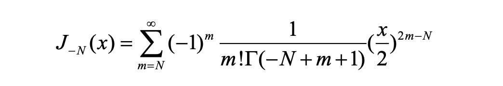

## 求解思路

主要结合了优化方程和矩阵求解的方法；

对于方程有$A_n,B_n,C_n,\gamma, n={1,2,3}$, 共13个变量，其中，A等可以用矩阵公式表示出来，$\gamma$在函数中，因此使用优化方式求解。具体函数表示为如下：

由于$\tilde \sigma_{yy}$的边界条件最简单$r=a, \theta=-\frac{\pi}{2}, z=0$, 因此将其作为优化主函数$f_0$, 其他函数作为约束函数f=0。
$$
\min_\gamma f_0 = ||\tilde \sigma_{yy}||^2\\
s.t. f_n(A,B,C,\gamma) = 0
$$
其中$f_0$为约束方程。

随后用假设迭代算法求解，首先假设$\gamma$变量固定，通过求解$f_n$的得到对应的A，B，C，再通过$f_0$更新$\gamma$的取值，如此迭代直到解收敛。

**以下讨论$f_0$的设计：**

1. 针对$z, \sigma, r$的离散化， 由于要符合边界条件，目前的思路是对几何物体设计控制点，将边界值进行离散化，等价几何意义如图所示，红点为部分控制点示意：

从而将一系列三角函数转化为固定的向量V：

$[\cos\theta_0sin\gamma z_0, \cos\theta_1sin\gamma z_0, ..., \cos\theta_N sin\gamma z_0, \cos\theta_N sin\gamma z_1, ..., \cos\theta_N sin\gamma z_N,]$

2. 在求$f_0$的时候将$\gamma$作为不变量，因此控制函数$f_n$展开如下：
   $$
   \tilde \sigma_{rr,  r\theta, rz} = 0, \\
   \tilde u_{r, \theta, z} = 0, \\
   \tilde \sigma_{xx, xy, xz} = 0, \\
   \tilde \sigma_{zz, rz, \theta z} = 0, \\
   $$
   

可以转化为矩阵形式：
$$
VA(\gamma)X=\bf{0}
$$
其中V为上面提到的三角函数的离散化矩阵，A为线性表示的参数矩阵，X为代求向量$A_n,B_n,C_n$，从而可以将求ABC变为求矩阵$\hat A=VA(\gamma)$的非零齐次解。

举个具体的例子：

对于
$$
\tilde\sigma_zz = 0, c=c/2, r\geq R, 0\leq\theta\leq2\pi
$$

计算公式如下，我们要求在给定r，$\theta$范围内的值为0

首先给定一个角度$\theta_0$和半径$r_0$， 转化为矩阵形式：
$$
\bf{VAX}=\left[
\begin{matrix}
\cos \theta_0 \cos\gamma z    \\
\cos \theta_0 \sin\gamma z	\\
\sin \theta_0 \cos\gamma z	 \\
\sin \theta_0 \sin\gamma z
\end{matrix}
\right]^T
\left[
\begin{matrix}
\lambda \alpha_{31}-2\mu\gamma^2\alpha_{32} &	-2\mu\gamma\alpha_{33}  & 0 & 0 &  0  & 0 & 0  &0 \\
0 & 0 & \lambda \alpha_{31}-2\mu\gamma^2\alpha_{32} &	2\mu\gamma\alpha_{33}  &  0  & 0 & 0  &0  \\
0 & 0 &  0  & 0&\lambda \alpha_{31}-2\mu\gamma^2\alpha_{32} &	-2\mu\gamma\alpha_{33}  & 0  &0\\
 0 & 0 &  0  & 0 & 0& 0&\lambda \alpha_{31}-2\mu\gamma^2\alpha_{32} &	2\mu\gamma\alpha_{33}   
\end{matrix}
\right]
\left[
\begin{matrix}
A_1	    \\
C_2   \\
A_3	\\
C_1\\
A_3\\
C_4\\
A_4\\C_3
\end{matrix}
\right] = 0
$$
由多个角度和半径的矩阵形式为：
$$
\bf{V_NA_NX}=\left[
\begin{matrix}
\cos \theta_0 \cos\gamma z & \cos \theta_1 \cos\gamma z & ...& \cos \theta_N \cos\gamma z \\
\cos \theta_0 \sin\gamma z & \cos \theta_1 \cos\gamma z & ...& \cos \theta_N \cos\gamma z \\
\sin \theta_0 \cos\gamma z	& \cos \theta_1 \cos\gamma z & ...& \cos \theta_N \cos\gamma z  \\
\sin \theta_0 \sin\gamma z & \cos \theta_1 \cos\gamma z & ...& \cos \theta_N \cos\gamma z 
\end{matrix}
\right]^T
\left[
\begin{matrix}
\lambda \alpha_{31}(r_1)-2\mu\gamma^2\alpha_{32}(r_1) &	-2\mu\gamma\alpha_{33}(r_1)  &...&& \\
&...\\
...&\lambda \alpha_{31}(r_1)-2\mu\gamma^2\alpha_{32} (r_1)&	2\mu\gamma\alpha_{33}(r_1) \\
&...\\
&...\\
\lambda \alpha_{31}(r_N)-2\mu\gamma^2\alpha_{32}(r_N) &	-2\mu\gamma\alpha_{33}(r_N)  &...&& \\
&...\\
...&\lambda \alpha_{31}(r_N)-2\mu\gamma^2\alpha_{32} (r_N)&	2\mu\gamma\alpha_{33}(r_N) \\
\end{matrix}
\right]
\left[
\begin{matrix}
A_1	    \\
C_2   \\
A_3	\\
C_1\\
A_3\\
C_4\\
A_4\\C_3
\end{matrix}
\right] = {\bf0}_{N^2\times1}\\
$$
将左边两个矩阵直接求解得到参数矩阵$\hat A\in R^{N^2x12}$, 并对$X\in R^{12\times1}$进行补零和排序得到：
$$
\hat AX = \hat A(\gamma,r=[0,...,N],\theta=[0, ...,2\pi/N])  \cdot [ A_1, A_2,A_3, B_1,B_2,...,C_3] ^T= 0_{N^2 \times 1}
$$
从而将问题变为求矩阵$\hat A$的非零齐次解。

**最终对12个求解方程进行以上的矩阵形式转变得到统一的矩阵求解，将约束$f_n$转化为求$\hat A_{12}$的非零齐次解。**

## 修正bessel函数

