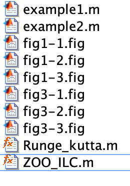
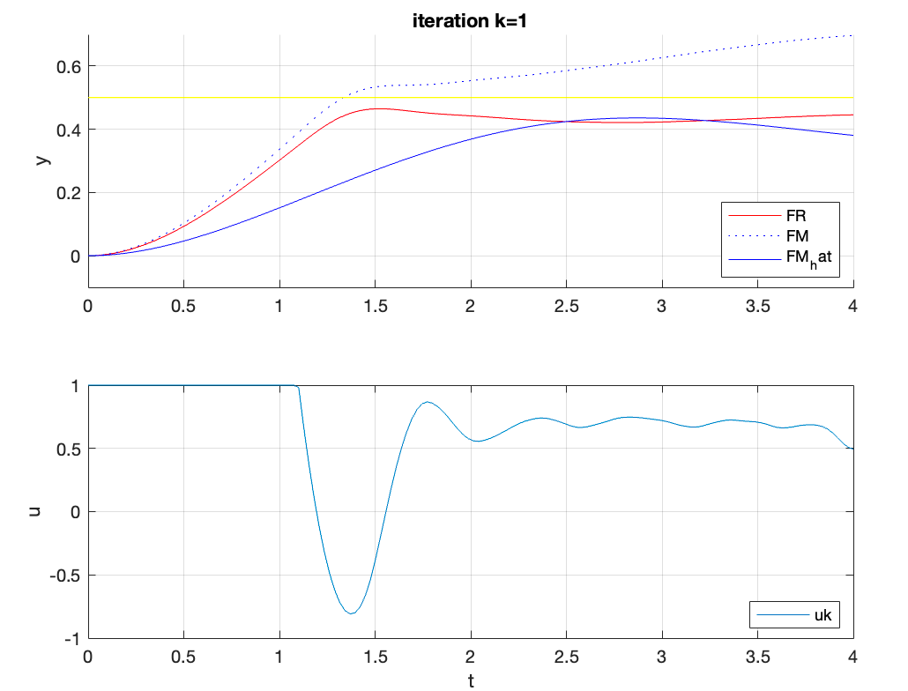

# 使用零阶优化的控制算法

## 文件说明



ZOO_ILC.m： 封装的零阶优化器

Runge_kutta.m：封装的微分方程求解器

example1/2.m：论文中的两个例子实现

fig*.m ：论文的各种图片复现


## ZOO_ILC使用和方程规范

### 语法

___

```
[uk_rcd, theta_rcd] =  ZOO_ILC(FM, FR, H, cost_fun, u_init, K, options)
[uk_rcd, theta_rcd] =  ZOO_ILC(FM, FR, H, cost_fun, u_init, K)
```

### 说明

___

ZOO_ILC用于求解论文设计的优化问题，并以迭代的形式优化输入的控制变量$u$：
$$
\arg \min_{u,y} \phi(u,y)\\
\begin{array}{rl}
s.t. & y=\hat F_M(u;,u_k,y_k),\\
     &H(u,y)<0
\end{array}
$$
根据论文的设计，优化器中的优化变量整合为$w=[u,y]$

### 输入参数说明

___

- FM - nominal model的方程，对应论文中的$y = F_M(u)$

  输入函数规定输入为1xM的向量$u$，输出1xN的向量$y$。

  ```
  function y = nominal_model(u)
      ...
  end
  ```

  

- FR - real model的方程，对应论文中的$y = F_R(u)$

  输入函数规定输入为1xM的向量$u$，输出1xN的向量$y$。

  ```
  function y = real_model(u)
      ...
  end
  ```


- H - 不等式约束$H(u,y)\leq 0 $

  函数规定输入包含了输入控制变量u和系统输出变量y，输出output为小于0的约束目标。

  ```
  function output = myH(u, y)
      output = 10 - y;
  end
  ```

- cost_fun - 目标函数， 输入为整合了控制变量$u$和$y$的向量$w=[u,y]$， 输出为1x1标量opt。

  ```
  function opt = cost_fun(w)
      % w = [u , y]
      N = length(u)
      u = w(1:N);
      y = w(N+1:end);
      opt = f(u,y)
  end
  ```

- u_init - 初始化的控制变量$u_0$

- K - 算法迭代次数iteration

- options（可选）- 有关优化器的选项，用于显示优化器的迭代信息和选择的优化梯度算法。常用的非线性约束优化算法一般使用fmincon作为求解器，其中的变量更新算法默认使用内点法（interior-point）。在变量维度较大的时候（如问题2），则建议使用sqp等算法。

  ```
  options = optimoptions('fmincon','Display','off','Algorithm','interior-point');
  ```

  


## Runge Kutta算法

在运动控制模型中，将运动系统建模成高阶微分方程，并使用离散的方法更新因变量。自己写的Runge Kutta算法可以加入独立变量，比使用插值的官方代码ode45要好用。

输入变量

1. dyfun：ode函数
2. x0：自变量的初始值
3. y0: 因变量的列表
4. delta： 差分间隔
5. iters：迭代次数
6. independ_var：独立变量（如果没有可以不加）

```
function [x_rcd, y_rcd] = Runge_kutta(dyfun, x0, y0, delta, iters, independ_var)
    if nargin == 5
        independ_var = [];
    end
    x = x0;
    y= y0;
    ynum = length(y0);
    x_rcd = zeros(iters, 1); y_rcd = zeros(iters, ynum);
    for i=1:iters
        x_rcd(i) = x;
        y_rcd(i,1:ynum) = y(1:ynum);
        if ~isempty(independ_var)
            y = [y(1:ynum), independ_var(i)];
        end
        dy1 = delta * dyfun(x,y);
        dy2 = delta * dyfun(x+delta/2, y+dy1/2);
        dy3 = delta * dyfun(x+delta/2, y+dy2/2);
        dy4 = delta * dyfun(x+delta, y+dy3);    
        y = y + (dy1 + 2*dy2 + 2*dy3 + dy4) / 6;
        x = x + delta;
    end
end
```


### ODE函数规范

---

使用4阶Runge Kutta时，需要自定义ode函数，输入为自变量t和因变量的列表$y_s=[y, y', y''...]$

输出的结果是微分列表 $dy = [dy, dy', dy''..]$

常规例子

```
function dy = throw_ode(t, ys)
    %t = [t];
    %ys = [px,py,vx,vy];
    vx=ys(3); vy=ys(4);
    global g CD m wx wy 
    px_dot = vx;
    py_dot = vy;
    vx_dot = -CD/m * sqrt((vx-wx)^2+(vy-wy)^2) * (vx-wx);
    vy_dot = -g -CD/m * sqrt((vx-wx)^2+(vy-wy)^2) * (vy-wy);
    dy = [px_dot, py_dot, vx_dot, vy_dot];
end
```

带有自变量u的例子，需要在输入变量列表中加入u，此时在输出的微分列表中u随时间的变化为0，即du=0。

```
function dy = nominal_ode(t, y)
    %t = [t];
    %y = [y,y_dot,y_dot_dot, u];
    y_dot = y(2);
    u = y(3);
    y_dot_dot = u - y(1) - y_dot;
    dy = [y_dot, y_dot_dot, 0]; %du=0
end
```


## 优化算法的选择

在问题2中将运动控制建模成非线性约束优化问题


求解的时候由于变量是一系列的u(t)，因此求解空间很大，用默认的梯度算法（内点法）效果很差，和论文上显示的不一样。因此针对问题2使用sqp算法。


问题1的求解变量较少，使用内点法可以得到较好的效果。在使用$L_{\infin}$范式做约束时，由于计算机离散精度问题，容易陷入局部最优解，此时需要使用精度更高的迭代次数。


## 复现结果对比

### 问题一

---

优化的向量$u=[u1, u2]$

在实现中优化变量维度较小，且可行域较大，结合实际可以使用快速收敛的内点法进行迭代更新。

针对三种范数进行分析，发现$L_\infin$	约束效果最好。结果如图所示：


复现结果接近论文所示结果。但由于制图需要计算FR=10的边界，FR的真值难以计算，在代码中是使用离散求根方法计算可行域的边界，需要较长时间，且可以看到在一些部分边界线会出现不平滑的现象。特别是在Linf范数中，边角上的误差会增大。


suboptimality和upper bound分析，结果列表如下：

absolute suboptimality, absolute upper bound, relative suboptimal, relative upper bound
L1:   0.040	,  0.003	, 0.21%	, 0.02%

L2：2.166	,  0.008	, 1.20%	, 0.00%

Linf： 0.137	,  0.001	, 1.43%	, 0.01%

列表结果和论文中的table1上有少量的偏差，这是由于代码实现所选择的封装优化器和优化器参数不同导致的。但是论文和复现的结果都可以看出，算法的收敛性都比较好。


### 问题二

---

由于问题的输入控制变量维度较高$u \in R^{150}$，而且因变量y和u的维度较高，而非线性可行域约束$y =\hat F_M(u)$的限制较大，表现为高维度空间的低维嵌入流型，使用内点法容易出现变量不在可行域上的情况，从而导致无法优化更新结果。因此测试使用active-set和sqp更新算法才可以有效优化问题。




在图中可以看出，更新迭代K次的效果比论文展示的要差一些，到k=3之后才会有较好的优化结果。有可能是因为初始值设置的原因，优化变量u的更新速度相较于论文展示的要更慢和缓和，估计论文使用了其他的更新算法，但是没有写出来。

在迭代次数K=5后，结果已经接近真实值。

