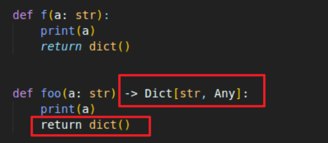

# PyLance

微软的新语言服务器

 Pylance的主要功能包括：自动导入、类型检查诊断、类型信息、多根工作区支持。

颜色方便更加清晰，支持torch的大部分库

 https://zhuanlan.zhihu.com/p/154108630

 目前还是preview，需要等一段时间

## 类型提示（type hint) 出现错误的情况

在定义函数类型的时候设置返回值类型提示时，后续代码pylance颜色高亮会失效。

- 解决方案：

将"python for vscode"插件删除就可以了。

应该是python for vscode 和python相互冲突了。

> 类型提示会存储在函数的 `__annotations__` 属性中。

