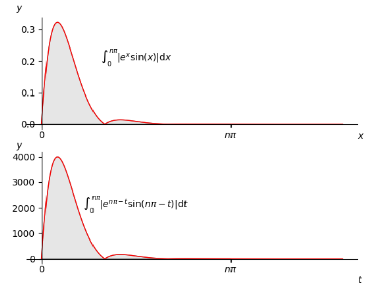

# 绘制积分函数的阴影部分


- 用matplotlib 的 Polygon类
- 设置坐标轴位于零点
- 用公式显示




```python
import numpy as np
import matplotlib.pyplot as plt
from matplotlib.patches import Polygon

def func(x):
    return np.abs(np.exp(-x) * np.sin(x) )

def func2(t,npi):
    return np.abs(np.exp(npi-t) * np.sin(npi-t) )

n = 3
x_bottom, x_top = 0,15
num = 1000
a, b = 0, n*np.pi  # integral limits
x = np.linspace(x_bottom, x_top,num)
y = func(x)

fig, axs = plt.subplots(2,1)

ax = axs[0]
ax.plot(x, y, 'r', linewidth=1)
# Make the shaded region
ix = np.linspace(a, b, num)
iy = func(ix)
verts = [(a, 0), *zip(ix, iy), (b, 0)]
poly = Polygon(verts, facecolor='0.9', edgecolor='0.5')
ax.add_patch(poly)

ax.text(0.5 * (a + b), 0.2, r"$\int_0^{n\pi} |e^x \sin(x)|\mathrm{d}x$",horizontalalignment='center', fontsize=10)
fig.text(0.9, 0.5, '$x$')
fig.text(0.1, 0.9, '$y$')

ax.spines['left'].set_position('zero') #set the axis to 0.0
ax.spines['bottom'].set_position('zero')
ax.spines['right'].set_visible(False)
ax.spines['top'].set_visible(False)
ax.xaxis.set_ticks_position('bottom')

ax.set_xticks((a, b))
ax.set_xticklabels(('$0$', '$n \pi$'))
# ax.set_yticks([])

y = func2(x, n*np.pi)
ax = axs[1]
ax.plot(x, y, 'r', linewidth=1)
# Make the shaded region
ix = np.linspace(a, b, num)
iy = func2(ix, n*np.pi)
verts = [(a, 0), *zip(ix, iy), (b, 0)]
poly = Polygon(verts, facecolor='0.9', edgecolor='0.5')
ax.add_patch(poly)

ax.text(0.5 * (a + b), 2000, r"$\int_0^{n\pi} |e^{n\pi-t}\sin(n\pi-t)|\mathrm{d}t$",horizontalalignment='center', fontsize=10)
fig.text(0.9, 0.05, '$t$')
fig.text(0.1, 0.47, '$y$')

ax.spines['left'].set_position('zero') #set the axis to 0.0
ax.spines['bottom'].set_position('zero')
ax.spines['right'].set_visible(False)
ax.spines['top'].set_visible(False)
ax.xaxis.set_ticks_position('bottom')

ax.set_xticks((a, b))
ax.set_xticklabels(('$0$', '$n \pi$'))
# ax.set_yticks([])

plt.savefig('demo')
```

