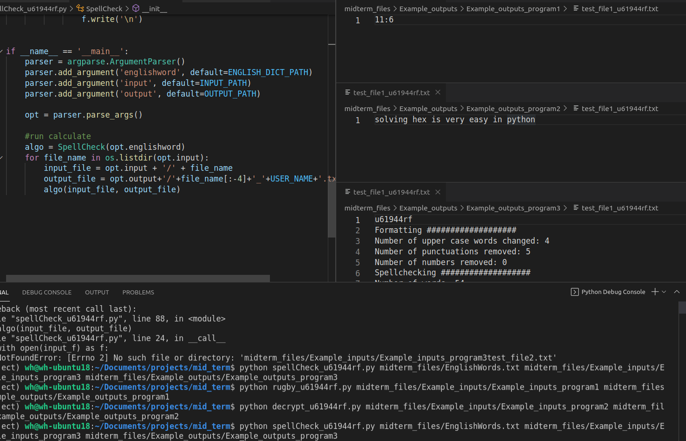

# Path拆分路径&合并路径

**拆分路径**:用"/"拆分路径

`path.split("/") `

 

**合并路径**: 用"/"作为分隔符合并list的路径

`"/".join(list) `

 

示例：截取后三段的路径

```python
src = "par1/par2/par3/file.png"
src_split = src.split("/") [-3:]
# \>>> src_split="par2/par3/file.png"
src_cat = "/".join(src_split)
```




