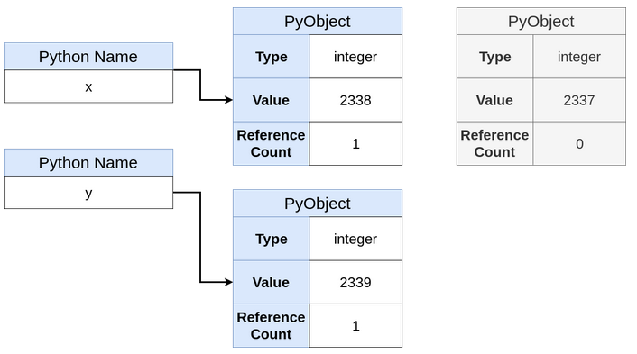

## Immutable vs Mutable Objects

In Python, there are two types of objects:

1. **Immutable objects** can’t be changed.
2. **Mutable objects** can be changed.

Understanding this difference is the first key to navigating the  landscape of pointers in Python. Here’s a breakdown of common types and  whether or not they are mutable or immutable:

| Type        | Immutable? |
| ----------- | ---------- |
| `int`       | Yes        |
| `float`     | Yes        |
| `bool`      | Yes        |
| `complex`   | Yes        |
| `tuple`     | Yes        |
| `frozenset` | Yes        |
| `str`       | Yes        |
| `list`      | No         |
| `set`       | No         |
| `dict`      | No         |

1. **`id()`** returns the object’s memory address.
2. **`is`** returns `True` if and only if two objects have the same memory address.

https://realpython.com/pointers-in-python/#why-doesnt-python-have-pointers

总结:

1. python的变量分为mutable和immutable, mutable可以改变对象中的value, immutable不能改变对象中的值.
2. python的name指向python对象.若改变name的值,若name指向immutable对象,则name指向新的值的对象;若name指向mutable对象,这name指向的对象可以改变包含的值.