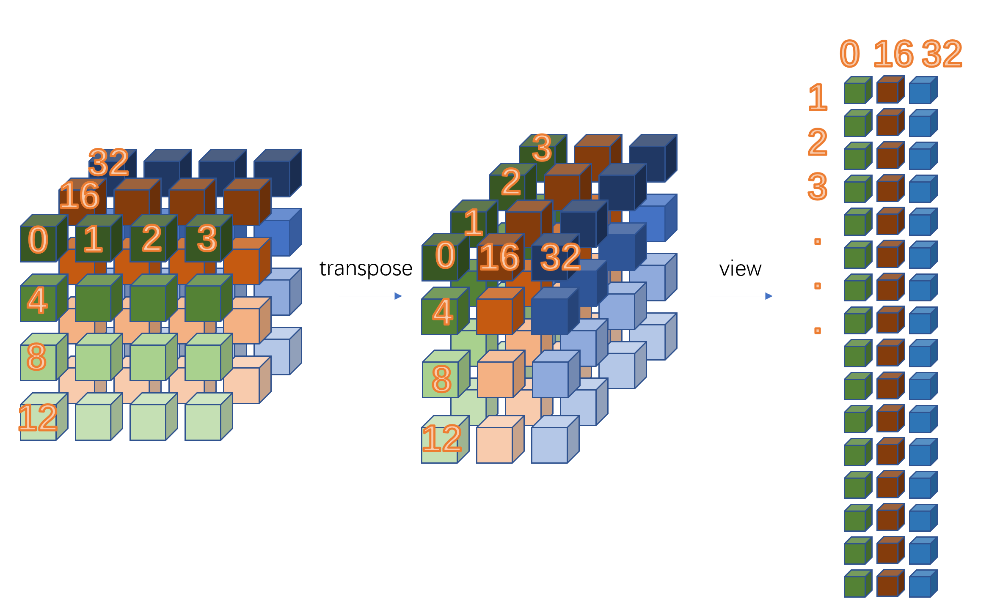
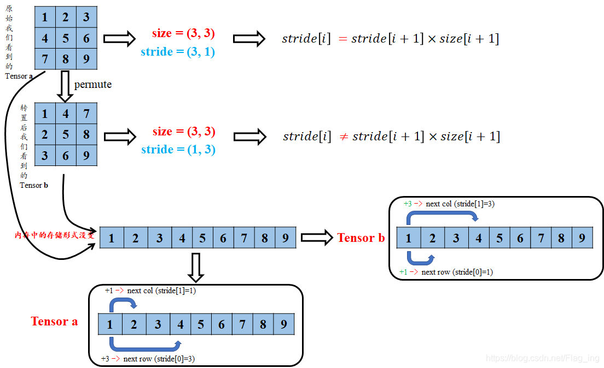

# 操作tersor的维度

## Tensor.permute()

可以处理任意多维度

```python
x = torch.randn(2, 3, 5) #x.shape=(2,3,5)
y = x.permute(2, 0, 1)# y.shape=(5,2,3)
```

## Tensor.transpose()

只能处理二维张量

可以连续进行多次transpose()

```python
torch.randn(2,3,4,5).transpose(3,0).transpose(2,1).transpose(3,2)# shape=(5,4,2,3)
```

**permute相当于可以同时操作于tensor的若干维度，transpose只能同时作用于tensor的两个维度；**


### permute函数与contiguous、view函数之关联


**contiguous**：view只能作用在contiguous的variable上，如果在view之前调用了transpose、permute等，就需要调用contiguous()来返回一个contiguous copy；

```python
x = torch.ones(10, 10) 
x.is_contiguous()  # True 
x.transpose(0, 1).is_contiguous()  # False
x.transpose(0, 1).contiguous().is_contiguous() # True
```


permute 和 transpose都是内存不连续的， 而且都是共享内存

```python
x = torch.arange(6).reshape(2,3) 
x_tr = x.transpose(1,0) 
x_pe = x.permute(1,0)

x.is_contiguous() #True
x_tr.is_contiguous() #False
x_pe.is_contiguous() #False
```


在转置后进行contiguous()得到的是新的拷贝张量

```python
x = torch.arange(6).reshape(2,3)
x_tr = x.transpose(1,0).contiguous()
x_pe = x.permute(1,0).contiguous()

x.is_contiguous() #True
x_tr.is_contiguous() #True，并且独立内存
x_pe.is_contiguous() #True，并且独立内存
```


## 张量的连续性

**A tensor whose values are laid out in the storage starting from the rightmost dimension onward (that is, moving along rows for a 2D tensor) is defined as `contiguous`.** [Contiguous tensors](https://stackoverflow.com/a/67021086/9067615) are convenient because we can visit them efficiently in order without jumping around in the storage (improving data locality improves performance because of the way memory access works on modern CPUs). This advantage of course depends on the way algorithms visit.

地址顺序由最右边的维度开始计算




It’s a flag indicating, if the memory is contiguously stored or not.
Let use an example to see, how we can get a non-contiguous tensor.

```python
# Create a tensor of shape [4, 3]
x = torch.arange(12).view(4, 3)
print(x, x.stride())
> tensor([[ 0,  1,  2],
        [ 3,  4,  5],
        [ 6,  7,  8],
        [ 9, 10, 11]]) 
> (3, 1)
```

As you can see, the tensor has the desired shape.
The strides are also interesting in this case. They basically tell us, how many “steps” we skip in memory to move to the next position along a certain axis.
If we look at the strides, we see, that we would have to skip 3 values to go to the new row, while only 1 to go to the next column. That makes sense so far. The values are stored sequentially in memory, i.e. the memory cells should hold the data as `[0, 1, 2, 3, ..., 11]`.

Now lets transpose the tensor, and have again a look at the strides:

```python
y = x.t()
print(y, y.stride())
print(y.is_contiguous())
> tensor([[ 0,  3,  6,  9],
        [ 1,  4,  7, 10],
        [ 2,  5,  8, 11]]) 
> (1, 3)
> False
```

The print statement of the tensor yields the desired transposed view of `x`.
However, the strides are now swapped. In order to go to the next row, we only have to skip 1 value, while 3 to move to the next column.
This makes sense, if we recall the memory layout of the tensor:
`[0, 1, 2, 3, 4, ..., 11]`
In order to move to the next column (e.g. from `0` to `3`, we would have to skip 3 values.
The tensor is thus non-contiguous anymore!

That’s not really a problem for us, except, that some operations won’t work.
E.g. if we try to get a flattened view of `y`, we will run into a `RuntimeError`:

```python
try:
    y = y.view(-1)
except RuntimeError as e:
    print(e)
> invalid argument 2: view size is not compatible with input tensor's size and stride (at least one dimension spans across two contiguous subspaces). Call .contiguous() before .view().
```

So let’s call `.contiguous()` before the `view` call:

```python
y = y.contiguous()
print(y.stride())
> (4, 1)
y = y.view(-1)
```

Now the memory layout is contiguous once again (have a look at the strides) and the `view` works just fine.
I’m not completely sure, but I assume the `contiguous` call copies the memory to make it continuous again.

That being said, continuous arrays are necessary for some vectorized instructions to work. Also generally they should have some performance advantages, as the memory access pattern on modern CPUs will apparently be used in an optimal way, but I’m really not an expert on this topic, so take these last information with a grain of salt. !:wink:

https://discuss.pytorch.org/t/contigious-vs-non-contigious-tensor/30107/2


### view()和reshape()的区别

reshape方法更强大，可以认为`a.reshape = a.view() + a.contiguous().view()`。

在满足tensor连续性条件时，**a.reshape()**返回的结果与**a.view()**相同，否则返回的结果与**a.contiguous().view()**相同


==不满足连续性条件时view会报错的原因==：由于每个维度储存了对应的索引方式（stride），在单一维度中只能使用一样的stride。如果在一个维度中使用了不同的stride步长，就会报错。不同维度之间不需要连续，只需保证索引步长在该维度不变就可。

如图所示，第三个图view后第[0]维索引步长为1，第[1]维索引步长为16，则不需要保证“绝对”连续性条件。


查看步长

```
tensor.stride()
```

查看内存地址

```python
tensor.storage()#查看数据存放形式
 a.storage().data_ptr()#查看地址
```

