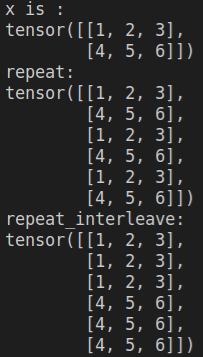

# exend(\*size)

# repeat(\*size)

 **expand**

对单个维度扩大为更大的尺寸

类似于*广播*（不分配新的内存）：也就是说，改变新增加的尺寸上的数值，实际上是改变了原本没有扩展之前对应的数值。只改变视图，==会导致内存不连续。并且扩展后的变量和原来的变量是共享内存的。==

 

改变扩展出来的位置上的数值会把原来的参照复制对象也改变

- 无法对没有定义的维度进行扩展
- 无法对原本长度的数值进行压缩 

以上两种操作都会引发报错：error:The expanded size must match the existing size at non-singleton(维度不为1) dimension

```
a = tensor([[1,2,3],[4,5,6]])
b = a.expand(2, -1)
#b=[1,2,3];
#  [1,2,3]
```


**repeat**

对张量进行对应位置上的扩展，**扩展后的张量在内存上是连续的**

张量在新的内存上，**不共享内存**

可以单独对指定索引位置数值进行改变。

```python
repeat(n_dim0,n_dim1,...,n_dimn) #每个维度都要输入倍数
```


###### repeat_interleave()



```python
repeat_interleave(n, dim)#n为复制数, dim为复制维度
```

沿着特定的维度重复这个张量，和`expand()`不同的是，`repeat()`**拷贝**张量的数据。

