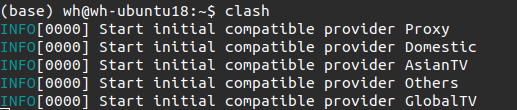
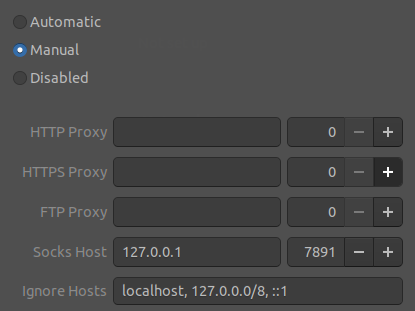
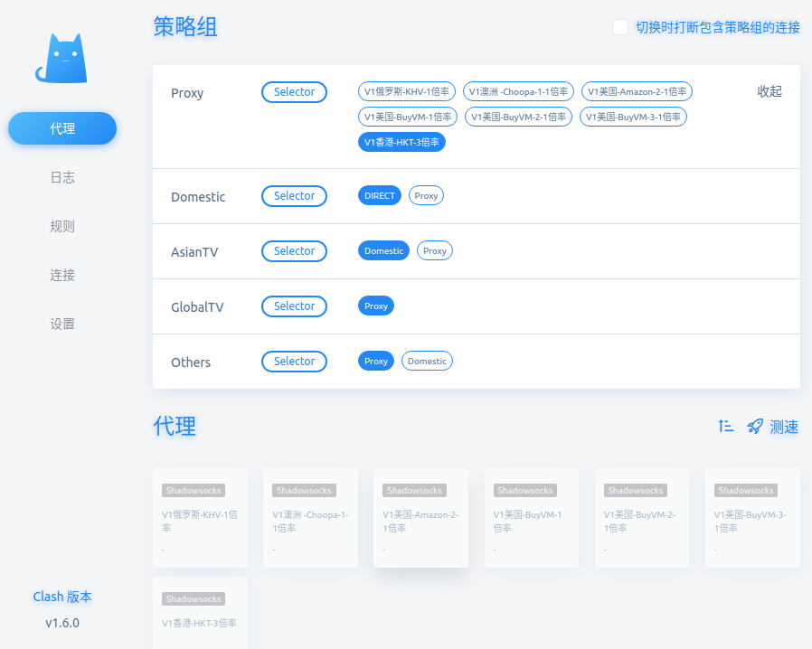

# 在实验室使用代理

## window系统使用代理

- <kbd>win</kbd>+<kbd>I</kbd>打开**设置**, 选择"网络和Internet" --> "代理" --> "手动设置代理"
- 输入地址: 90.0.0.21
- 端口 7890

  ## ubuntu系统使用代理

- 命令行配置代理

```
export http_proxy="http://90.0.0.21:7890"
export https_proxy="http://90.0.0.21:7890"
```

# 在ubuntu下配置VPN


## 前期准备

在windows上把clash配置文件导出来，点击Edit in text mode 另存命名为config.yml

## 软件安装

- 下载64位的amd64压缩包（因为我是64位系统）clash for linux下载地址：https://github.com/Dreamacro/clash/releases

- 下载到Downloads文件夹
- 解压文件

## 配置软件

- 创建配置文件夹路径

```
sudo mkdir ~/.config/clash
cd ~/Downloads #传输config文件的目录
sudo mv config.yml ~/.config/clash/config.yaml
sudo mv clash-linux-amd64 /usr/local/clash
sudo chmod a+x clash
```

- 配置快捷启动

```
cd /usr/local/bin
sudo ln -s /usr/local/clash clash
```


## 启动Clash

```
clash
```

成功启动显示如下




### 配置端口

- 打开config.yaml确定代理端口

```
sudo gedit ~/.config/clash/config.yaml
```

```
# SOCKS5 代理端口
socks-port: 7891
```

确定端口为7891

- 系统设置（settings）——网络(Network)——Nerwork Proix——Manual——把端口改成7891




### 选择代理节点

打开http://clash.razord.top/,界面显示可选择的代理节点

选择可用节点即可.





## question

有时候在ubuntu上无法连接网络，也打不开clash的配置页面，这时候说明连接被封掉了。

应该先关闭代理（proxy），然后打开配置页面http://clash.razord.top/，选择可以访问的节点，再打开代理。就可以上网了。


如果没有可以连接的节点，就要重新去飞机场更新可以使用的节点。
