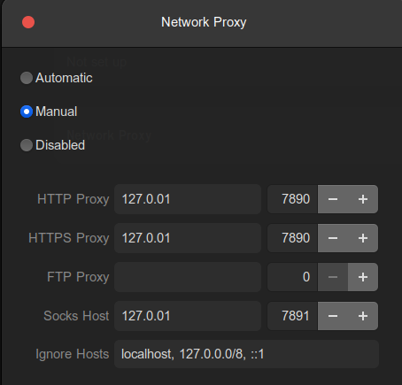

# 在实验室使用代理

## window系统使用代理

- <kbd>win</kbd>+<kbd>I</kbd>打开**设置**, 选择"网络和Internet" --> "代理" --> "手动设置代理"
- 输入地址: 90.0.0.21
- 端口 7890

## ubuntu系统使用代理

命令行配置代理

```
export http_proxy="http://90.0.0.21:7890"
export https_proxy="http://90.0.0.21:7890"
```

## MAC系统使用代理

打开设置-wifi-高级，如图所示，将三个打勾的选项中的web proxy server改成90.0.0.21（服务器内网地址）。（SOCKS Proxy的端口为7891）


# 在ubuntu下配置VPN


## 前期准备

在windows上把clash配置文件导出来，点击Edit in text mode 另存命名为config.yml

## 软件安装

- 下载64位的amd64压缩包（因为我是64位系统）clash for linux下载地址：https://github.com/Dreamacro/clash/releases

- 下载到Downloads文件夹
- 解压文件

## 配置软件

- 创建配置文件夹路径

```
sudo mkdir ~/.config/clash
cd ~/Downloads #传输config文件的目录
sudo mv config.yml ~/.config/clash/config.yaml
sudo mv clash-linux-amd64 /usr/local/clash
sudo chmod a+x clash
```

- 配置快捷启动

```
cd /usr/local/bin
sudo ln -s /usr/local/clash clash
```


## 启动Clash

```
clash
```

成功启动显示如下


### 配置端口

- 打开config.yaml确定代理端口

```
sudo gedit ~/.config/clash/config.yaml
```

```
# SOCKS5 代理端口
socks-port: 7891
```

确定SOCKS端口为7891

- 服务器系统设置（settings）——网络(Network)——Nerwork Proix——Manual——把端口改成7891



- 在命令行中输入：

```
export http_proxy="http://127.0.0.1:7890"
export https_proxy="http://127.0.0.1:7890"
```


### 选择代理节点

- 服务器本地：打开https://clash.razord.top/#/proxies，界面显示可选择的代理节点，进行测速并选择可用节点即可.


- 服务器远程控制：

  1. 需要在服务器下载远程交互的页面

  ```
  git clone -b gh-pages --depth 1 https://github.com/Dreamacro/clash-dashboard /home/wh/.config/clash/dashboard #/home/wh/.config/clash是放置clash的配置文件位置
  ```

  2. 修改配置文件`/home/wh/.config/clash/congif.yaml`，并重启clash

  ```
  # 在配置文件中修改或增加以下内容；
  external-controller: 0.0.0.0:9090 # 修改ip地址和端口；
  external-ui: /home/wh/.config/clash/dashboard # clash-dashboard的路径；
  ```

  3. 输入http://90.0.0.21:9090/ui/#/proxies进入远程控制界面。


## question

有时候在ubuntu上无法连接网络，也打不开clash的配置页面，这时候说明连接被封掉了。

- 应该先关闭代理（proxy），然后打开配置页面http://clash.razord.top/#/proxies，选择可以访问的节点，再打开代理。就可以上网了。

- 如果没有可以连接的节点，就要重新去飞机场更新可以使用的节点。


- 可以自定义代理，将config.yaml对应部分更换成以下部分即可（其他的不要动）。

```
proxies:
  # http
  - name: "spl in"
    type: http
    server: 90.0.0.179
    port: 7890

  - name: "spl school"
    type: http
    server: 115.156.95.129
    port: 17890


proxy-groups:
-
  name: Proxy
  type: select
  proxies:
    - spl in
    - spl school

```

https://docs.gtk.pw/contents/configfile.html#格式
