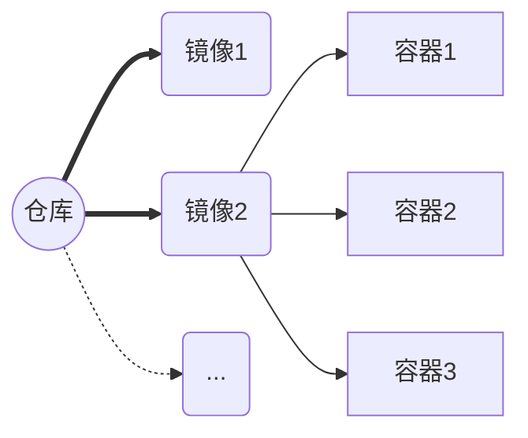
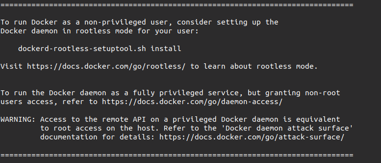

# **Docker使用说明**


# I. 架构介绍

在docker中包含镜像(Image), 容器(container),仓库(repository);

**容器**与**镜像**的关系类似于面向对象编程中的**对象**与**类**。

**仓库**用来保存镜像，可以理解为代码控制中的代码仓库。




# II. Docker安装与指令操作

## 2.1 使用国内源安装

### 2.1.1 安装Docker

```
curl -sSL https://get.daocloud.io/docker | sh
```

安装成功展示



### 安装支持库

1. 添加支持库路径

```
distribution=$(. /etc/os-release;echo $ID$VERSION_ID)
curl -s -L https://nvidia.github.io/nvidia-docker/gpgkey | sudo apt-key add -
curl -s -L https://nvidia.github.io/nvidia-docker/$distribution/nvidia-docker.list sudo tee /etc/apt/sources.list.d/nvidia-docker.list
```

2. 安装支持库

```
sudo apt-get update 
sudo apt-get install -y nvidia-container-toolkit
sudo systemctl restart docker
```


## 2.2 报错以及解决方案:

出现403 forbiddened, ubuntu系统的apt list没有更新

- 首先进行`apt-get update`,如果出现以下报错:

> The repository 'http:// archive.getdeb.net/ubuntu xenial-getdeb Release' does not have a Release file.

解决方案:

```
cd /etc/apt/sources.list.d
sudo vim getdeb.list
将里面的句子注释 ,保存再运行 sudo apt-get update 
```


## 2.3 查看指令选项
直接在命令方输入查看全部指令
```
user@ubuntu:~#docker
```

查看具体指令使用方式

```
user@ubuntu:~#docker stats --help
```


# III. 镜像

##  3.1 查看镜像内容
输入`docker images`显示镜像信息, 获得如下显示:

```
runoob@runoob:~$ docker images           
REPOSITORY          TAG                 IMAGE ID            CREATED             SIZE
ubuntu              14.04               90d5884b1ee0        5 days ago          188 MB
php                 5.6                 f40e9e0f10c8        9 days ago          444.8 MB
nginx               latest              6f8d099c3adc        12 days ago         182.7 MB
mysql               5.6                 f2e8d6c772c0        3 weeks ago         324.6 MB
httpd               latest              02ef73cf1bc0        3 weeks ago         194.4 MB
```

- `REPOSITORY`:镜像的仓库源
- `TAG`：镜像的标签,代表这个仓库源的不同个版本
- `IMAGE ID`：镜像ID
- `CREATED`：镜像创建时间
- `SIZE`：镜像大小


## 3.2 获取公开的镜像

### 3.2.1 在Docker Hub网站搜索公开的镜像

网址:  https://hub.docker.com/search?q=&type=image

### 3.2.2 使用命令搜索镜像

```
docker search xxx(搜索名称)
```

### 3.2.2 下载镜像

```
docker pull xxx(下载镜像的名称)
```


## 3.3. 创建镜像

如果需要自己创建镜像,有以下两种方式:

1. 从已经创建的容器中更新镜像，并且提交这个镜像
2. 使用 Dockerfile 指令来创建一个新的镜像

### 3.3.1 在已创建的容器中更新镜像

1. 更新镜像之前，我们需要使用镜像来创建一个容器。

```
 user@ubuntu:~$ docker run -t -i ubuntu:15.10 /bin/bash
 root@e218edb10161:/# 
```

- `-i`: 交互式操作

- `-t`: 终端

- `ubuntu:15.10`: 这是指用 ubuntu 15.10 (ImageNAME:TAG)版本镜像为基础来启动容器

- `/bin/bash`：放在镜像名后的是命令，这里我们希望有个交互式 Shell，因此用的是 /bin/bash

- `e218edb10161`: 为容器的ID(不是镜像ID)

  

2. 通过命令 `docker commit` 来提交容器副本创建新镜像`test/ubuntu:v2`

 ```
 docker commit -m="has update" -a="user" e218edb10161 test/ubuntu:v2
 ```

- `-m`: 提交的描述信息
- `-a`: 指定镜像作者
- `e218edb10161`：容器 ID
- `test/ubuntu:v2`: 指定要创建的目标镜像名

   

### 3.3.2 使用 Dockerfile 指令来创建镜像

1. 创建Dockerfile文件

```
FROM    Ubutnu:18.04
MAINTAINER      Fisher "fisher@sudops.com"

RUN     /bin/echo 'root:123456' |chpasswd
RUN     useradd cuser
RUN     /bin/echo 'cuser:123456' |chpasswd
RUN     /bin/echo -e "LANG=\"en_US.UTF-8\"" >/etc/default/local
EXPOSE  22
EXPOSE  80
CMD     /usr/sbin/sshd -D
```

- `FROM`:是使用的镜像源(ubuntu)
- `RUN`: 在镜像内执行的命令


2. 通过 `docker build` 命令构建镜像

```
docker build -t test/ubuntu:18.04 .dir/of/Dockerfile
```

- `-t` ：指定要创建的目标镜像名

- `.dir/of/Dockerfile` ：Dockerfile 文件所在目录，可以指定Dockerfile 的绝对路径

## 3.4 删除镜像

在不需要某个镜像的时候,使用命令删除对应镜像

```
user@ubuntu:~$ docker rmi xxx(镜像名称)
```

## 3.5 设置镜像TAG

使用 `docker tag` 命令，为镜像添加一个新的标签

```
docker tag 860c279d2fec user/ubuntu:newtag
```

- `860c279d2fec`: 镜像ID
- `user/ubuntu`: 镜像名
- `newtag`: 新标签

# IV. 容器

Docker 允许你在容器内运行应用程序， 使用 `docker run` 命令来在容器内运行一个应用程序,此时会从对应镜像创建一个新的容器,一个镜像只能最多创建128个容器.创建后的容器可以停止和重启, 如果需要删除容器,需要使用删除指令.

## 4.1 容器常用操作指令

- 启动容器并进入终端,此时会创建一个容器.

  ```
  docker run -it <镜像名称> /bin/bash
  ```

- 后台启动容器

  ```
  docker run -itd --name ubuntu-test <镜像名> /bin/bash
  ```

- 查看所有的容器

  ```
  docker ps -a
  ```

- 在容器终端中退出,但不停止容器

  ```
  root@ed09e4490c57:/# exit
  ```
- 进入后台运行的容器
  ```
  docker attach  <容器 ID> #exit退出会导致容器停止
  docker exec -it <容器 ID> /bin/bash #exit退出容器继续运行
  ```
- 停止容器
  ```
  docker stop <容器 ID>
  ```

- 重启容器

  ```
  docker restart <容器 ID>
  ```

- 删除容器

  ```
  docker rm -f <容器 ID>
  ```

## 4.2 容器与主机之间的数据拷贝

docker cp :用于容器与主机之间的数据拷贝

- 将主机/user/data目录拷贝到容器96f7f14e99ab的/data目录下.

  ```
  docker cp /user/data 96f7f14e99ab:/data/
  ```

- 将主机/user/data目录拷贝到容器96f7f14e99ab中，目录重命名为xxx.

  ```
  docker cp /user/data 96f7f14e99ab:/xxx
  ```

- 将容器96f7f14e99ab的/data目录拷贝到主机的/tmp目录中.

  ```
  docker cp  96f7f14e99ab:/data /tmp/
  ```

  


# V. 用户权限

给予用户使用docker的管理员权限

```
sudo usermod -aG docker xxx(username)
```

