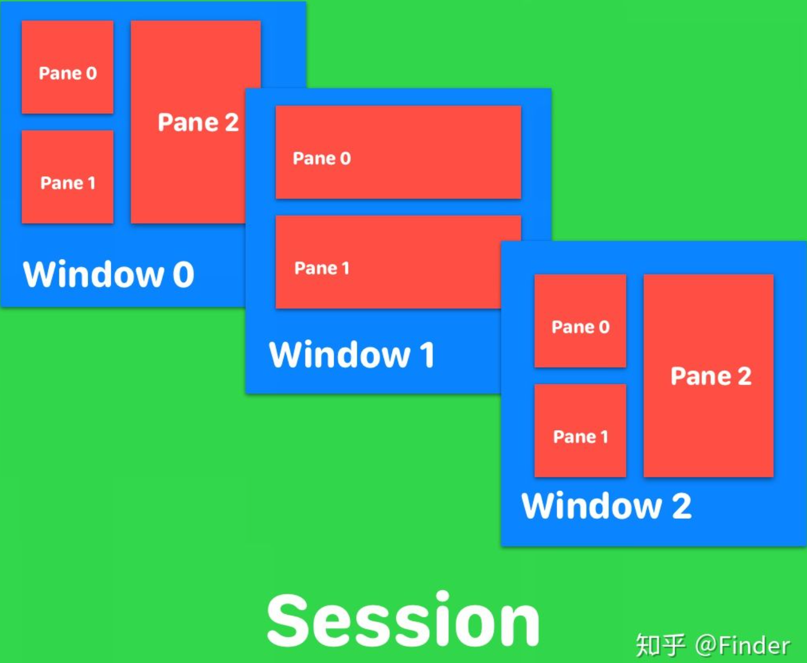

# tmux使用和配置

快捷键

```
<prefix> = crtl+B
```


| **pane** |                              |
| -------- | ---------------------------- |
| 左右分屏 | \<prefix\> + %               |
| 上下分屏 | \<prefix\> + “               |
| 切换窗口 | \<prefix\> + 方向键          |
| 删除pane | \<prefix\> + x   /    ctrl+d |


| **window**   |                |
| ------------ | -------------- |
| 创建window   | \<prefix\> + c |
| 重命名window | \<prefix\> + ,   |


| **session** |                     |
| ----------- | ------------------- |
| 创建session | \<prefix\> + 方向键 |
| 切换session | \<prefix\> + s      |


**首先安装**

```
sudo apt-get install tmux
```

 

1. open session

```
tmux new-session -s basic
```

 或者

```
tmux new -s basic
```

-s参数表示session名称，如果不加-s参数，那么Tmux默认会新建一个以数字(下标从0开始)命名的session，并默认打开一个window。打开一个session后，后续的所有控制Tmux本身的快捷键都需要加前缀，默认是 **Ctrl+b** ，以下把前缀按键称为Prefix。

2. detach session 

想要暂时离开Tmux，回到终端环境时，可以通过快捷键 **Prefix+d** (d for detach)。要注意的时，即使是detach的状态，Tmux中在运行的程序还会继续运行。想要回到Tmux session时，只需执行：

```
 tmux attach -t basic
```

-t参数可以指定要attach的session。

3. list session 

终端中执行 **tmux ls** (ls for list session)可以列出当前有多少个session。如果已经在session中，执行 **Prefix+s** (s for session)可以列出当前有多少个session，并且可通过上、下键选择要进入的session。

4. kill session 

要真正关闭一个session，可以在终端下执行命令 **tmux kill-session -t basic** ，其中-t参数表示session名称。


### window

如果说session是个不可见的东西，那么window就是我们输入、执行命令的地方。一个session可以包含多个window。把window类比成iTerm2中的标签应该就理解了。

1. 创建window 

在创建session的时候默认会创建一个以"数字下标+bash"命名的window，并且名称随着bash中执行的不同命令而变化。在新建session时可以通过-n参数指定默认打开的window名称，比如通过 **tmux new -s basic -n win** 命名一个win名称的window。也可以随时通过 **Prefix+,** 来修改window名称。

2. 切换window 

类似标签，我们可以通过一些快捷键在同一个session下的多个window之间切换。比如:

**Prefix+p** (p for previous)：切换到上一个window。 

**Prefix+n** (n for next): 切换到下一个window。 

**Prefix+0** : 切换到0号window，依次类推，1、2、3... 

**Prefix+w** (w for windows): 列出当前session所有window，通过上、下键可以选择切换到指定window。

3. 关闭window 

**Prefix+&** : 关闭当前window。

### pane 

一个window可以切割成多个pane，也就是所谓的分屏，算是Tmux的核心功能之一。

1. 分屏 

**Prefix+%** : 垂直分屏，用一条垂线把当前窗口分成左右两屏。 

**Prefix+"** : 水平分屏，用一条水平线把当前窗口分成上下两屏。

2. 切换pane 

默认情况下，被选中(激活状态下)的pane会被绿色边框高亮突显出来。 

**Prefix+o** : 依次切换当前窗口下的各个pane。 

**Prefix+Up|Down|Left|Right** : 根据按箭方向选择切换到某个pane。 

**Prefix+Space** (空格键): 对当前窗口下的所有pane重新排列布局，每按一次，换一种样式。 

**Prefix+z** : 最大化当前pane。再按一次后恢复。

3. 关闭pane 

**Prefix+x** : 关闭当前使用中的pane。

关于Tmux的三个核心概念(session、window和pane)及其基本用法已经介绍完毕。接下来的是一些个性化配置和奇技淫巧，包括重新绑定快捷键、自定义快捷键、UI样式、鼠标支持、复制粘贴等等，这些可配置的高级功能也是Tmux受人推崇的原因。Tmux配置文件推荐放在~/.tmux.conf文件中，避免某个用户修改配置影响到其他用户，修改配置文件后要经过reload操作才会在已打开session中生效。




## 关闭其他远程用户

在多个用户连接到同一个session中的时候，会出现窗口缩小的情况，所以需要远程中断其他用户的连接。


<kbd>Ctrl</kbd>+<kbd>B</kbd>+<kbd>Shift</kbd>+<kbd>D</kbd>

```
<prefix> + D #注意D要大写
```

选择要关闭的用户，<kbd>Enter</kbd>关闭对应连接。


