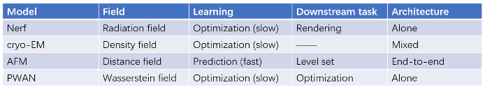

## Nerf

讨论：

基于优化的方法泛化性会不会更好？不一定，基于优化的方法可能速度更加慢。

有没有工作是基于在inference中做训练的，通过首先对大数据进行预训练，然后在inference中再自监督优化一下？

在测试的过程中把网络权重更新一遍。在测试时用minimize期望。这个想法其实就相当于预训练+自训练，新意其实不够。

可以使用field的思想去做nerf，

关注的点：用optimization变成prediction。如果你去找一个，要么就是说能够快速发现自身图像的性质，否则opt。

nerf的setting更重要的是图不够，是没有办法把field刻画的很好，怎么在sample不够的时候去prediction/optimize这个场。

nerf如果能够在在100个场景训练场景，希望能够在第101个新的场景做出来。（nerf的作者可能在做）用meta learning。可能只能用来设置初始值，用于加速。

