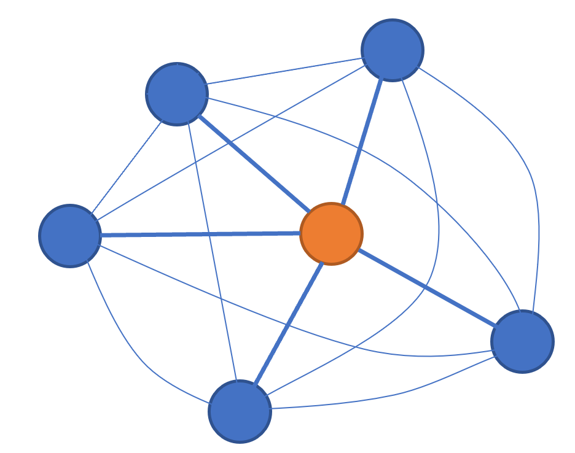
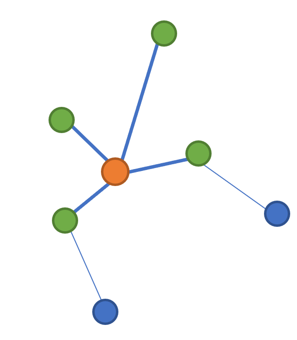
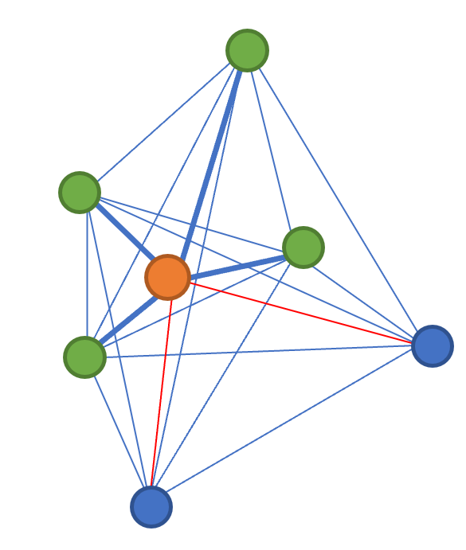

# 用于记录使用了注意力机制的各种工作

CAM(class activation map)

Learning Deep Features for Discriminative Localization CVPR16

> 一种可视化技术，通过线性加权和可视化分类CNN关注的区域

Grad-CAM

> 可视化CNN，visualized CNN predictions by highlighting 'important' pixels

这个好像也不是注意力机制

Transformer注意力机制用于NLP领域，超越了LSTM和RNN成为SOTA的常用模块。

在CV领域也得到了广泛的应用。

长期依赖性使得可以让网络学到全局的信息？

non-local机制

## Transformer为何强大

如何捕获特征的位置关系？

- RNN 是先来者先处理，通过**线性序列的方式**天然将位置信息编码进模型中
- CNN的卷积层保留了部分位置相对信息，通过**增加深度**，可以把周围的特征的位置信息编码。
- Transformer使用Self-attention将输入特征和任意特征进行连接，再集成入一个输出向量中，位置信息是没有编码进去的。**需要明确在输入端将位置信息编码。**

解决远距离依赖问题

- RNN需要靠隐层节点序列传播

- CNN需要增加网络深度来捕获远距离特征
- Self-attention令特征和其他任意特征都进行了连接，保证了所有的信息都能学习到。

图模型和Transformer的联系，改造的难点：

Tranformer是一种全连接的图：

难点：

Transformer虽然节点中一开始编码了位置信息，但在连接的时候仍然会受到噪声（远距离节点）的影响。

思考NLP和图像匹配的关系

语言是有逻辑的，具有较为明确的对应关系。

但是特征点之间的连接是比较任意的，仅仅是分布空间的变化就很难去匹配。

## 比较Attention的计算效率

对于图模型中，图中的节点大约200-300左右。常用的embedding size为128-512，因此self attention计算效率高于RNN和CNN。