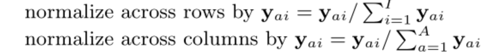
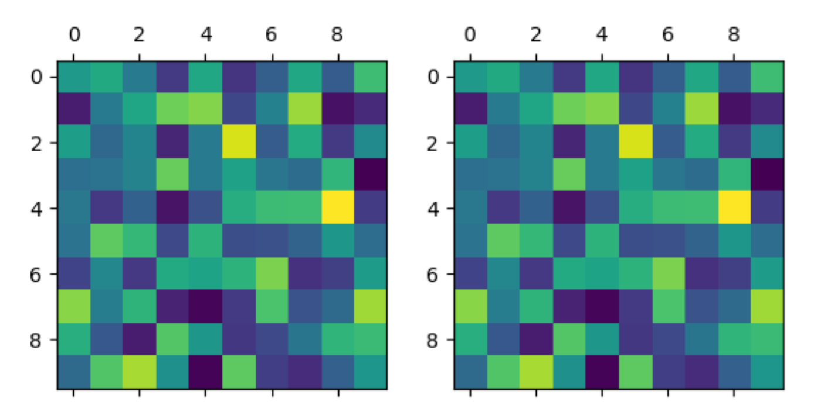
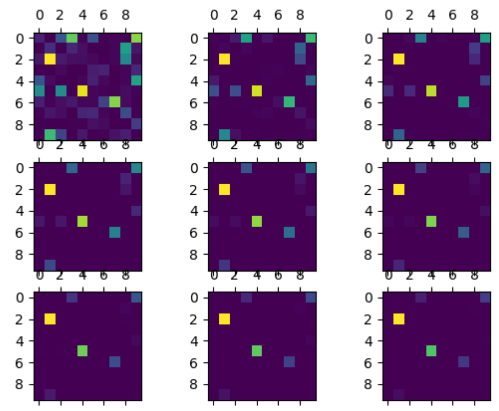
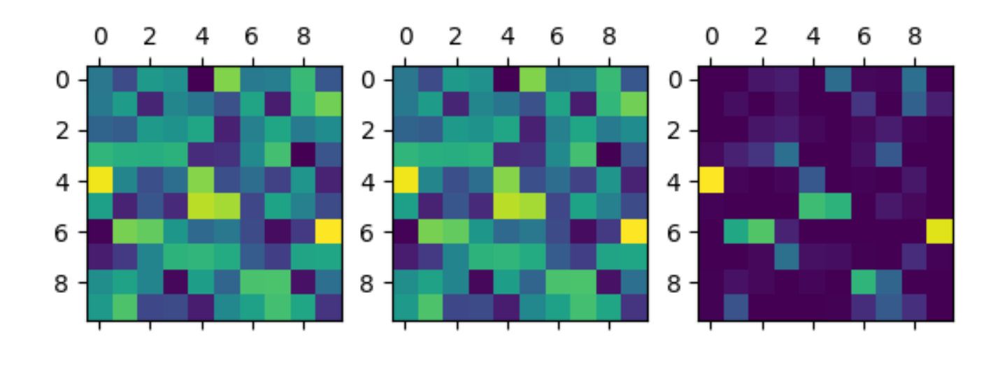
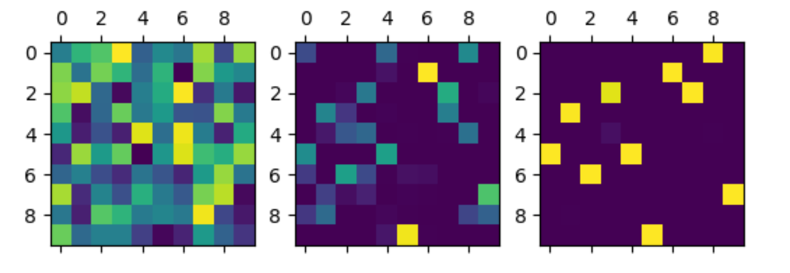
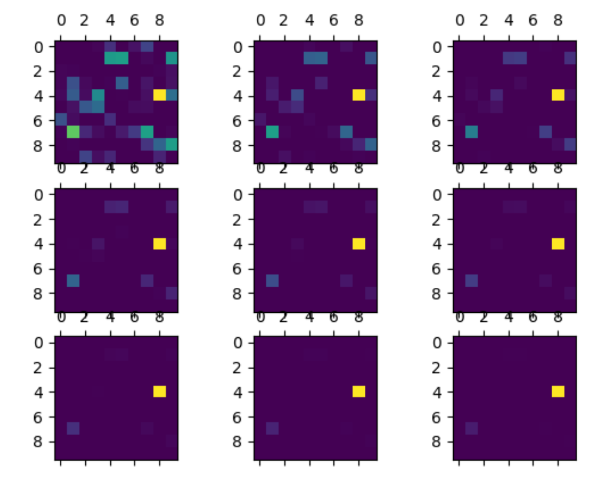

# 匈牙利算法 指派问题

Hungrian algorithm

Sinkhorn 


## Hungrian algorithm

问题描述：

对于$N$个对象要指派$M$个任务，对应的成本矩阵为$P=R^{N \times M}$，对每个确定的对象$i$，进行任务$j$的成本为$P_{ij}$，要令整体的成本最低。

**数学描述为求解最优化解：**

对于所有可能匹配对$P_v \in R^{n^2}$， 稀疏矩阵$W_a \in R^{nm \times nm}$
$$
\min_P P_v^\top W_aP_v
$$
等价问题：
$$
\min_P WP
$$


在图像匹配问题中的应用：

在特征匹配对建立匹配矩阵：要令整体匹配对集相似度最高，于是构建权重矩阵$W_{ij} = <d_i, d_j>$

相似度矩阵$P \propto D$


对于两张图像（源图像source$I_s$和目标图像target$I_t$），分别存在$N,M$个特征点，将其建立相似度矩阵$P \in \mathbb{R}^{N \times M}$。
$$
P = 
\left[
\begin{array}\
12 & 7 & 9 & 7 & 9 \\
8  & 9 & 6 & 6 & 6 \\
7  & 17& 12& 14& 9 \\
15 & 14& 6 & 6 &10 \\
4  & 10& 7 & 10& 9 \\
\end{array}
\right]
$$
其中$P_{ij}$代表在源图像的第$i$个特征点和目标图像第$j$个特征点的相似度。


指派问题在于矩阵中求解一一对应的的关系，即每一行每一列只有一个数值为1，其余为0：


指派矩阵的一个最重要的性质：

**系数矩阵的全行（列）加减任意值，得到的新矩阵和原矩阵的最优解相同**

求解思路：

先试着指派对象，利用等价变换增加选择的数量，直到得到合适的一对一指派。

**令最小值为0，在选择列让更多元素变为0，求解问题。**


求解步骤：

一、每一行减去最小的数,得到每行都有0的系数矩阵
$$
P = 
\left[
\begin{array}\
5&  0&  2&  0&  2 \\
2&  3&  0&  0&  0 \\
0& 10&  5&  7&  2 \\
9&  8&  0&  0&  4 \\
0&  6&  3&  6&  5 \\
\end{array}
\right]
$$


1. 指派规则（树形图），在矩阵大的时候计算量指数增加。
2. 算法：输入矩阵和行扫描优先级，对优先级最高的行开始扫描，确保所有的情况都能扫描得到（？）（开始的行不同，扫描的顺序不同）计算量：$O(n^3)$。如果存在最优解，指派结果可以不同，但是整体成本相同。  

2. 


## Sinkhorn

一种简单的迭代方法

保证了矩阵每一列的和，每一行的和都为1



2. 


```python
def compute_optimal_transport(M, r, c, lam, epsilon=1e-8):
    """
    Computes the optimal transport matrix and Slinkhorn distance using the
    Sinkhorn-Knopp algorithm

    Inputs:
        - M : cost matrix (n x m)
        - r : vector of marginals (n, )
        - c : vector of marginals (m, )
        - lam : strength of the entropic regularization
        - epsilon : convergence parameter

    Outputs:
        - P : optimal transport matrix (n x m)
        - dist : Sinkhorn distance
    """
    n, m = M.shape
    P = np.exp(- lam * M)
    P /= P.sum()
    u = np.zeros(n)
    # normalize this matrix
    while np.max(np.abs(u - P.sum(1))) > epsilon:
        u = P.sum(1)
        P *= (r / u).reshape((-1, 1))
        P *= (c / P.sum(0)).reshape((1, -1))
    return P, np.sum(P * M)
```

在对比了RRWM和SuperGlue的Sinkhorn迭代，RRWM使用了求和归一化的迭代方式，SuperGlue里使用了指数求和的迭代方式。

- 首先探索了求和的迭代方式：

对于矩阵$y\in R^{N\times M}$

算法：

1. $y_{ai} \gets \frac{y_{ai}}{\sum_i y_{ai}}$
2. $y_{ai} \gets \frac{y_{ai}}{\sum_a y_{ai}}$

迭代后每行每列满足约束，但是结果比较分散。下图分别为每行求和，每列求和，结果迭代后接近约束（每行每列求和为1）。



但是直接求和的归一化效果却不太好，考虑使用每列softmax函数处理，beta的范围从[1,10]结果如下图所示
$$
\text{softmax}(x_{ij}) = \frac{exp(\beta x_{ij})}{\sum_i exp(\beta x_{ij})}
$$




最右边的图是$\beta $为50 的结果，使用每一列使用softmax，这样会导致每行的约束不成立，因此想到在迭代过程中就使用softmax。



于是考虑到上面的熵正则化



在熵正则化处理后得到中间图，对每一列进行softmax后得到满足一一对应的匹配图（$\lambda = 2, \beta = 50$）

- 接着探索了指数求和的迭代方式：

$$
P_{ij} = e^{- \lambda  M_{ij}}
$$


下图为$\lambda$的在范围[1,10]对矩阵的影响，$\lambda$作为熵正则化因子




