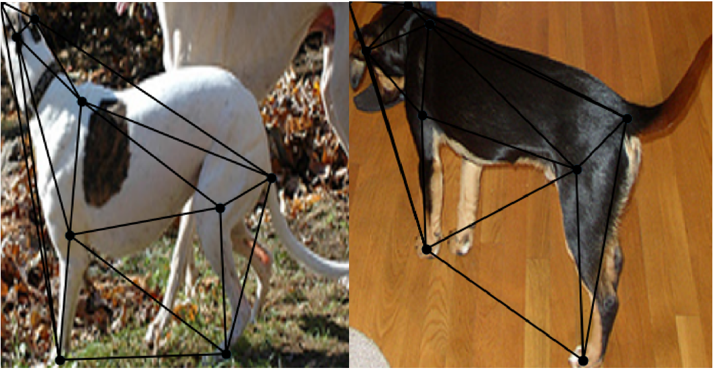
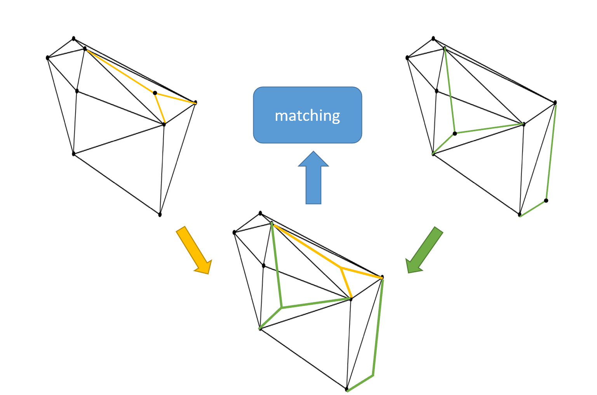

# 自监督 生成式图匹配

### 问题：

1. 语义匹配点并非是一一对应的。在两个待匹配的图像中存在相同语义的特征点，也存在由于遮挡或者缺失情况导致无法匹配的特征点。

-  previous works only consider the keypoints which is in the other set. 通过在代码中去除无法匹配的语义点，保证所有点都有对应的匹配对象。

```python
anno_dict_1["keypoints"] = [kp for kp in anno_dict_1["keypoints"] if kp["name"] in kp_names_2]
anno_dict_2["keypoints"] = [kp for kp in anno_dict_2["keypoints"] if kp["name"] in kp_names_1]
```
   - visualization
     
     
2. 有监督学习需要大量人工标注样本。


### 解决方法：

1. 通过对两个图片计算相同的特征点，找出两幅图不匹配的特征点，对缺失的特征点进行补全。

2. 生成同构的图结构
3. 使用自监督的方法训练模型


###难点：

1. 如何让模型学习到有多少个缺失的特征点
2. 如何保证图的同构
3. 如何对输入样本进行无监督训练


### 解决思路

1. 解决无监督学习，对一个样本，使用随机算法将图的节点去掉，得到两个待匹配图，两个图各有相同的节点，以及缺失的节点。
2. 要求模型输入两个生成的待匹配图，输出完整的原图，并且得到每一个节点一一匹配关系。
3. 使用transformer的篮子生成补全节点，使用hangrian对最后的匹配计算gt，再将gt和预测结果计算。
4. 补全节点对目标图的已有节点计算相似度，对本图的已有节点计算相似度。


## 算法流程

### 单个图像生成一对待匹配图

输入：特征点坐标$V$，图像$I$。

输出：两个去除随机节点的图$G_s=\{V_s,V_s',E_s\} $和$G_t=\{V_t,V_t',E_t\} $

详细步骤：

1. 按照给定删除率$\beta$得到随机的待补全节点$V'=f_{drop}(V, \beta ),V'\in\{V'_s,V'_t\}$
2. 在源点集中划分保留点$V_s,V_t$和待补全点$V'_s,V'_t$：$V_s = V/V'_s, V_t = V/V'_t$
3. 使用三角化得到图结构: $E_s = \text{Delaunay}(V_s)$，$E_t = \text{Delaunay}(V_t)$
4. 输出图$G_s=\{V_s,V_s',E_s\} $和$G_t=\{V_t,V_t',E_t\} $


### 对保留点的嵌入表示

使用图卷积对保留节点的

### 对待补全点的嵌入表示


### 计算相似度

## 推理阶段

