# 自监督 生成式图匹配

### 问题：

1. 语义匹配点并非是一一对应的。在两个待匹配的图像中存在相同语义的特征点，也存在由于遮挡或者缺失情况导致无法匹配的特征点。

-  previous works only consider the keypoints which are the same in both graphs. (通过在代码中去除无法匹配的语义点，保证所有点都有对应的匹配对象)

```python
anno_dict_1["keypoints"] = [kp for kp in anno_dict_1["keypoints"] if kp["name"] in kp_names_2]
anno_dict_2["keypoints"] = [kp for kp in anno_dict_2["keypoints"] if kp["name"] in kp_names_1]
```
   - visualization. 如图所示，只有两张图都出现的语义点才被保留，右图的右前腿由于在左图中被遮挡了，该点会在预处理中被去掉了。
     
     
2. 有监督学习需要大量人工标注样本，训练匹配模型需要对所有语义点进行一一匹配，工作量大而且容易出错。
3. 由于坐标点的变化会生成不一致的图结构。


### 解决方法：

1. 通过对两个图片计算相同的特征点，找出两幅图不匹配的特征点，对缺失的特征点进行补全。

2. 生成同构的图结构，让网络自己学习出图的结构，而不是仅仅依赖几何坐标。
3. 使用自监督的方法训练模型，解决标图的困难。


###难点：

1. 如何让模型学习到有多少个缺失的特征点
2. 如何保证图的同构
3. 如何对输入样本进行无监督训练


### 解决思路

1. 解决无监督学习，对一个样本，使用随机算法将图的节点去掉，得到两个待匹配图，两个图各有相同的节点，以及缺失的节点。
2. 要求模型输入两个生成的待匹配图，输出完整的原图，并且得到每一个节点一一匹配关系。
3. 使用transformer的篮子生成补全节点，使用hangrian对最后的匹配计算gt，再将gt和预测结果计算。
4. 补全节点对目标图的已有节点计算相似度，对本图的已有节点计算相似度。


## 整体流程框架

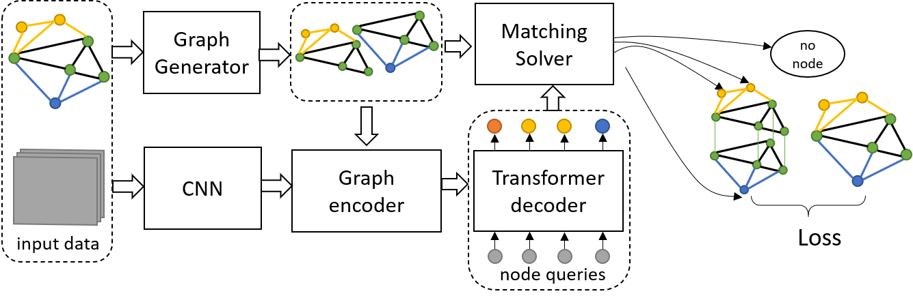


## 算法流程

### Graph Generator:单个图像生成一对待匹配图

输入：特征点坐标$V$，图像$I$。

输出：两个去除随机节点的图$G_s=\{V_s,V_s',E_s\} $和$G_t=\{V_t,V_t',E_t\} $

详细步骤：

1. 按照给定删除率$\beta$得到随机的待补全节点$V'=f_{drop}(V, \beta ),V'\in\{V'_s,V'_t\}$
2. 在源点集中划分保留点$V_s,V_t$和待补全点$V'_s,V'_t$：$V_s = V/V'_s, V_t = V/V'_t$
3. 使用三角化得到图结构: $E_s = \text{Delaunay}(V_s)$，$E_t = \text{Delaunay}(V_t)$
4. 输出图$G_s=\{V_s,V_s',E_s\} $和$G_t=\{V_t,V_t',E_t\} $
5. 记录重叠节点的匹配关系，最终用于计算Loss


### Graph encoder:对保留点的嵌入表示

使用图卷积对保留节点的进行编码
$$
Z = \text{GCN}(V,E)
$$


### Transformer decoder：对待补全点的嵌入表示

1.使用DETR[1]的解码器对查询节点的初始化

2.使用decoder对查询节点进行本图$G_s$和目标图$G_t$的解码

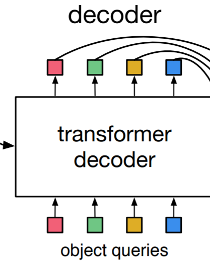

### Matching Solver：将解码的节点匹配到目标中

使用huangrian算法计算相似度最高的匹配对作为ground truth匹配。

将要使用的模块时BB-GM[2]的求解器


### Loss 计算：

使用Hamming距离计算Loss。将得到的匹配结果和原来的生成对应关系进行比较。

对于预测的结果$M$和实际上的匹配结果$M^*$,使用Hamming计算Loss:
$$
L(M) = M \odot (1-M^*) + M^* \odot (1-M)
$$
其中$\odot$代表元素间相乘


## 数据生成

通过一定比例去除点.

三种情况:

- 两边都没有去除:建立gt匹配矩阵
- 其中一边被去除:被去除的节点通过预测补全点和另一边的待匹配特征计算相似度,相似度高的为gt匹配
- 两边都被去除:


计算步骤:

处理数据:

划分全保留点(两边都保留的点)

待补全点(只有一边有的点)

隐藏点(两边都去除的点)


## 数据框架的方案

在构建网络框架的时候有以下几种选择:

- 原始torch.tensor数据,灵活性高,但是需要自己写领域矩阵,占用更多内存,

- torch_geometric: 使用边索引的方式记录图的结构,有现成的巻积模块,但是图的连接在一开始就固定下来了,灵活性很差,难以写成transforem的形式

  

  

程序结构

- detr结构. 训练过程不进行封装

- ntm的结构,模块化好,通过继承类,规范化更好.模块解耦好.甚至直接对训练过程进行封装.

- pcagm结构,比较直接灵活的结构,更多的使用实例化类的

- mmlab结构,使用流水线pipeline, 对训练过程进行抽象封装. 使用字典将从参数进行传递.

  

## 确定方案

1. 对bb-gm进行原始tensor重写,需要重写巻积模块以及部分dataloader的加载部分. 通过计算结果保证修改没问题.
2. 直接使用bb-gm的网络输出的graph.x, 抛弃了前面的edge_ids


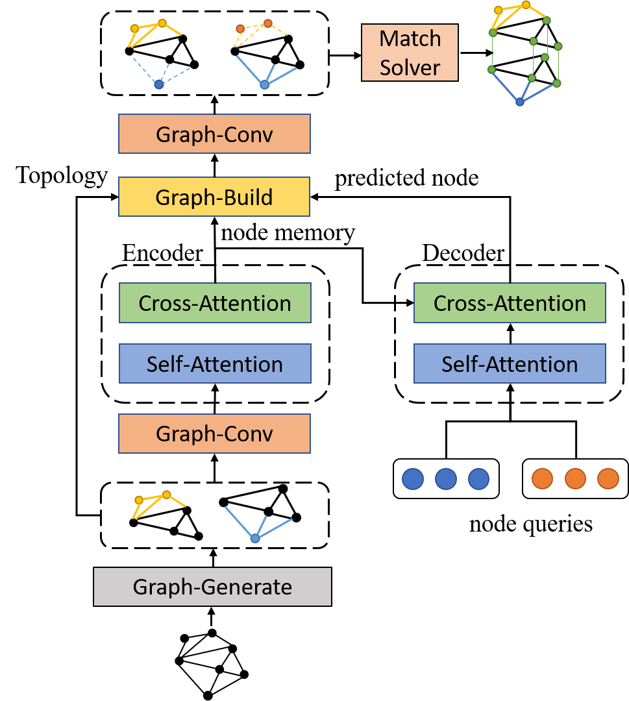


## 难点攻破

如何根据预测节点和原本的图节点构建一个新的图结构。

可以参考dlgm的方式做成可差分的模式，也可以做分离的判断式

## 数据匹配 

调用detr的matcher,


hypergraph generator.


1. 构建超图，利用深度学习将原始节点映射到超节点上
2. 同时构架原始节点和超节点的关系
3. 求解器只求解超节点的关系


要解决的问题：

1. scale的问题：使用固定的超节点，但是不同scale的节点可以映射到超节点上

2. outlier的问题：将outlier也映射到超节点上，但是outlier与超节点的连接更加弱，从而达到去除outlier的效果。


要


code:

cdict: L1 cost / L2

loss: matching/ self-connect/ outlier mask/ contrastive


atten_mat is negative

atten_mat & hard_mat

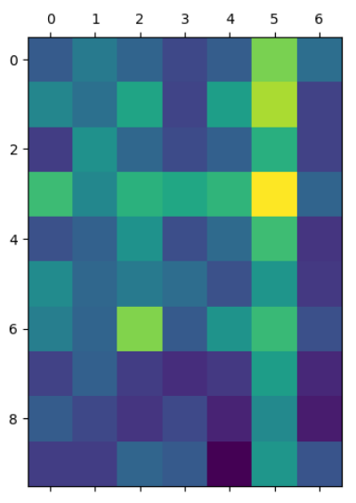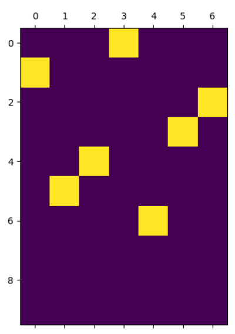


The self_mask is too powerful, laeding to the matching learning to the idenity matrix $I_{n \times n}$

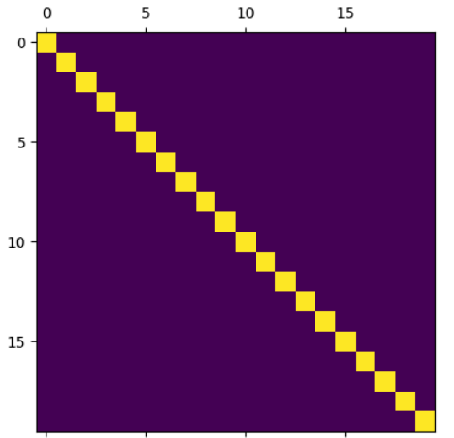


sinkhorn predict mat

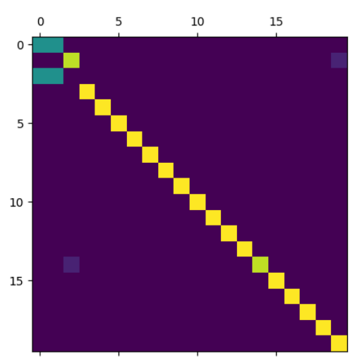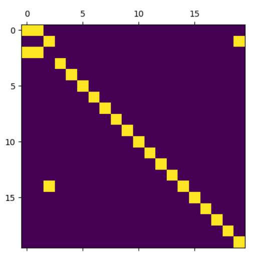

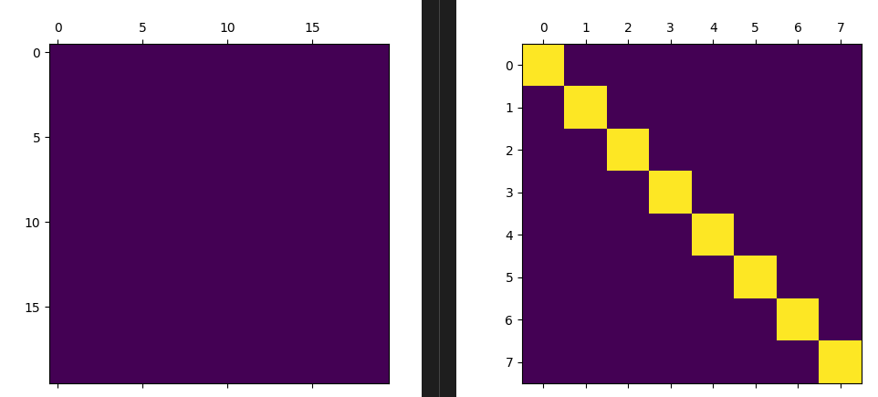


After many run: oversmooth problem is servies


node feature[NxC]

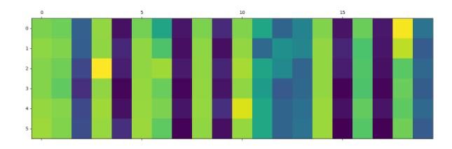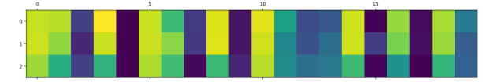


query_emb & after decoder:

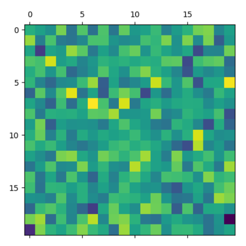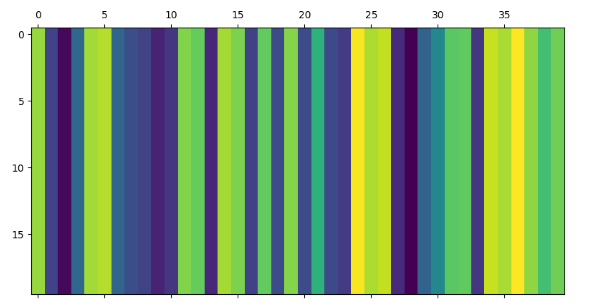


the same situation while using lpmp_solver:

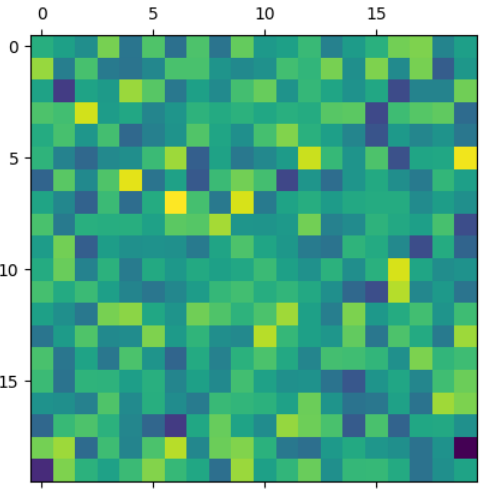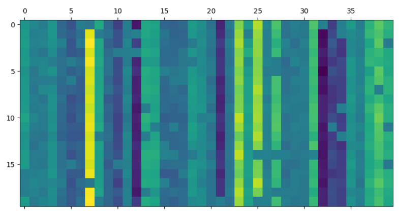


### there are mainly 2 problem:

1. The unary cost matrix is too large, the lambda can't change the result of the solver. the number of each feature is too large.
2. The oversmooth is serious. 


opearte:

1. reduce the layer number of encoder-decoder
2. batch normaliza 
3. remove the graph conv module

| no grad?/oversmooth?/accuracy                          | y    | y    | y    | y    | y    | n/y/20 | n/y/20 | n/?/23 | n/?/35 | n/y/20 |      |      |      |      |
| ------------------------------------------------------ | ---- | ---- | ---- | ---- | ---- | ------ | ------ | ------ | ------ | ------ | ---- | ---- | ---- | ---- |
| reduce the layer number of encoder-decoder[default: 3] |      | 2    | 3    |      |      |        |        |        |        |        |      |      |      |      |
| batch normaliza                                        |      |      | o    |      |      |        |        |        |        |        |      |      |      |      |
| remove the graph conv module                           |      |      |      |      |      |        |        |        |        |        |      |      |      |      |
| layer_norm                                             |      |      |      | o    |      |        |        |        |        |        |      |      |      |      |
| no_relu                                                |      |      |      |      | o    |        |        |        |        |        |      |      |      |      |
| feat_norm                                              |      |      |      |      |      | o      | o      | o      | o      | o      | o    |      |      |      |
| chang_gt_effect[default: 1]                            |      |      |      |      |      |        | 0.2    | 0.2    | -0.2   | -0.2   | -0.2 |      |      |      |
| no-self-mask[default:o]                                |      |      |      |      |      |        |        | x      |        | x      |      |      |      |      |
| contrastive                                            |      |      |      |      |      |        |        |        |        | 0.3    | 0.3  |      |      |      |
| random initial[default:x]                              |      |      |      |      |      |        |        |        |        |        | o    |      |      |      |

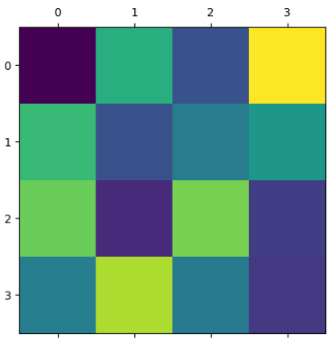


unary_cost & matching_pred & gt:
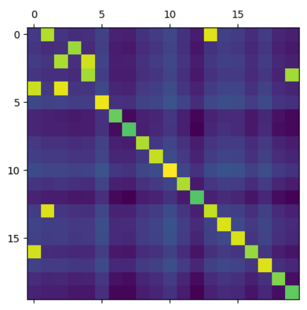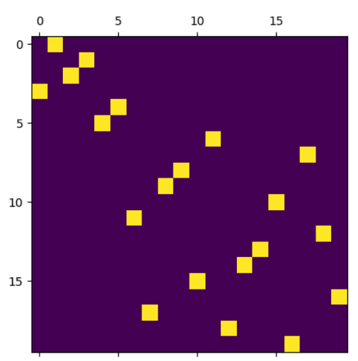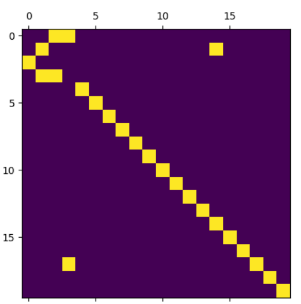

used_feat_norm, at the begining:

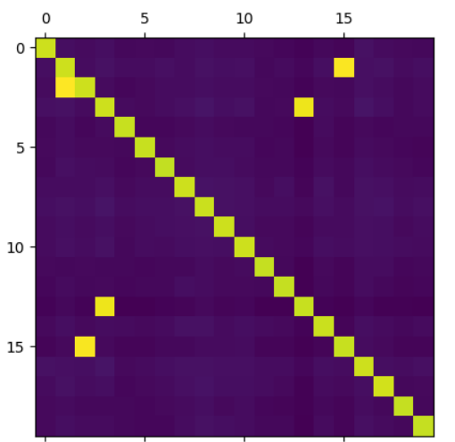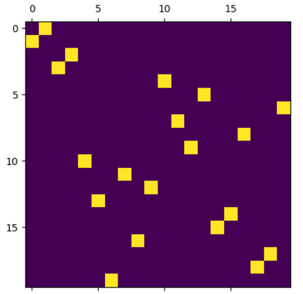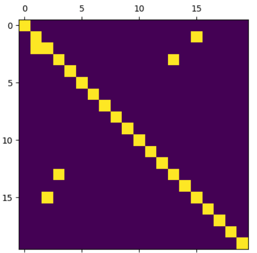

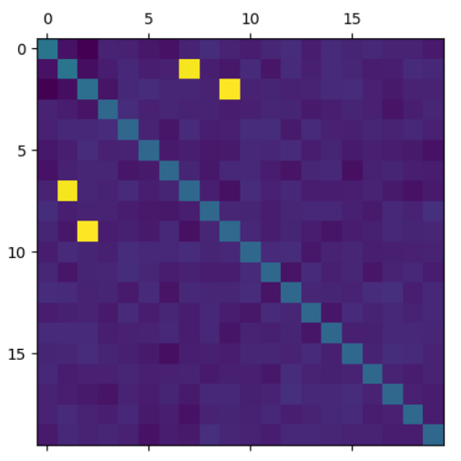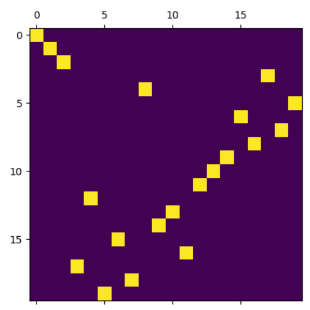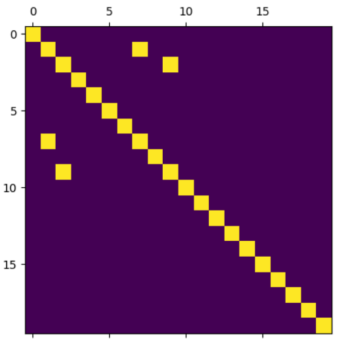


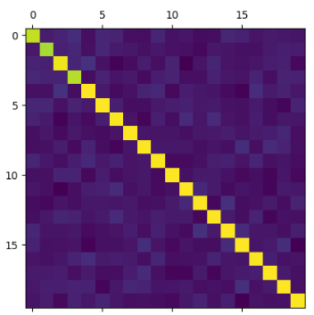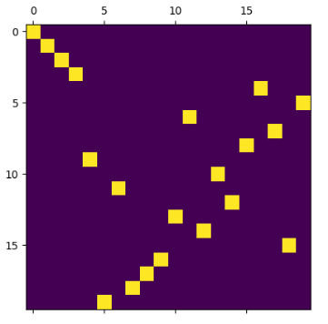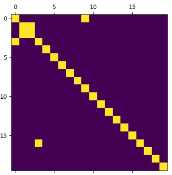


eval:

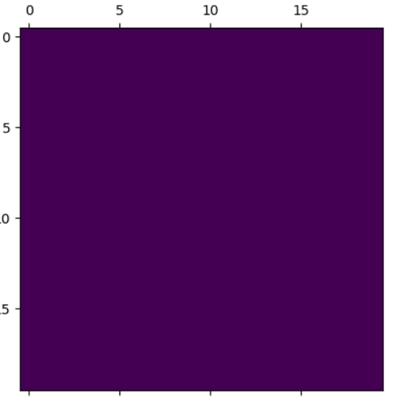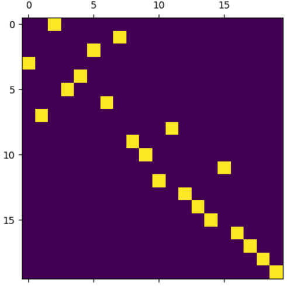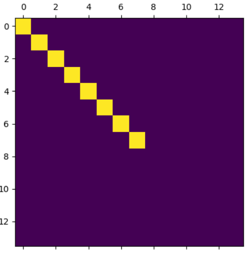


used conditional detr, no sinkhorn:

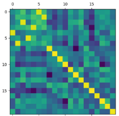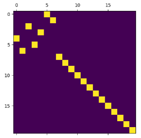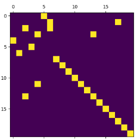


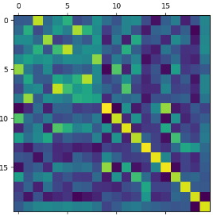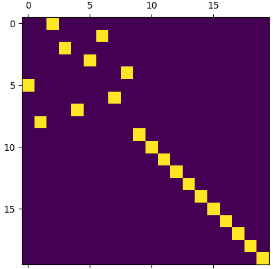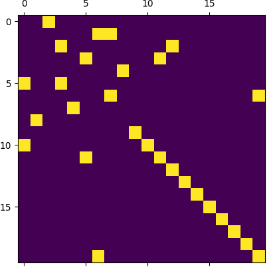


now in training process, oversmooth is solved, but is serious in test :


train| test

query_emb:    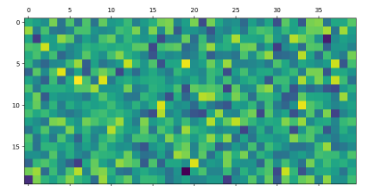


----

Transformer


src: 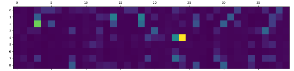


qkv: 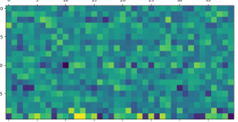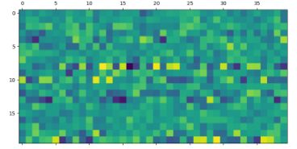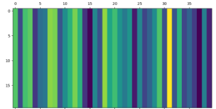

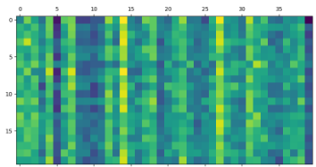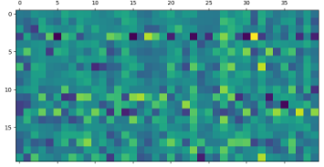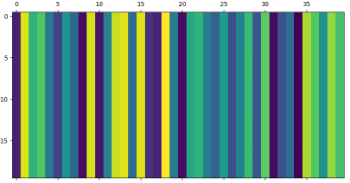


query_after_self_atten: 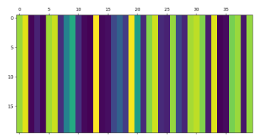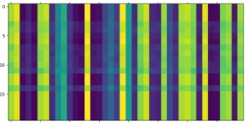


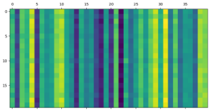


---

builder

atten_mat 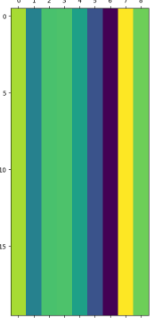

query: 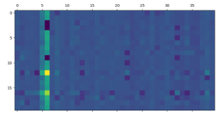

q:

v: 


k: 

message: 


new_feat = 

adj_mat = 


## found bug

**graph_builder_hq**: the  input of *linear_sum_assignment* should be **negative** of inner product of feature.


## oversmooth

### at the beginning of training:


### at the end of training: 


atten_mat, asign_mat, message, new_feat


new_feature, unary_cost, matching, gt


tes:


"LR": 0.00002,,lambda:2


use single train and single test: accuracy:54, 


the gap between single and intersection:

----

使用各种归一化后oversmooth的问题解决了，但是在自监督训练集中57%但是在测试集中精度只有10%，Loss现在能够下降，但是精度却没有提升，目前猜测网络只是把匹配噪声的部分做的比较好，但是有对应匹配点的部分却不怎么样。


前一个版本中，query仅作为outlier，这样可以提升真正有对应点的匹配阈值，反逼特征点更加接近彼此，从而提升精度，当在测试阶段，完全没有噪声点的情况下，问题退化成query自身的匹配匹配，但是网络能够通过学习区分query和实际特征点来提升匹配的精度。
