#  linked-graph

[TOC]

## 针对噪声点和图结构的问题

- 具体解决图网络输入的问题

  目前网络是通过将两个图前后输入同一个GNN中然后得到匹配，会导致网络无法得到两个图之间的相似信息。

  PCA的工作提出了将目标域按照相似度变换到源域，进行拼接后输入一个GNN，该方法可能会造成过渡平滑。

## Related work

### Outlier的匹配相关工作

图匹配的outlier定义为源graph中不与目标graph匹配的节点。outlier无法从单个graph中确定，而是要通过两个graph的联合信息确定。

网络对outlier的处理上： 网络需要对输入的两个graph同时进行处理，而不是依次单独处理。首个深度网络GMN[1]将深度网络引入图匹配问题中用于特征的embedding，然而没有将两个graph**联合输入网络**中，PCA-GM[2]将把目标域的特征按**相似度线性变换**后拼接入源域特征中，但这种直接的线性变换可能会导致影响节点特征的非线性关系，从而导致过度平滑。BBGM只通过将单个graph依次输入共享权重GNN中，无法让源图在forward中学习到目标图的信息。

在后处理阶段对outlier的处理： 图匹配问题要满足**一一匹配**的约束，即每个节点的匹配可能性求和为1。传统计算的Hangrain算法由于不能求梯度而无法作为网络训练的匹配求解算法。PCA-GM, DQGM[3]使用可求导的sinkhorn迭代求解匹配，但是由于sinkhorn会让所有节点满足一一匹配约束，因此同时也会让**outlier的与目标域的匹配可能性求和为1**，从而无法被剔除。

### 图匹配问题转化为分类问题

- 可以将图匹配转化为节点分类问题。 Tao等人[4]直接将两个图结构构造成associate graph，考虑每一个边之间的关系。计算复杂度为$O((N_e*M_e)^2)$。然而

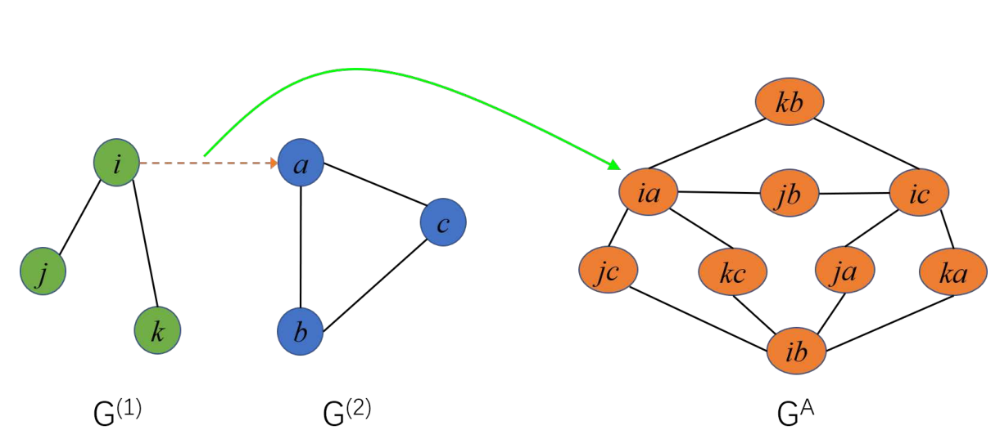

- 而我们直接可以将两个图直接连接起来，构造link graph，此时可以更好地分理出outlier，并且计算复杂度为$O((N_v+M_v)^2)$， 当节点的数量增加时，该方法效率会更加高。 

  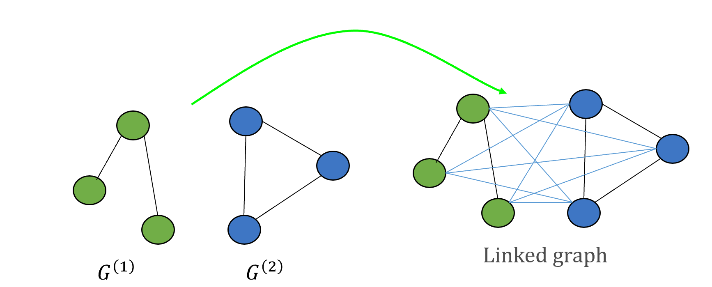

## motivation

- 针对outlier的特性，我们应该考虑让网络能够同时处理两个图，而不是分别进行输入。下图为前人的工作，GNN之间虽然是共享权值，但是在forward过程中是无法得知目标图的信息，这导致outlier的区分度仅仅依靠单个图上的特征分布决定，而无法通过两个图的相互关系得到。我们的目的：

1. 针对让网络剔除outlier的问题，将两个图同时输入网络，让网络能够学习到两个图的信息。

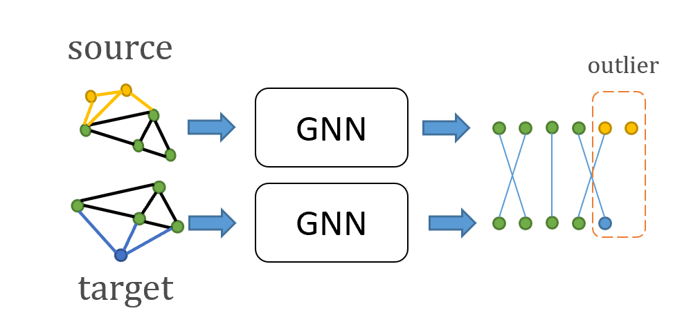

## Method

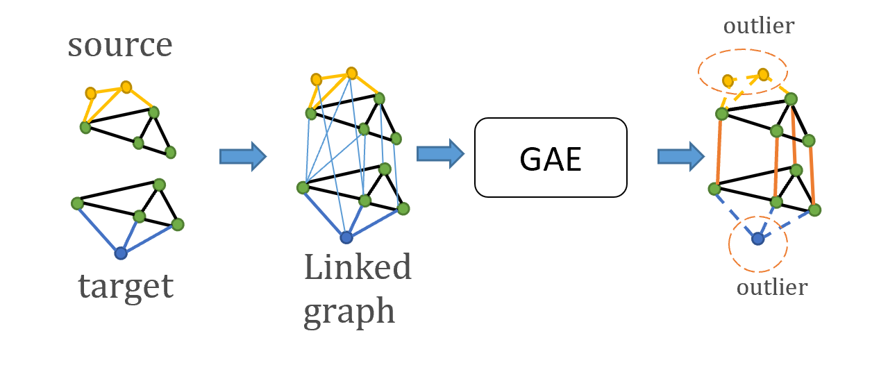

- 如上图所示，将两个网络首先计算节点相似度，然后生成对应的连接边，构建一个包含两个图的连接图linked graph。将连接图输入到图生成网络中，输出的是包含了改进后的各个单图**独立边**结构和求解匹配的**匹配边**，并且对outlier的边进行抹除，后处理中通过检测孤立节点从而剔除outlier。
- 该方法将图匹配问题转化为图结构生成问题，不仅仅让网络求解匹配关系，同时还对图的结构进行重生成，让图的结构更加一致。

#### Loss

1. 匹配边的分类Loss：将两个图之间的**匹配边**$\hat Y_e$进行交叉熵。$L = -Y_eln(\hat Y_e)$
2. 图结构一致性Loss：用匹配关系作为监督，令两个图之间的结构更加一致。$L = ||\hat Y_s - X\hat Y_tX^T||_2$
3. outlier Loss：outlier的应该是孤立点，减少边节点$\hat Y_e$的Loss。$L = \sum_{Y_e\in Y_{outlier}}(1-\hat Y_e))$ 

## 贡献点

1. 将图匹配问题转化为图结构生成问题，并构建连接图求解问题。
2. 对图匹配中的噪声点进行定义，并通过检测生成图中的孤立节点剔除噪声点。
3. （希望）在带有噪声的图匹配问题中效果比已有方法要好（F1>60%）

## 未来可以提升的点

- 生成的匹配边是全连接图，感觉会也导致求解困难。要解决全连接图的求解复杂度：使用全连接边的图会增加求解空间的复杂度。 因此需要先验策略减少生成的边缘。

计算梯度反传，当匹配矩阵的forward得到的值比较小的时候，我们可以认为他跟对应节点之间的关系较小，反传参数的值也比较小。可以直接删除对应的边，从而减少计算量。

## 目前的不足

1. 未能进行显式的一一匹配约束，但是DGMC的工作表明不一定需要进行匹配的约束。

## 测试outlier对性能的影响

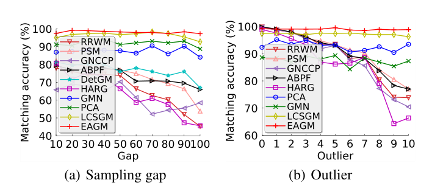

## Code visulaization

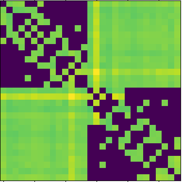

A_l matrix

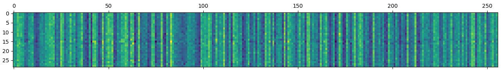

x_l 

## implementation
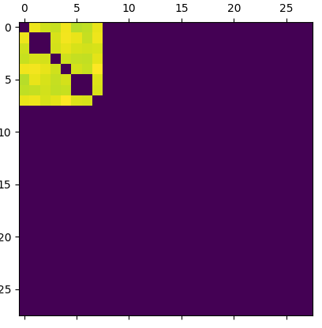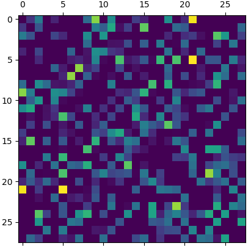

Adjancey off-blance

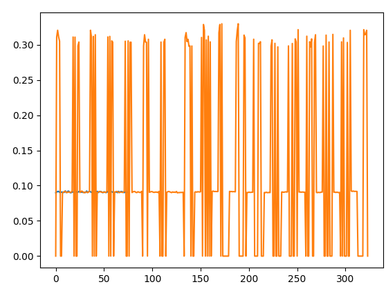

S_L的效果不理想 mean：17%

S_0的效果反而挺好： 

|      | aerop | bicyc | bird  | boat  | bottl | bus   | car   | cat   | chair | cow   | dinin | dog   | horse | motor | perso | pot   | sheep | sofa  | train | tv    | mean    |
| ---- | ----- | ----- | ----- | ----- | ----- | ----- | ----- | ----- | ----- | ----- | ----- | ----- | ----- | ----- | ----- | ----- | ----- | ----- | ----- | ----- | ------- |
| S_0  | 24.53 | 56.06 | 43.81 | 56.55 | 83.46 | 81.29 | 69.34 | 60.79 | 33.04 | 52.18 | 75.66 | 50.94 | 61.36 | 39.76 | 42.08 | 94.85 | 52.46 | 84.37 | 90.70 | 79.96 | 61.6595 |
| S_L  | 8.2   | 16.5  | 14.1  | 16.8  | 19.5  | 24.8  | 17.5  | 11.2  | 17.3  | 12.5  | 23.1  | 11.9  | 13.1  | 17.9  | 11.3  | 27.5  | 13.1  | 14.5  | 31.5  | 31.5  | 17.7    |
|      |       |       |       |       |       |       |       |       |       |       |       |       |       |       |       |       |       |       |       |       |         |

在

只使用一个gnn生成match结果：

output aerop bicyc bird  boat  bottl bus   car   cat   chair cow   dinin dog   horse motor perso potte sheep sofa  train tvmon mean

S0: 39.7  50.9  51.2  58.8  83.0  82.2  75.2  61.6  33.5  60.0  79.8  58.1  65.2  45.0  52.4  89.8  55.0  79.2  87.5  83.0  64.6 

SL: 36.2  44.1  48.4  55.4  81.2  80.6  64.9  50.4  32.0  47.8  81.7  50.8  49.0  40.9  38.5  90.3  49.1  71.3  82.9  82.2  58.9 

这个不算很差，修改了基本可以work， 但是问题：match边和图边的不平衡，由左上图看出当match的正确率比较高的时候，self-edge的值相对较小，容易造成不平衡，如何去解决这个不平衡问题？或者说这个不平衡和精度之间是否是天然矛盾的？

#### 实验11/30-1

取消了节点特征生成各自图的归一化后，效果反而下降了。linked-graph的边权重不平衡没有减缓。

|output| aerop|bicyc|bird |boat |bottl|bus  |car  |cat  |chair|cow  |dinin|dog  |horse|motor|perso|potte|sheep|sofa |train|tvmon|mean|
| ---- | ----- | ----- | ----- | ----- | ----- | ----- | ----- | ----- | ----- | ----- | ----- | ----- | ----- | ----- | ----- | ----- | ----- | ----- | ----- | ----- | ------- |
|S0| 14.3 |26.7 |18.0 |51.9 |72.8 |82.6 |44.3 |26.8 |25.4 |20.2 |72.7 |21.8 |26.3 |29.1 |18.2 |93.5 |22.5 |58.6 |89.0 |78.2 |44.6 |
|SL| :13.2 |25.7 |18.5 |51.7 |62.6 |81.1 |43.3 |24.0 |24.8 |19.6 |71.3 |21.2 |24.6 |29.7 |16.3 |90.8 |21.6 |56.7 |86.5 |77.6 |43.0 |

#### 实验11/30-2

节点dim=-1归一化后加转置，效果一般50起步，SL低于S0

| output | aerop | bicyc | bird | boat | bottl | bus  | car  | cat  | chair | cow  | dinin   | dog  | horse | motor | perso | potte | sheep | sofa | train | tvmon | mean |
| ------ | ----- | ----- | ---- | ---- | ----- | ---- | ---- | ---- | ----- | ---- | ------- | ---- | ----- | ----- | ----- | ----- | ----- | ---- | ----- | ----- | ---- |
| S0     | 29.5  | 38.7  | 40.4 | 57.9 | 80.6  | 82.4 | 73.0 | 58.9 | 32.0  | 54.4 | 79.94.7 | 56.2 | 78.2  | 85.9  | 80.8  | 60.8  |       |      |       |       | 61.2 |
| SL     | :28.5 | 31.1  | 38.1 | 59.3 | 77.7  | 77.7 | 61.7 | 54.5 | 31.0  | 48.7 | 77.9    | 49.8 | 52.8  | 35.8  | 34.3  | 93.2  | 50.7  | 76.7 | 85.1  | 78.0  | 58.2 |

#### 实验11/30-3

节点dim=-1归一化后加转置/2

| output | aerop | bicyc | bird | boat | bottl | bus  | car  | cat  | chair | cow  | dinin   | dog  | horse | motor | perso | potte | sheep | sofa | train | tvmon | mean |
| ---- | ----- | ----- | ----- | ----- | ----- | ----- | ----- | ----- | ----- | ----- | ----- | ----- | ----- | ----- | ----- | ----- | ----- | ----- | ----- | ----- | ------- |
|S0| 37.8 |38.4 |44.9 |65.7 |84.1 |82.9 |75.5 |64.5 |29.7 |56.4 |78.2 |54.1 |63.5 |43.6 |43.5 |95.1 |61.3 |82.8 |91.5 |82.9 |65.6|
|SL| :33.7 |37.2 |39.5 |61.9 |82.6 |75.4 |63.8 |53.5 |29.7 |46.4 |74.0 |48.4 |50.8 |38.6 |32.0 |95.0 |52.5 |81.6 |85.0 |79.1 |58.9|

#### 实验 11/30-4  no_detach()

不切断S0的计算图，结果一般比切断的要好一些

| output | aerop | bicyc | bird | boat | bottl | bus  | car  | cat  | chair | cow  | dinin | dog  | horse | motor | perso | potte | sheep | sofa | train | tvmon | mean |
| ------ | ----- | ----- | ---- | ---- | ----- | ---- | ---- | ---- | ----- | ---- | ----- | ---- | ----- | ----- | ----- | ----- | ----- | ---- | ----- | ----- | ---- |
| S0     | 34.1  | 50.4  | 47.6 | 63.0 | 84.3  | 81.0 | 74.2 | 65.2 | 37.2  | 56.4 | 86.6  | 61.9 | 64.2  | 52.8  | 51.0  | 93.7  | 58.9  | 80.1 | 87.2  | 82.4  | 65.6 |
| SL     | :29.2 | 43.2  | 44.9 | 57.6 | 84.3  | 78.1 | 61.1 | 55.1 | 33.1  | 46.5 | 76.3  | 53.0 | 53.0  | 49.3  | 38.8  | 92.3  | 50.5  | 73.5 | 79.5  | 78.5  | 58.9 |

#### 实验 11/30-5 add_S0SL

精度有了很好的提升，比较work，但是不sota

| output | aerop | bicyc | bird | boat | bottl | bus  | car  | cat  | chair | cow  | dinin | dog  | horse | motor | perso | potte | sheep | sofa | train | tvmon | mean |
| ------ | ----- | ----- | ---- | ---- | ----- | ---- | ---- | ---- | ----- | ---- | ----- | ---- | ----- | ----- | ----- | ----- | ----- | ---- | ----- | ----- | ---- |
| S0   | 36.9 | 55.8 | 50.5 | 59.5 | 81.8 | 84.5 | 82.2 | 70.0 | 34.4 | 56.3 | 81.9 | 56.5 | 68.7 | 53.4 | 49.8 | 91.8 | 60.5 | 89.2 | 86.7 | 79.0 | 67.3 |
| SL   | :37.0 | 55.9 | 50.8 | 59.8 | 81.7 | 84.3 | 82.2 | 70.0 | 34.5 | 56.3 | 81.9 | 56.4 | 68.6 | 53.7 | 49.8 | 91.9 | 60.5 | 89.2 | 86.8 | 78.9  | 67.3 |

#### tablet

| method                       | epoch | accuracy  | loss                      | other  |
| ---------------------------- | ----- | --------- | ------------------------- | ------ |
| S0+SL GAC_my nodetah         | 15    | 67.3      | S0loss,SLloss outlierloss |        |
| S0+SL GAC_my nodetah batch32 | 10    | 71.2      | S0loss,SLloss outlierloss |        |
| S0+SL GAC_my nodetah batch64 | 10    | 72        | S0loss,SLloss outlierloss |        |
| no detach                    | 15    | 65.6/58.9 | S0loss,SLloss outlierloss |        |
| dgmc                         | 20    | 73        | S0loss,SLloss             | spline |
| spline-gnn                   | 20    | 63        | S0loss                    |        |

增加batch size可以增加精度，目前只是做了生成边的模型，并且还需要将S0加上去（生成模型）相当于残差部分，有一点效果，但是提升不算大，还没有超过dgmc。

下一步计划用于生成原来图上的结构， 用于让网络更加容易做匹配。

要用groundtruth监督图的结构，然后再用这些结构去跑匹配，最后剔除噪声点。

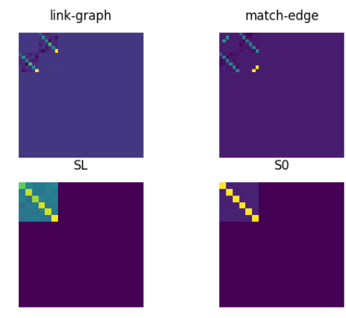

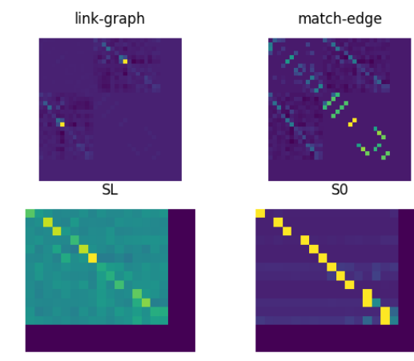

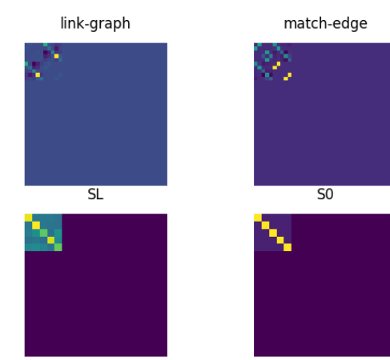

通常target图的节点特征强度会大一点？：代码bug

ht，hs做了归一化之后效果好很多了，说明特征生成的图结构还是要做归一化才生成linked-graph比较好。

Loss都是下降的，但是精度还是卡住了，说明网络存在过拟合的可能。

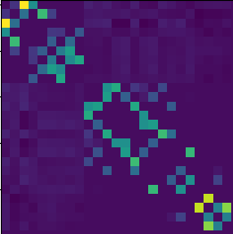

如何让网络将原本的噪声去除？

如果一开始的判断就出错了，网络如何在后续的迭代更新节点特征中把错误的信息重新判断到？

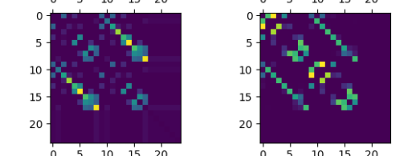

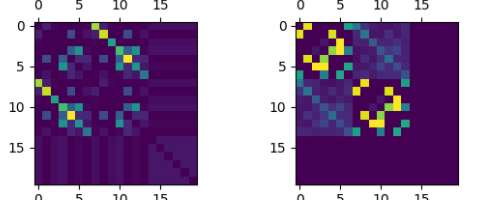

要让生成网络做的任务是预测边结构，因此要有一个合理的方式生成图的结构。首先不能让原本的匹配结果更加平滑，我们的目标就是要根据松弛的初始解得到一个更加精确的离散解，网络在求解离散解的时候效果不一定很好，但是网络的拟合能力比较强的，根据这个对所有的节点做分类。

过拟合问题：初始的解已经无法再继续优化了，这时候应该有个减缓机制，防止网络过拟合

网络应该去预测噪声，让让这个模块接近离散解，同时又可以用参数做拟合。

通过让网络生成的方式，能够让网络补全初始解中未能发掘的匹配对，如下图所示：

左图为初始解生成的linked-graph，其中受噪声干扰某些gt的概率比较低，通过网络生成右图的连接边，可以获得更接近gt的匹配结果.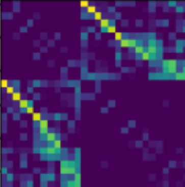

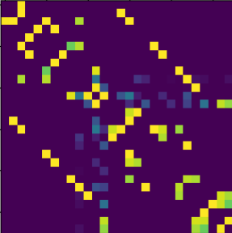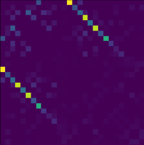

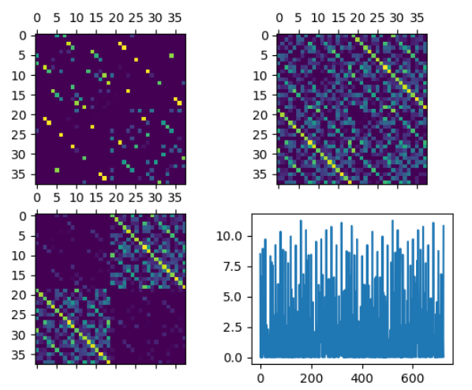

但是使用relu会造成上限没有限制，会让一些结果变得很小，使用sigmiod反而会让梯度消失。

尝试使用layernorm去平衡分布，让预测值范围更小。

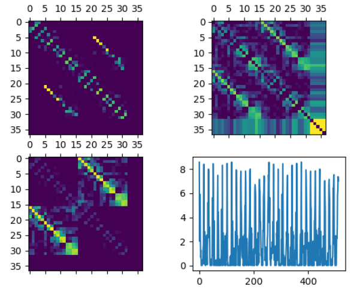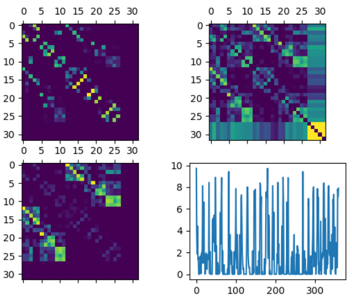

生成的图尾部出现模糊情况，不清楚为什么。

在初始解噪声较大的情况下，优化效果也不是很好。

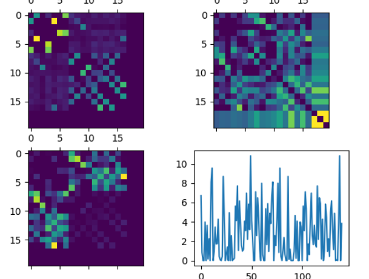

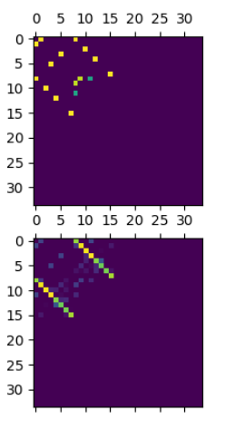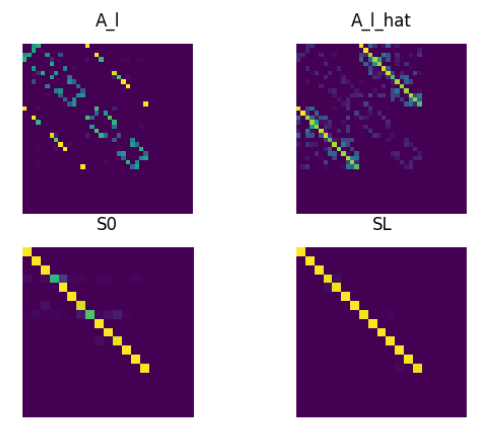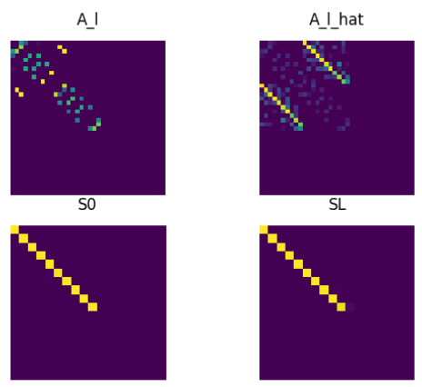

## 过拟合问题

网络主要由两个结构组成：

1. emb = GNN(x,A) 学习特征初始解
2. AL = GAE(x,A) 优化特征解

过拟合的情况认为第一个网络训练的效果太好了，已经没有过多优化空间给GAE，所以要给GAE的优化空间要更大。

采取的措施：首先训练GAE，然后再训练GNN。 做了一次实验后发现，训练好的GAE精度可以将S0的30%提升到70%，但是一开始训练GNN，所有的精度都掉到20%了，相当于随机初始化，而且效果更差，可视化结果如下，gnn输出的预测差异太大了，

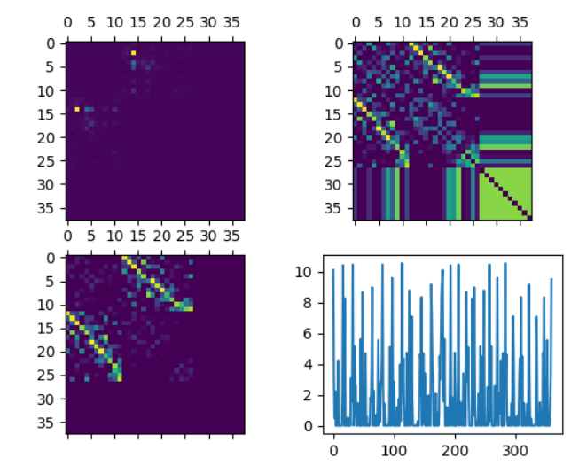

## 讨论结果

1. GNN是否有效[^如何更加鲁棒地表示图结构的嵌入]？怀疑特征是根据节点特征就可以做好分类，而不需要GNN再做特征表达。

2. GAE的有效性？GAE的形式和attention很像，有没有方法可以更好的学习到整个图的相似性，而不是仅仅类attention。；

3. 大规模数据集的用处

4. 如何用上iteration提升精度

5. outlier数量比较多的时候精度如何？

6. 如何设计使用传统迭代去输出结果，这应该是一个比较自然的过程。

   

1. GNN的有效性：去除了SplineGNN之后精度下降了很多，但是在初始解噪声比较大的时候还是可以获得比较好的还原的。可能是模型的参数量不够大，试验后的结论是好的GNN确实是有效的，可以学习到每个节点在图上对应的位置。

   | GNN                                                          | GAE  | acc   |
   | ------------------------------------------------------------ | ---- | ----- |
   | √                                                            | √    | 72    |
   | x(直接使用图像的feature作为节点特征)                         | √    | 56.73 |
   | x(让节点只和自己相连，切断所有的边，输入到GNN中得到emb feature) | √    | 50    |
   | x(直接对image特征相似度做softmax作为S0)                      | √    | 56.45 |
   | x                                                            | x    | 42    |
   
   

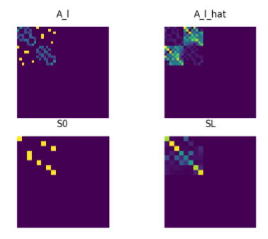
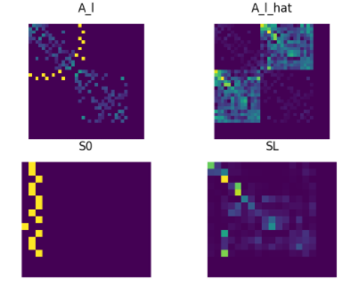

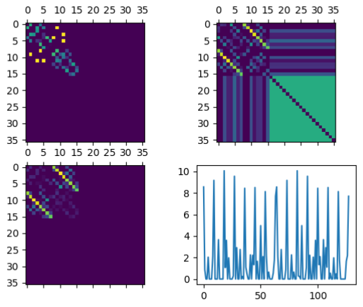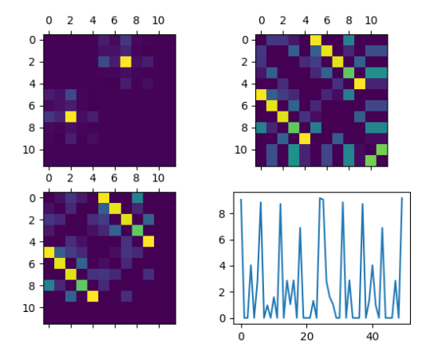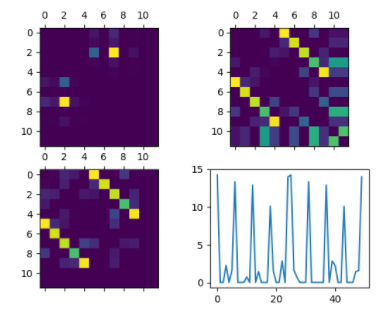

存在右图的这种全部识别到一个特征的情况，应该要减少softmax的规范化。但是精度也没有明显的提升，估计要调学习率

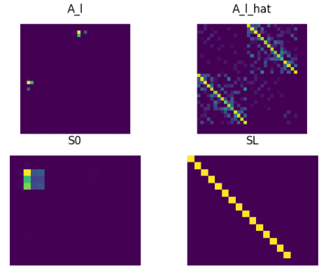

2. GAE的效果，如何证明GAE是有效的？只用一个

3. 大规模数据集，使用superglue的特征点做特征提取。

4. 使用迭代的方法精度并没有提升，稍微掉点了（69%），感觉网络参数还是太少了了，导致没办法学习到泛化性。

[^如何更加鲁棒地表示图结构的嵌入]: https://arxiv.org/abs/2010.12811

## 考虑连接图detach的设计，以及不加入权重的设计

## 收集检测精度低的效果图

## 下游任务的问题

作为图匹配算法，主要针对的问题是图片的语义匹配上，语义匹配中没有固定的图片结构，所以是人为定义语义结构，但是在蛋白质生物领域上，还是有客观存在的图结构的，这时候再去改变图结构就显得不是很好。

## 改变生成器的结构

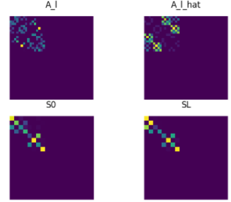

直接使用gae效果并不好，几乎很难学到东西，自己写的又过于简单，对精度提升很小。精度不高的原因：网络参数太少了，做生成式模型的效果太差。

提高参数数量，对生成器设置合理的结构

在生成器经过了图的聚合之后，所有的值会相加，从而导致数值过大，求内积之后每个图的权重就很大，应该要求余弦距离，保证所有的值都在-1，1之间。

不监督S0的情况下，S0的检测精度比较低，但是最终结果依然会比较高。 

但将S0做detach之后，结果就比较低了。**这时候还是有hs和ht可以传递梯度的**，将hs和ht完全detach之后，精度只有13，在gnn一开始

以上的实验结果说明了spline具有较强的拟合能力，即使不直接监督最终结果，但是spline依然会通过配合最终输出得到一个较好的效果。目前来看spline的精度上限在73，而后续的提精度拟合重任则放在了生成器上。

但是对于生成器来说，输入的是73正确率的图结构，就会出现正负样本分配不平衡的问题，如何去解决这个呢？

1. 首先增加生成器的结构复杂度：用spline做生成器？做了之后发现效果一般，说明不是生成器里面结构的问题，而是可能是生成器的使用就有问题。
2. 动态调节正负样本的分配

## 设计一个判别器去对匹配结果打分

目标函数最大值不一定代表实际上的匹配，实际上匹配具有噪音，并且

## 合理的假设

我们可以将图匹配问题整合，对分离的两个图进行节点映射到相同的特征空间中，也可以对连接的图进行节点表达并映射到相同的空间中，这样做能够让图节点获取到更多的信息（但是简单的直接连接也会导致噪声的引入），因此需要尽可能地减少噪声来将两个图进行连接。首先我们先对图进行简单的连接计算，然后在做特征学习，就是先匹配后优化的策略，

## 理论上限的测试

现在的生成器模块是输入不确定的连接图，假如能够给理论上限中完全准确的连接图，测试生成器的作用。

假设每一个点都有一个连接边（link-edge），通过给ground truth的边连接，可以达到95的精度，说明这种做法的理论上限很高，因为一开始就有了完全正确的匹配结果，随着噪声的增加，精度会逐渐下降，问题就在于当给的边连接情况不好的时候，如何逐渐优化边连接。

从实验结果可以认为，当边的优化情况较好的时候，网络可以得到较好的结果，因此我们想办法去逐渐根据给分来优化边的预测。

但是当在训练过程中给gt连接，在测试阶段不给，会导致精度大幅降低，说明网路只能在连接较好的情况下有不错的表现，然而在连接不佳的情况时无法给出更好的结果，问题就又绕回到如何获得较好连接上面了。。

我们需要让网络具有优化的能力，比如说精度的连接情况下能够有更好的推理

目前的给分是由监督信息给出的，当没有监督信息的时候，我们设置一种分数，当分数越高的时候，越接近实际匹配结果。

但是在连接边精度不高的时候，生成器的效果也变差了，说明目前单个生成器还没有能力去很好地优化特征的关系，甚至还没有不用真值的情况。

这个测试我觉得算不上理论上限的测试，反而是用结果推原因的一种错误。。因为本来就是要求匹配关系的，如果给定了匹配关系，再返回去求他，这说不过去。因此也可以解释为啥用gt监督的网络效果很差，就是因为本身就给网络gt，这个网络就没有意义了。

重点是如何证明网络具有优化初始匹配的能力。

实验显示，生成器确实可以增强匹配的效果，在初始匹配精度较低的情况下，通过

- 做一个全部连起来的实验

- 做一个局部连接的实验

为什么连了线效果就变好了？

以下是实验的结果记录：

- 实验1:对图使用spline进行一次特征嵌入后再构建linkgraph，边的权重由特征相似度d=1表示

| 实验条件                | 理想上限                                 | 有噪声的初始匹配                  | 有噪声的初始匹配                  | 有噪声的初始匹配                  | 估计的匹配                       | 全连接                         | 不连接                                  |
| ----------------------- | ---------------------------------------- | --------------------------------- | --------------------------------- | --------------------------------- | -------------------------------- | ------------------------------ | --------------------------------------- |
| 边连接情况              | gt，直接将匹配真值作为边，完全正确的连接 | 部分连接，可控的给gt加入噪声p=0.1 | 部分连接，可控的给gt加入噪声p=0.1 | 部分连接，可控的给gt加入噪声p=0.4 | 由相似度计算得到的初始匹配作为边 | 全连接，将所有匹配的点做全连接 | 没有匹配边的连接，退化为原始孪生网络GNN |
| 网络模块                | spline                                   | spline                            | spline                            | spline                            | Liner                            | spline                         | spline                                  |
| loss                    | crossentropy/outlier                     | crossentropy/outlier              | crossentropy                      | crossentropy/outlier              | crossentropy/outlier             | crossentropy/outlier           | crossentropy/outlier                    |
| epoch                   | 20                                       | 20                                | 20                                | 20                                | 20                               | 20                             | 20                                      |
| 初始匹配准确率（f1,%）  | 100                                      | 60.01                             | 37.64                             | 16.71                             | -                                | 11.47                          | 0                                       |
| 预测误差准确率（f1, %） | 97.75                                    | 78.16                             | 72.66                             | 70.58                             | 72                               | 70.08                          | 67.3                                    |

- 实验2: 直接对原始图结构构建linkgrapph， 边特征由特征相似度d=1表示

| 实验条件                | 理想上限                                 | 有噪声的初始匹配                  | 有噪声的初始匹配                  | 有噪声的初始匹配                  | 估计的匹配                       | 全连接                         | 不连接                                  |
| ----------------------- | ---------------------------------------- | --------------------------------- | --------------------------------- | --------------------------------- | -------------------------------- | ------------------------------ | --------------------------------------- |
| 边连接情况              | gt，直接将匹配真值作为边，完全正确的连接 | 部分连接，可控的给gt加入噪声p=0.1 | 部分连接，可控的给gt加入噪声p=0.1 | 部分连接，可控的给gt加入噪声p=0.4 | 由相似度计算得到的初始匹配作为边 | 全连接，将所有匹配的点做全连接 | 没有匹配边的连接，退化为原始孪生网络GNN |
| 网络模块                | spline                                   | spline                            | spline                            | spline                            | Liner                            | spline                         | spline                                  |
| loss                    | crossentropy/outlier                     | crossentropy/outlier              | crossentropy                      | crossentropy/outlier              | crossentropy/outlier             | crossentropy/outlier           | crossentropy/outlier                    |
| epoch                   | 20                                       | 20                                | 20                                | 20                                | 20                               | 20                             | 20                                      |
| 初始匹配准确率（f1,%）  | 100                                      | 59.90                             |                                   |                                   | -                                | 44.05                          | 0                                       |
| 预测误差准确率（f1, %） | 94.68                                    | 75.72                             |                                   |                                   |                                  | 57.78                          |                                         |

- 实验3: 直接对原始图结构构件linked-graph，边特征由节点的归一化坐标向量d=2表示

| 实验条件                | 理想上限                                 | 有噪声的初始匹配                  | 有噪声的初始匹配                  | 有噪声的初始匹配                  | 估计的匹配                       | 全连接                         | 不连接                                  |
| ----------------------- | ---------------------------------------- | --------------------------------- | --------------------------------- | --------------------------------- | -------------------------------- | ------------------------------ | --------------------------------------- |
| 边连接情况              | gt，直接将匹配真值作为边，完全正确的连接 | 部分连接，可控的给gt加入噪声p=0.1 | 部分连接，可控的给gt加入噪声p=0.1 | 部分连接，可控的给gt加入噪声p=0.4 | 由相似度计算得到的初始匹配作为边 | 全连接，将所有匹配的点做全连接 | 没有匹配边的连接，退化为原始孪生网络GNN |
| 网络模块                | spline                                   | spline                            | spline                            | spline                            | Liner                            | spline                         | spline                                  |
| loss                    | crossentropy/outlier                     | crossentropy/outlier              | crossentropy                      | crossentropy/outlier              | crossentropy/outlier             | crossentropy/outlier           | crossentropy/outlier                    |
| epoch                   | 20                                       | 20                                | 20                                | 20                                | 20                               | 20                             | 20                                      |
| 初始匹配准确率（f1,%）  | 100                                      | 59.90                             |                                   |                                   |                                  |                                |                                         |
| 预测误差准确率（f1, %） |                                          |                                   |                                   |                                   |                                  |                                |                                         |

在无连接的情况下也会存在准确率不为零的情况，要查一下原因。

发现是argmax的问题，当检测结果全部为0的时候，依然要找到最大值的索引，这时候就会全部索引到第一个位置（0，0）作为最优解，这时候当有gt为（0，0）的时候就会出现计算误差。

这个计算方法实际上是问题的，将假设了src的节点一定会在tgt有对应节点，并将argmax作为最终的计算结果，结果就是导致了预测pos和实际pos的数量是相同的，f1等价于准确率，而且在全0的准确率和全1的准确率是不正确的，这个结果只能用公式计算出来：
$$
prec|_{x=0} = recall|_{x=0} = 0 \\
prec|_{x=1} = recall|_{x=1} = \frac{2}{y+1}
$$

## 直接构建连接图，

首先二维的几何向量应该是有效的，因此图内边特征就用几何向量表示，而图外的边就要找一个二维的特征向量来表示，此时还要计算一个初始匹配矩阵，想用一个比较好用初始矩阵来计算，然后再计算相应边的特征向量。

尝试使用节点特征之间的相似度作为边特征（一维），但是计算得到的效果不是很好（精度57），有两种可能，一种是边特征没有做好，另一种是网络参数量不够（因为去掉了孪生的GNN）。

## 理论分析

构建图匹配的统一框架，用于图匹配的深度网络设计与其他任务的区别在于：网络不仅仅要考虑单个图上的特征表达，将单个图的信息聚合到节点上，还要通过某些方式将匹配对的目标图上的信息聚合到源域上来。因此在图匹配领域中，常用孪生网络、cross-graph、cross-attention等方式将对应匹配图的信息聚合到源图中。虽然此类方法实现结果各异，但是都可以用统一的框架对该方法进行表示。

首先我们提出linked-graph框架，通过构造权重函数计算匹配节点之间的距离矩阵S，再根据距离矩阵的权重更新节点信息。
$$
S = f_w(x_s,x_t) \\
h_{s} =  f_{update}(S x_t, xs)
$$

通过构造连接图矩阵如下，用单一矩阵表示匹配两图之间的拓扑和匹配关系。
$$
A_l  = \left [ 
\begin{matrix}
A_s & S \\
S^T& A_t
\end{matrix} \right ] \in R^{N \times M} \\

x_l = \left[\begin{matrix} x_s \\ x_t\end{matrix} \right] \in R ^{(N+M) \times D}
$$

我们可以通过构建以上的连接图统一表示图匹配框架的图结构：

1. 孪生网络
   $$
   A_l  = \left [ 
   \begin{matrix}
   A_s & 0 \\
   0 & A_t
   \end{matrix} \right ] \in R^{N \times M} \\
   
   h = f(A_l, x_l)
   $$
   

​			

2. cross-graph
   $$
   A_{l1}  = \left [ \begin{matrix}0 & S \\S^T & 0\end{matrix} \right ] \in R^{N \times M} \\ 
   A_{l2}  = \left [ \begin{matrix}A_s & 0 \\0 & A_t\end{matrix} \right ] \in R^{N \times M} \\
   \\h = f_0([f_1(x_l),, A_l f_2(x_l)]\\
   h = f_0([f_1(x_l), A_l f_2(x_l)])
   $$

   ​				
   ​					

## 二次规划的问题

传统工作使用affinity matrix K， 描述了节点之间的相似度和边之间的相似度，因此在匹配的时候不仅仅要考虑节点之间的相似度，还要考虑上边的相似度。此时这个问题就是NP-complete的二次规划问题。加上一一对应匹配问题约束，让求解到最优解非常难。

利用网络的嵌入表示，将边的特征映射到节点上，最终通过计算嵌入节点之间的特征相似度来作为最终的匹配结果，该假设在于网络能够很好地将边相似度嵌入到节点特征上面，此时只需要计算节点之间的一次相似度和考虑约束结果就可以作为最终的匹配结果。

在网络的加入后，问题从求解二次规划问题转变到如何将边特征更加地嵌入到节点特征上面。

节点特征的分布空间是高维度的，此时可以通过计算高维上的欧式距离或者余弦距离来表示特征之间的相似度，

而在构建了图网络后的拓扑结构约束了节点特征的距离分布，无法直接计算节点之间的相似度。在传统算法是计算二次规划的最优解，即计算节点和边的相似度，求解加权最优解。而在深度网络时代，则通过有监督的方式训练网络对图结构进行嵌入表示，使用神经网络将图结构（边特征和节点特征）的信息聚合到节点特征上表示，使用节点匹配来解决二次规划的约束。此时将图结构特征映射到高维空间表示中。

