# How to build the Affinity Matrix

define:


In graph matching, the affinity matrix evaluate the importance of pairs of node and edges between source and target graph.

The objective function $f(x)$ measures the mutual similiarity of graph attributes, and is typically decomposed into a unary similarity function $s_v(v_i. v_a)$ for a node pair, and a pairwise similarity function $v_e(e_{ij}, e_{ab})$ for a edge pair.
$$
f(x) = \sum_{x} s_E(e_{ij}, e_{ab}) + \sum_{x_{ia}}s_v(v_i,v_j)
$$
Also , the similarity functions are usually represented by a symmetric affinity matrix $A$,.
$$
A_{ia,ia} = exp(\frac{-d(v_i,v_a)^2}{\sigma^2})\\
A_{ia,jb} = exp(\frac{-d(e_{ij},v_{ab})^2}{\sigma^2})
$$
The code of the building of affinity matrix is written by the Kronecker multiple

```matlab
nP1 = length(X);
nP2 = length(Y);

P1 = X;
P2 = Y;

E12 = ones(nP1,nP2);
n12 = nnz(E12);

[L12(:,1), L12(:,2)] = find(E12);
[group1, group2] = make_group(L12);


E1 = ones(nP1); E2 = ones(nP2);
[L1(:,1), L1(:,2)] = find(E1);
[L2(:,1) ,L2(:,2)] = find(E2);

G1 = P1(L1(:,1),:)-P1(L1(:,2),:);
G2 = P2(L2(:,1),:)-P2(L2(:,2),:);

G1 = sqrt(G1(:,1).^2+G1(:,2).^2);
G2 = sqrt(G2(:,1).^2+G2(:,2).^2);

G1 = reshape(G1, [nP1 nP1]);
G2 = reshape(G2, [nP2 nP2]);

M = (repmat(G1, nP2, nP2)-kron(G2,ones(nP1))).^2;
```


Another version

```matlab
%% Construct matching indicator matrix E12
E12 = ones(n1,n2);
n12 = nnz(E12);
% [L12(:,2) L12(:,1)] = find(E12);
[L12(:,1) L12(:,2)] = find(E12);

%% Construct Affinity matrix M - using distance
E1 = ones(n1); E2 = ones(n2);
[L1(:,1) L1(:,2)] = find(E1);
[L2(:,1) L2(:,2)] = find(E2);
G1 = node1(L1(:, 1), :) - node1(L1(:,2),:);
G2 = node2(L2(:, 1), :) - node2(L2(:,2),:);
G1 = sqrt(G1(:,1).^2+G1(:,2).^2);
G2 = sqrt(G2(:,1).^2+G2(:,2).^2);
G1 = reshape(G1, n1, n1);
G2 = reshape(G2, n2, n2);

M = zeros(n12);
for j = 1:n12-1
    for i = j+1:n12
        dist1 = norm(node1(L12(j,1),:)-node1(L12(i,1),:));
        dist2 = norm(node2(L12(j,2),:)-node2(L12(i,2),:));
        M(j,i) = exp(-(dist1-dist2)^2/settings.scaleSigma); 
        M(i,j) = M(j,i);
    end
end

```

the MATLAB code is redundant, so I tend to write it to python.


在MPM中的代码matlab，计算的稠密矩阵M效果很差，而需要用稀疏矩阵计算，我在考虑直接先在Maltba上计算的到较好的M矩阵，再迁移到python中。只有全连接的图才能直接用korncker乘积，其他的要用稀疏表示。（因为无法直接reshape).


build the S


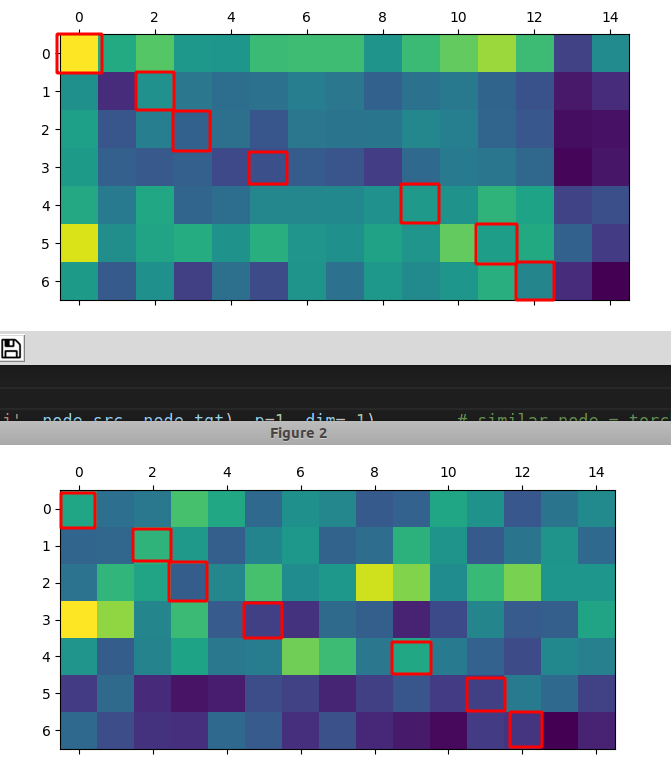


use the M of affinity matrix:

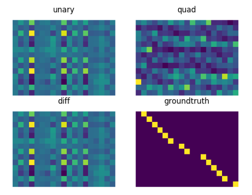


after 1 epoch:

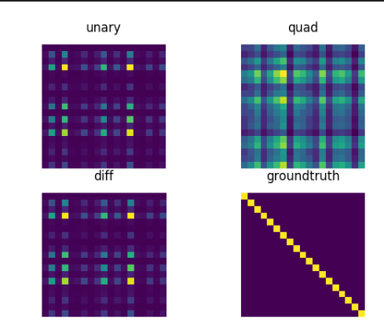


lucky case:

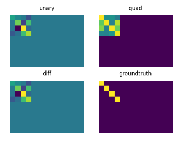


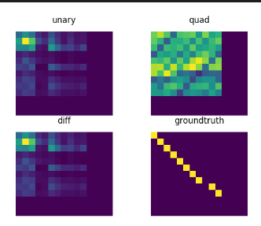

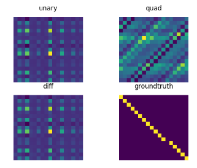


only use F.normlize(vec_S):

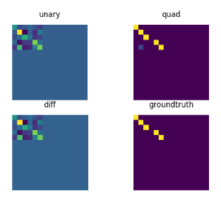


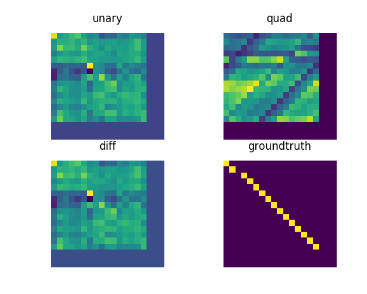


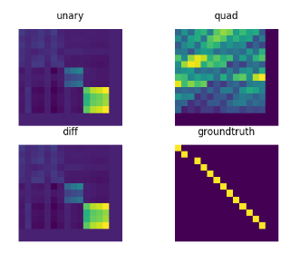

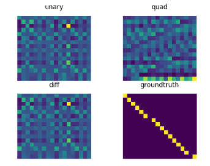


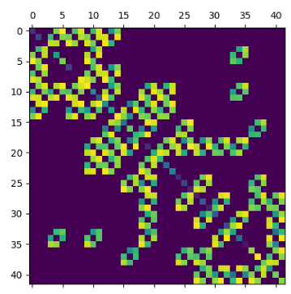

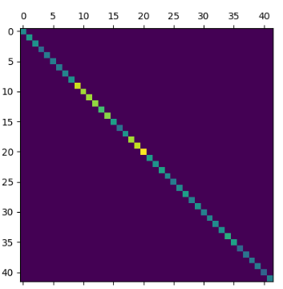

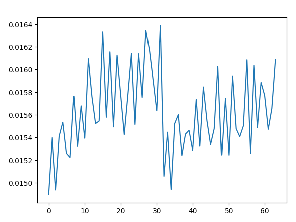


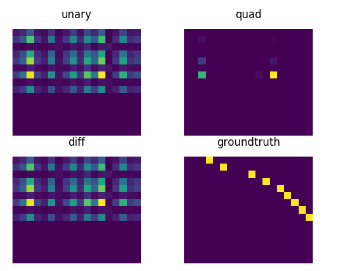

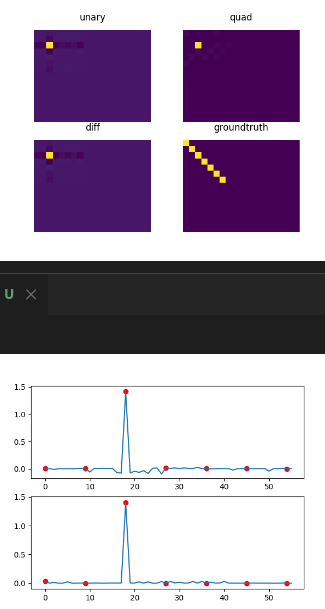

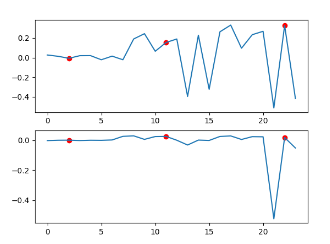


- use softmax for everynode


- repaire the affinity

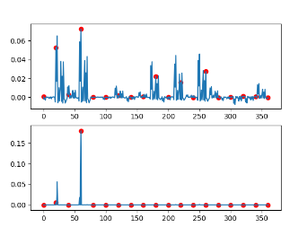


- ```
  S_output[:ns, :nt] = (1 - lam) * S_x + lam * S_select
  ```

  

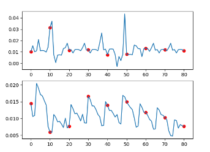

