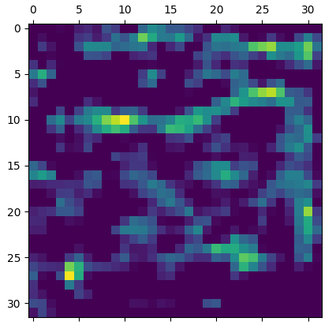
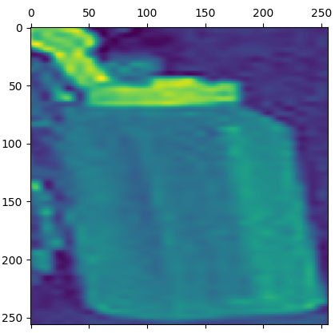
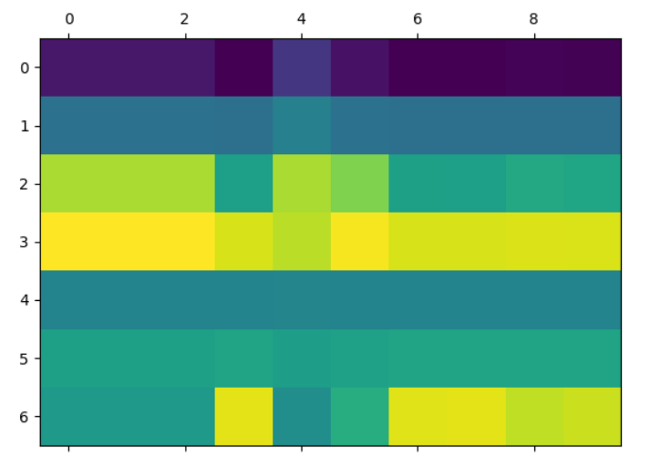
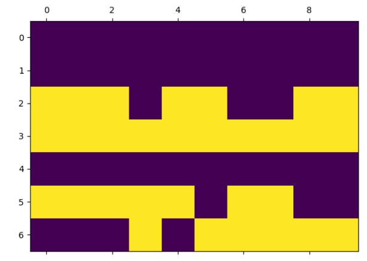
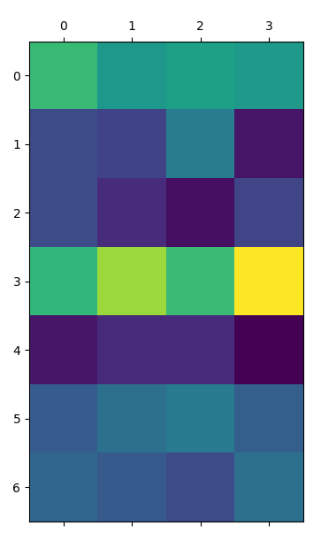
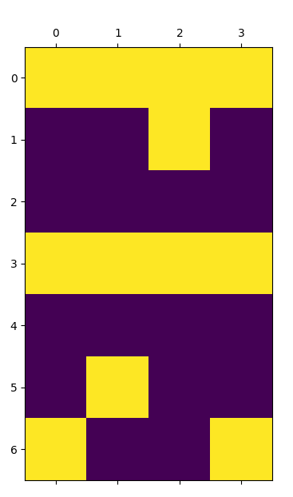
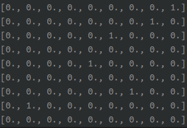
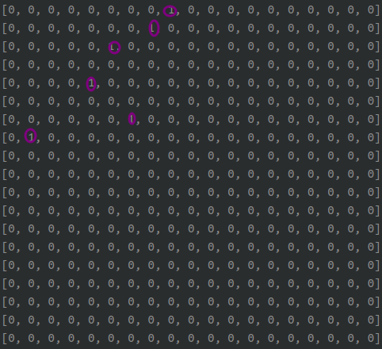
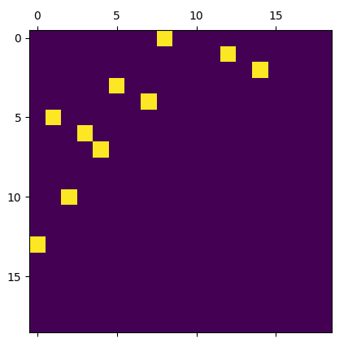
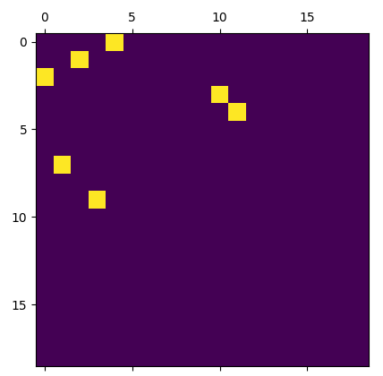

# The problem when implement

 ## Question

问题：

geo_metric的边顺序是固定的吗

如何在图中添加新的节点

torch_sparse coalesce()

如何获得边缘？

## node_feat

## graph builder

### used softmax

probability_edge , hard_mat

.

### used L1 

probability_edge , hard_mat

finished the edgebuilder

gt_mat

## final output

pred

output

## ablation study

single grtaph: Done  eval Accuray

GAT : Done 

encoder

decoder

| method                                                       | status | Training Accuracy | Eval Accuracy | other        |
| ------------------------------------------------------------ | ------ | ----------------- | ------------- | ------------ |
| supervised-SplineConv-Lpmp                                   | Done   | 0.79              | **0.79**      | iter 2000*10 |
| supervised-GATv2Conv-Lpmp                                    | Done   | 0.447             | 0.6625        | iter 2000*10 |
| self-supervised-SplineConv-Lpmp                              | Done   | 0.936             | 0.3057        | iter 200*10  |
| self-supervised-GATv2Conv-Lpmp                               | Done   | 0.598             | 0.3793        | iter 200*10  |
| self-supervised-GATConv-Lpmp                                 | Done   | 0.622             | 0.3804        | iter 200*10  |
| supervised-Transformer-GATConv-encoder-Lpmp                  | Done   | 0.424             | 0.6071        | iter 2000*10 |
| supervised-Transformer-SplineConv-encoder-Lpmp               | Done   | 0.858             | 0.7657        | iter 2000*10 |
| self-supervised-Transformer-SplineConv-encoder-Lpmp          | Done   | 0.597             | 0.2092        | iter 200*10  |
| supervised-Transformer-encoder-decoder-Lpmp                  | Ready  |                   |               |              |
| ssl-Transformer-gbuild                                       | Done   | 0.08              | 0.4009        | iter2000*10  |
| ssl-Transformer-gbuild-constractLoss                         | Done   | 0.08              | 0.5060        | iter2000*10  |
| ssl-Transformer-gbuild-constractLoss-16b                     | Done   | 0.0               | 0.0           | iter2000*10  |
| ssl-Transformer-gbuild-constractLoss-0.2Hamming              | Done   | 0.08              | 0.3525        | iter2000*10  |
| ssl-Transformer-gbuild-Hungraian-Hamming                     | Done   | 0.99              | 0.3866        | iter2000*10  |
| ssl-Transformer-spline-gbuild-Hungraian-Cintrastive+QueryLoss+Hamming | Done   | 0.99              | 0.40          | iter400*10   |
| sl-Transformer-gatv2-gbuild-Hungraian-Cintrastive+QueryLoss+Hamming | Done   | 0.99              | 0.3733        | iter400*10   |

实验设计：1. 设计相同匹配距离Loss

2. 设计用网络学习图的结构。

## contrastive Loss

自监督学习得到的知识先验和eval上的差距很大，导致了在自监督上精度70，结果在测试集上的精度只有20，效果很差，如何跳过这个自监督样本和有监督学习的gap值得去思考。

