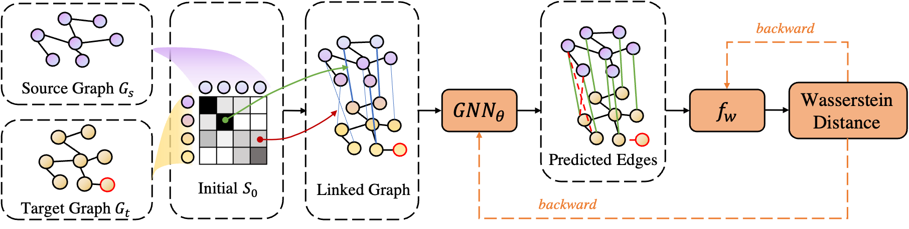

## 重新开始思考图生成器求解图匹配的问题

研究背景与意义：

在计算机视觉问题中，图像匹配是计算机视觉基本的语义匹配是一个基础的问题。图像匹配在Sfm、三维重建等任务上其中将图像中的语义目标进行匹配非常重要，将两张图像中的语义特征进行配对是计算机视觉中很重要的问题，解决该问题是三维重建、optical flow， augmented reality，目标跟踪的基础步骤（a critical element）。在以往的工作中，将图像中的语义特征构建为图结构并进行后续的匹配求解是较为流行和有效的工具之一。图模型能够在非线性变换场景中对匹配进行有效的求解，将语义特征作为图节点特征并将节点之间的联系作为图的边特征，从而构建图模型。通过将两幅图像转化为两个图结构，并求解图结构之间的节点匹配，将其作为二次规划问题求解。如今在深度学习的发展下，使用图网络GNN对图节点进行映射，将节点的邻域信息和结构信息嵌入到节点特征中，已有大量实验验证了其方法的可行性。

despite of the progress made by the above mentioned graph matching approaches, they depend heavily on the GNN embedding network. which only aggregate  information of single graph。以往的工作主要通过大数据驱动的方式，对节点映射到相同的特征空间中，通过求解二次规划问题进行指派匹配。 但在图匹配问题中需要满足一一对应约束，而由于截断或者遮挡的原因，图像上存在大量的outlier，难以满足这个约束。为了处理这些噪声点，一些工作考虑部分匹配的方法，通过排除相似度较低的特征来或者将相似度较低的特征指派到垃圾桶节点上，但是这种操作会导致被排除的特征无法反传梯度，导致网络难以学习到有效的信息。以上的方法都是使用迭代的方法求解匹配，导致计算量消耗大，同时算法的耗时加大。

在深度学习发展下，神经网络的泛化性能够在各种任务中获得较好的效果，在匹配场景中，神经网络将目标特征映射到高维空间，使其对不同语义目标具有较好的区分度。针对以上两个问题，我们提出Linked graph PW solver，首先考虑到噪声点和一一匹配约束的问题，构建连接图，并使用泛化性强的GNN直接求解匹配结果。随后针对网络难以应用到匹配求解过程的问题，应用MLP表示的wasserstein distance，通过对抗学习的方法计算得到最优的匹配方式，令神经网络的泛化性能够应用到匹配求解过程中。

Image matching is a basic task in the computer vision field.

（介绍语义匹配的意义）

在语义匹配中，通过对语义特征构建图结构，

以往工作的注重于图匹配的

（调研前期工作）

**相关工作：**

Learning free

Learning-based method

solver： 

scot、这类型的工作

图匹配：

深度学习：

## idea

设计了基于MLP的求解器，针对以往

## motivation 

为了解决场景中语义目标被遮挡或者被截断的情况，需要考虑到部分匹配的图匹配算法。然而目前大部分图匹配算法都是考虑完全匹配的图像，当图像存在噪声点的时候，匹配效果变得很差。

因此动机

1.考虑部分匹配

2.计算两个图之间特征的一一对应匹配是QAP问题，需要较大的计算复杂度和时间复杂度，因此需要一种更快捷的方式对匹配进行一个计算。

基于动机1. 我们使用考虑概率质量的特征计算，让模型推断出语义点在场景中的匹配可能性。通过连接两个图获得linkedGraph，输入网络预测每一个节点的质量，当源图中目标没有匹配对象的时候，预测出来的质量效果较小，该匹配点在图中被匹配的概率则更小。当语义目标之间存在匹配对的情况，匹配目标的概率质量接近1，此时目标可以有效进行匹配。通过构建连接图的方式预测语义特征的匹配概率，从而实现在存噪声的情况下有效进行匹配。

基于动机2. 我们针对最优传输中的EM距离计算进行优化，在以往的工作中，在计算出特征后，将特征进行EM距离的计算，此时一般是使用迭代的方式求解EM距离和对应的匹配矩阵，当存在EM距离的时候，匹配矩阵预测则认为是接近最优解。但是EM距离的计算通常是复杂度较高的计算，我们使用MLP对特征学习一个wassertein距离，此时使用一个判别器对特征学习到一个一维的wassertein距离，并使用对抗的训练方式，训练求解器求解最优的距离。

##  version 2

问题1: 存在噪声的匹配，由于GNN只对单个图的节点进行信息聚合，无法从单个图像中识别出outlier，因此目前的方法无法对噪声进行有效的处理。 并且当噪声点存在的时候，图结构和匹配对应关系变化剧烈，图网络会受到图结构变化的影响而导致节点的差异增大。【增加在噪声点下，有节点语义信息无图结构的精度，无语义信息只有图结构的精度。】

因此我们提出将两个图进行连接构成一个连接图，连接图中包含了每个图对应的结构信息，同时包含匹配信息，让图网络直接对连接图进行边预测，将求解匹配问题转化为边预测问题。让网络能够自适应去结合两个图的节点语义信息和图结构信息来求解问题。

问题2: 在深度学习下的图匹配框架中，常用的方法是有监督学习的方法，通常将匹配结果和真实结果计算误差损失来更新网络，让网络对特征进行更好的映射。通过设计损失函数监督网络进行学习

## method

The core part of our model is a learnable distribution of the matching matrix M between two graphs. We first develop an efficient approach of computing gradients of the distribution parameters. We then develop a learning architecture that can iteratively refine a predicted matching. An overview of the model is given in Figure 

1.

To capture the inherent correlations among graph topology and node attributes for unsupervised graph alignment, a straightforward solution is to obtain node embeddings with prevalent GCNs and then perform bipartite graph matching based on the node similarity matrix in the embedding space. However, this solution has several limitations as follows: (1) the embeddings of nodes from different graphs are in different feature spaces and the global graph patterns cannot be well captured; (2) the computational cost of traditional bipartite graph matching is high; (3) the node embeddings may not be suitable for the alignment task.

The propposed framework

为了获得图节点特征之间的匹配关系，一种直接的方法将将特征节点映射到相同的特征空间，并通过计算两个图之间的最优传输距离得到匹配结果。但是这种求解方式有以下几种缺点：1） 噪声点的存在会导致最优传输距离计算效果较差，目前还没有方法能够解决图匹配中的最优传输距离受噪声点的影响。（2）可差分的迭代求解最优传输距离的方式需要较高的时间和计算复杂度。（3）特征学习网络在不同场景下的特征具有不同的连接关系，在拓扑结构差异较大的情况，特征学习网络难以学习到场景特异的信息。

针对以上的问题，首先提出了对抗生成连接图求解模型，

在深度框架中大部分针对这个问题的求解方法工作是基于有监督学习的方法。

图匹配需要求解两个图中节点之间的对应关系，目前常用的求解方式是基于最优传输的sinkhorn迭代算法，然而这种算法在处理噪声点和离散化匹配结果上效果较差。损失函数的设计上通常使用

首先考虑到以往的方法

## 各个模块的作用

GCN： 主要负责学习特征节点在语义空间的表达。

求解器：主要用于根据特征在空间中的表示进行匹配求解。

求解器的缺陷：求解器没有获取显示的图结构信息，仅仅根据相似度求得的匹配距离并不是最优的。

GCN的缺陷： 在CV领域中，由于语义特征会出现明显的位置变化，甚至出现遮挡和截断的情况，并且图结构的生成是根据直接的几何距离得到的，这种直接的图结构构件方式导致了匹配图之间的结构差异较大，难以进行有效的匹配。网络的特征学习器无法在差异较大的图结构中进行正确的特征映射。

/home/wh/Documents/codes/GNN/linked-graph-generator/show_gen_g.png

因此针对以上两个缺陷，首先构建连接图，让网络能够同时处理图结构和节点特征信息，并且在针对通过对节点和边的重构，进行匹配的求解。

However, the existing methods of learning GM mainly focus on improve the affinity matrix by learning a graph feature embedding , paying little attention to the generalizatio of the optimization compmnent.

## 实现方案， 现在有三种实现方案

1. 参考lsgm的编码器，要自己转tensorflow为pytorch的代码
2. 参考spline使用，要将dense的矩阵变为sparse计算节点特征，再算边特征
   1. 加入之后计算时间变长（140sample/s）， 但是精度依然还是达不到70。已经过拟合了，
3. 用mlp计算

实验发现只需要给连接的边，不需要给权重就可以让网络有不错的效果
