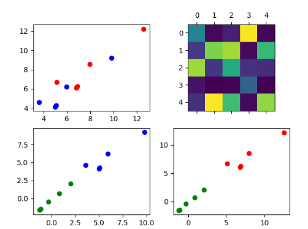
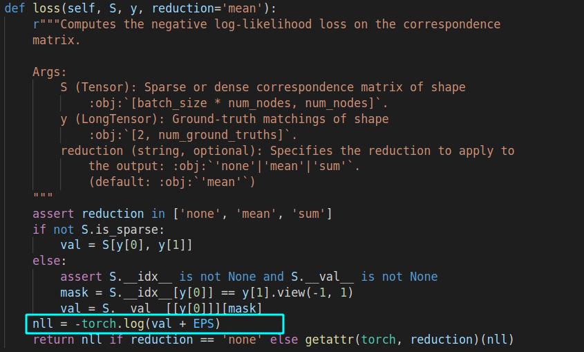

# How the encode learn from the point set?



The encoder only consider propagate the features on each graph， BB-GM used Siman-Network to propagate the embedding space， However, the output of the GNN only consider feature on each graph independently. PCA-GM used the affinity matrix to represent the connection between the source graph and target graph, but the similarity matrix would lead the over-smooth at the beginning.  




这个代码看得我都傻了。。


outlier与inlier的差异


DGMC中的实验是包含了outlier的，精度为73，而即使去掉了outlier之后的匹配精度还是73.2


## pseudo code

```latex
\begin{algorithm}
\caption{Quicksort}
\begin{algorithmic}
\PROCEDURE{Quicksort}{$A, p, r$}
    \IF{$p < r$} 
        \STATE $q = $ \CALL{Partition}{$A, p, r$}
        \STATE \CALL{Quicksort}{$A, 
        
    \ENDIF
\ENDPROCEDURE
\PROCEDURE{Partition}{$A, p, r$}
    \STATE $x = A[r]$
    \STATE $i = p - 1$
    \FOR{$j = p$ \TO $r - 1$}
        \IF{$A[j] < x$}
            \STATE $i = i + 1$
            \STATE exchange
            $A[i]$ with     $A[j]$
        \ENDIF
        \STATE exchange $A[i]$ with $A[r]$
    \ENDFOR
\ENDPROCEDURE
\end{algorithmic}
\end{algorithm}
```


