# 重新做用query匹配outlier的实验

之前做超图query的实验基本上宣告失败了， 网络更加倾向于学习伪造的outlier的匹配，导致实际的匹配点无法找到正确的匹配。出现过拟合现象。

## 重新利用query做outlier的匹配候选点

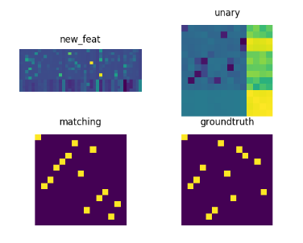

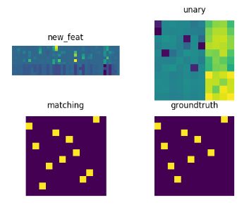

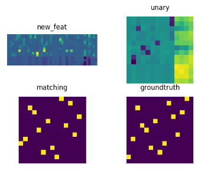

eval   

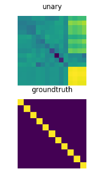

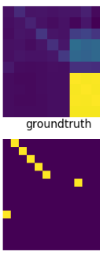

use hungarian as gm_solver:

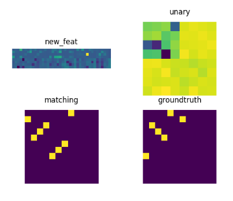

eval:

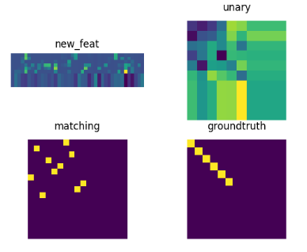

### ot+mu

training

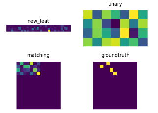

eval:

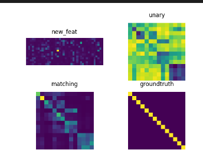

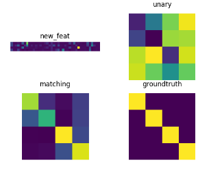

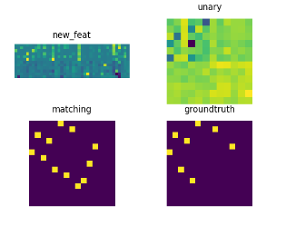

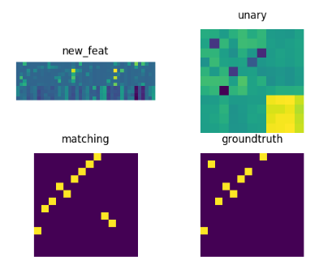

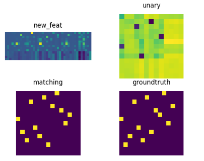

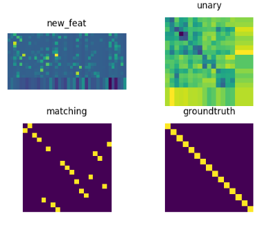

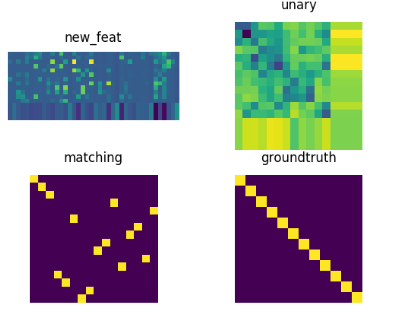

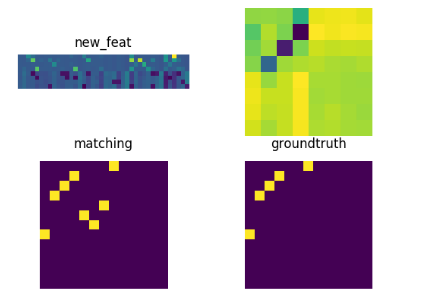

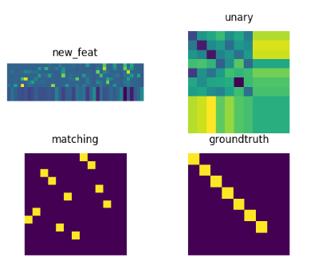

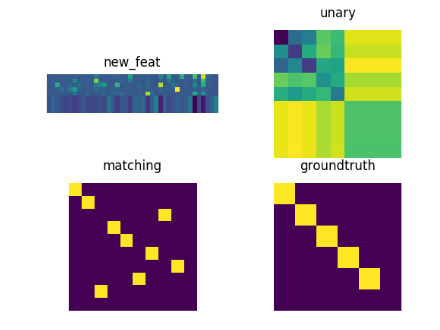

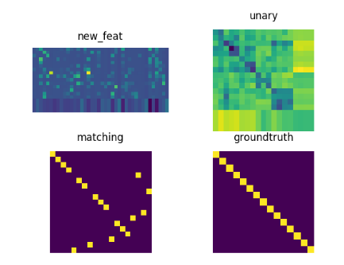

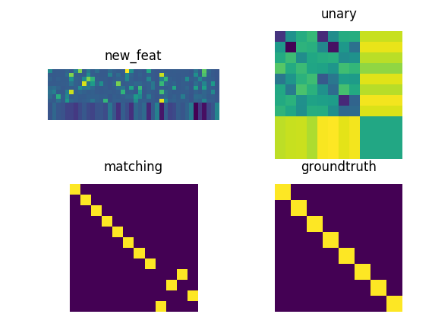

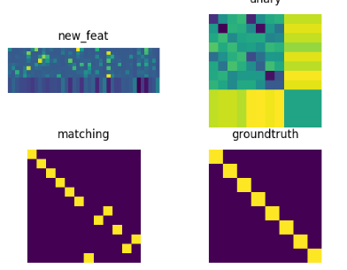

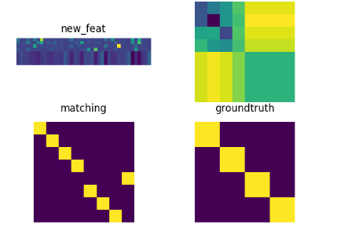

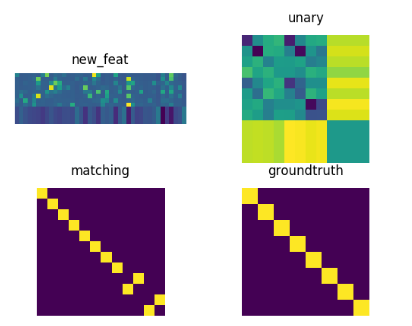

在保证ar分布相同的情况下，就会得到两个都过度平滑的情况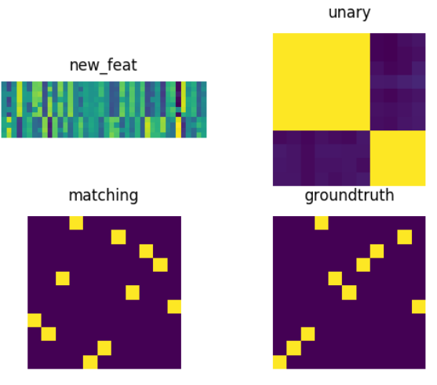
