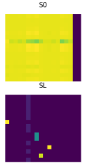
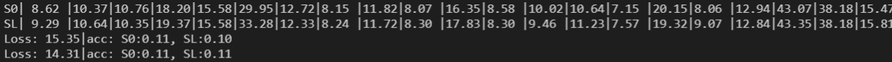

# SIGMA 复现


## 初始跑的结果

很差，精度只有18，根本就是烂了

可视化效果也很差：






查了一下和我的代码的差异，发现他改了数据集，修改了VGG提取特征的层。看看到底是用了哪些层，然后跑他的源码是不是就有效果？

果然用了他改的网络层输出作为节点的feature之后，精度就正常了，在pretrain之后精度在（60），然后训练之后精度到达论文的精度，然后batch_size设512，相比我之前的64要大很多，但是设置64也可以有一样的效果。源码中实际只用了一个网络，所以使用**随机加噪声和迭代的方法**也是有效的。


```python
# vgg16.features[20].register_forward_hook(hook)  # relu4_2
vgg16.features[29].register_forward_hook(hook)  # relu4_2
# vgg16.features[25].register_forward_hook(hook)  # relu5_1
vgg16.features[36].register_forward_hook(hook)  # relu5_1

```


给我的启发是在网络之前加上随机噪声可能效果会更好。


在sinkhorn的时候使用随机sinkhorn：gumbel_sinkhorn，加入了随机噪声，下面做实验去除噪声看看会不会有影响。


## 测试预训练的效果


将预训练epoch设为0，然后看看效果


## 在自己写的训练框架中，精度依然下降了

用了预训练效果很差，不用的话精度也是接近70左右，说明我的代码中数据训练可能存在提升点。

代码里面有低级错误。。将args的参数用错了，以后要复现代码的时候要仔细检查每一个参数是不是对的。


改完之后貌似结果也不对，精度还是差一些。


