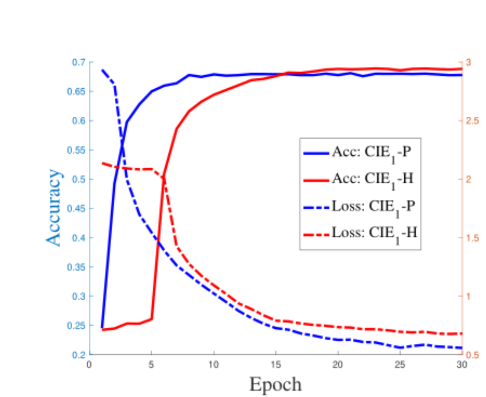
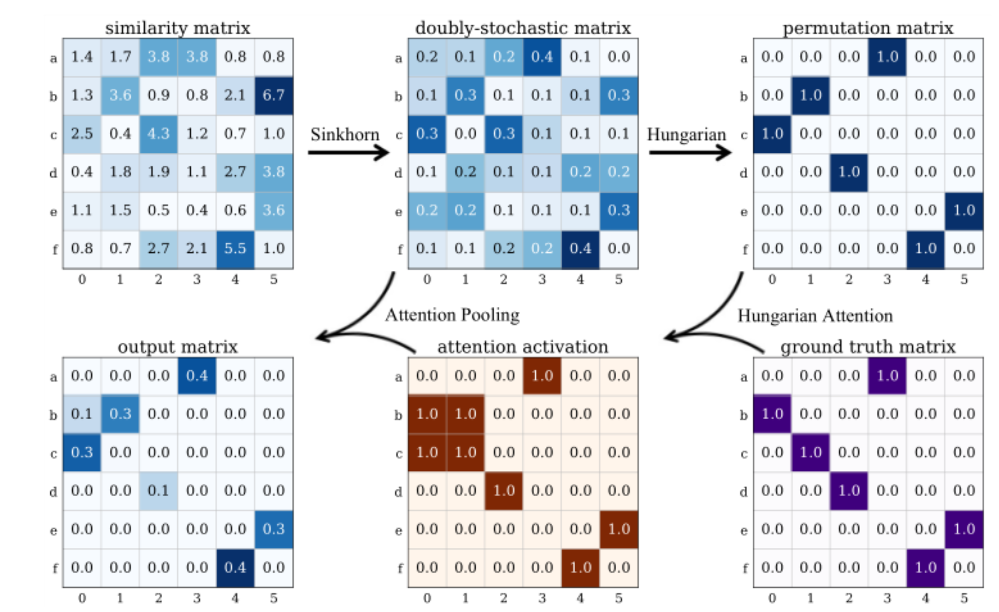

# 图匹配的问题和想法

### 人工标注点的问题

如何自动获取点，大部分工作[1],[2]使用的Pascal VOC数据集的annotation里面包含了人工标注的点和边，邻域矩阵A是通过对坐标点进行三角剖析获得的。有没有方法让网络自己学习到邻域矩阵A？

**目前方法**：使用Self-attention对边进行相似度的权值计算，可以通过网络学习到边的权重。

这种方法在SuperGlue和LoFTR中使用到，但是他们属于特征点匹配，还没有用在语义点匹配的问题上。

**我的想法**：将Self-attention用在语义匹配上

### 匹配矩阵的计算复杂度

研究Sinkhorn是否是影响到计算复杂度[^1]

Hungarian不可以反传参数，但是可以减轻不必要的计算，保证了精确率。

**设计实验**：

测试反传参数的梯度大小

大量的迭代导致样本不平衡的影响更大

**解决方法**：对最终的loss加入mask $Z$

原公式如下所示：
$$
L_{CE}=-\sum_{i \in G_1,j\in G_2}(S^G_{ij}\log{S_{ij}+(1-S^G_{ij})\log{(1-S_{ij})}})
$$
加入mask，其中mask由离散形式的Hungarian和groundtruth结合而成：
$$
H_{CE} =-\sum_{i \in G_1,j\in G_2}Z_{ij}(S^G_{ij}\log{S_{ij}+(1-S^G_{ij})\log{(1-S_{ij})}})
$$

**可能的缺点**：只是在最后的输出层考虑的最有可能为正样本的损失，在反传时仍然需要考虑其他负样本的计算，依旧会导致不平衡。

**最直接的方式**：缩短甚至消除Sinkhorn的迭代层。

**我的想法：**动态调节迭代次数，逐渐缩减，同时设计损失函数考虑所有的样本，但是会动态调节平衡。

### 样本不平衡问题

由于对匹配矩阵的输出进行二分类，分为匹配的点对和不匹配的点。

对于匹配矩阵${\bf X} = R^{n \times m}, n \leq m$， 正确匹配的点对为$n$ , 不匹配的点为$m \times n - n$。

目前的解决方法相当于对不同分类调整权重[^2]

解决方法：使用超参数调节二分类的权重

对比交叉熵损失：
$$
L_{crossentry} = -\sum_{ij} {\bf X}_{ij}^*\log({\bf X}_{ij})+(1-{\bf X}^*_{ij})\log(1-{\bf X}_{ij})
$$

$$
L_{FM}=e^{\alpha \sum_{ij}[{\bf X} \bigodot (1-{\bf X}^*)]}+e^{\beta \sum_{ij}[{\bf X}^* \bigodot (1-{\bf X})]}
$$

但是过度扩大小类别的权重会出现过拟合现象。

### 数据集问题

目前没有SAR和可见光的语义点数据集，可以自己做一个，并用前人的模型在数据集上进行测试。

需要做的工作是收集2000幅光-SAR图像，每张图像标注10个语义点。

[^1]: Tianshu Yu, Runzhong Wang, Junchi Yan, and Baoxin Li. Learning deep graph matching with channel-independent embedding and hungarian attention. In Proceedings of the International Conference on Learning Representations, volume 20, 2020. https://openreview.net/pdf?id=rJgBd2NYPH
[^2]: Quankai Gao, Fudong Wang, Nan Xun, Jin-Gang Yu, Gui-Song Xia1Deep Graph Matching under Quadratic Constraint. In Proceedings of the IEEE Conference on Computer Vision and Pattern Recognition, 2021.

## 解集为凸集的证明

定理：匹配矩阵的可行解集合为凸集

证明：
$$
对于任何 \bf X_1,X_2\in \{{\bf X}|{\bf X}^T{\bf 1}=1,X1\leq1\} \\
\theta_1+\theta_2 = 1\\
X_3 = \theta X_1 + \theta_2 X_2\\

X_3^T1 = 
\begin{array}

a & s \\

\end{array}
$$

