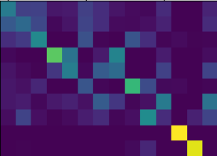

## 针对outliers问题（size-varied graph matching problem）

要解决的技术路线：

1. 首先要给得到一个区分outlier和inliers的权重
2. 根据得到的权重（saclar）区分开outliers和inliers
3. 最终通过可差分的方式得到outliers和inlier的特征并计算相似度。

目前的图匹配中常使用sinkhorn做匹配求解（solver）， 但是sinkhorn只能处理intersection（只有内点）d的affinity matrix。在包含outlier的情况下，需要设计一种去除outlier的策略，用于在输入sinkhorn之前提供每个点的匹配先验（参考scot）。

1. 如何学习出这一个先验？

根据每一个点和其他所有点之间的相似度（可变的n维，但是序列无关），计算一个outlier值。要求是：1. 序列无关，改变序列顺序不会影响最后输出结果。2. 输出一个标量。 3. 可以反传梯度。

1. 可以首先使用排序保证顺序不变性。或者是抽取【均值，方差，最大最小中位数】等数据的统计特征。
2. 输出一个权重，可以用mlp得到一个值。或者计算一个差异值

主要有两个路线：1）使用传统方法，统计分析出一个outlier的可能性， 2）用mlp预测一个inlier的概率。

2. 得到inlier概率后，如何应用这个概率计算出匹配结果？

这里也有两个方案：1种是直接作用于求解匹配的相似矩阵，用inlier作为sinkhorn的先验概率，输出最终匹配结果。2是对节点特征做乘法作为特征权重，将outlier的特征减少到接近0（会直接改变节点的特征表示）再用这些加成后的节点计算相似度。重复以上的操作，直到数量变换稳定（达到一定的循环次数）

## 针对MLP的设计进行讨论

用一个mlp去学习到一个特征，轩少说为啥不直接使用平均作为最后的权重？

用求和来计算inlier的概率好像是个可行的思路，outlier和其他点的相似度会更加低，

## 数据集更改

发现存在一些数据样本里面存在少于3个点的情况，重新处理了数据集。得到的精度有所提升：

| sigma | acc after re-process | acc before |
| ----- | -------------------- | ---------- |
| Sigm  | 58.34                | 55.84      |
|       |                      |            |
|       |                      |            |

检测outlier的数量对算法的影响

| outlier number | <4   | 4-6  | 6-8  | 8-10 |
| -------------- | ---- | ---- | ---- | ---- |
| Sigma          |      |      |      |      |
|                |      |      |      |      |
|                |      |      |      |      |

之前sigma对所有的节点都加对应的全0的dummy node，去除dummy node后查看实验结果

| ablation study   | dummy node x N | dummy node x 1 | no dummy node |
| ---------------- | -------------- | -------------- | ------------- |
| sigma            | 58.34          |                | 58.84         |
| linked-graph     | 56.85          |                | 57.30         |
| linked-graph +mu |                |                | 56.97         |

## inlier -loss

设计inlier的输出为分类，并且使用交叉熵。

在测试的时候，用0-1结果做sinkhorn求解。

这个模型出来的结果还不如之前用于回归的模型。

## 理想分类inlier分类模型

用gt给一个outlier分类概率，验证一下理论上线的方法精度。（即假设了完全能够分类正确的情况）

理论上限为： 65.08

graph-context结果：64.6

在给了inlier-gt的时候，问题应该退化成intersection的匹配问题，但是为什么精度还是那么低？

是不是sinkhorn上面还是有问题，导致没有算好，或者说不应该做归一化，而是直接求解会更好？

### 没有归一化的sibkhorn先验求解 （w/gt）

## size-varied graph matching的新范式

针对存在outlier的（size-varied）graph matching 问题，提出一种新的建模范式。通过将图匹配问题分解成两种模块，针对每一个模块中的问题，设置对应的方案，最终得到有效的结果。

## 加入outlier 的混淆information模型是否有效？

假设存在单射的映射方式，将source graph 双射到target graph。 需要测试一下理想情况下的graph embedding 的效果。outlier的输入是否会影响最终inlier的embedding featrue 表示相似度。

## 测试outlier info的影响

在sinkhorn上使用的是ground-truth的先验。测试outlier节点的连接是否会对网络的映射造成影响。

主要测试outlier信息对网络的训练和测试部分的影响。

1.使用没有outlier的图匹配训练网络，然后使用有噪声的测试集验证精度图embedding的精度，只取inlier进行匹配。

2.使用包含outlier的数据集作为训练集，在匹配部分只取inlier进行匹配。

3.测试只取inlier进行u=1的sinkhorn测试，与用0-1分布的先验分布做测试的结果是否相近。

原始网络是不使用link的，通过使用attention进行较差信息传递实现

这里的varied测试指使用ground truth信息，直接给到先验的solver。

| 实验名称                          | S0精度 | SL精度 | 备注 |
| --------------------------------- | ------ | ------ | ---- |
| inlier训练inlier测试，先验solver  | 71.94  | 72.49  | end  |
| inlier训练inlier测试，常数solver  | 76.6   | 74.09  | end  |
| inlier训练varied测试， 先验solver | 63.34  | 62.68  | end  |
| varied训练varied测试，先验solver  | 64.68  | 63.94  | end  |
| varied训练inlier测试，先验solver  | 69.35  | 67.33  | end  |

## inlier discriminer的效果

## 带先验的sinkhorn迭代/平均常数sinkhorn迭代/gumbel sinkhorn

测试了代码

带有dummy node and noise的gumbel sinkhorn

u=平均数的sinkhorn

0-1先验的sinkhorn

在某一些样本中，带有先验的sinkhorn准确率更高。

[ 0,  1,  2,  3,  4,  5,  7, 10, 11, 13]

err图

## 为什么使用先验的solver的效果比不上常数的效果？

能不能在理论上证明这两个方式是等价的？

在梯度更新上有差距么？

