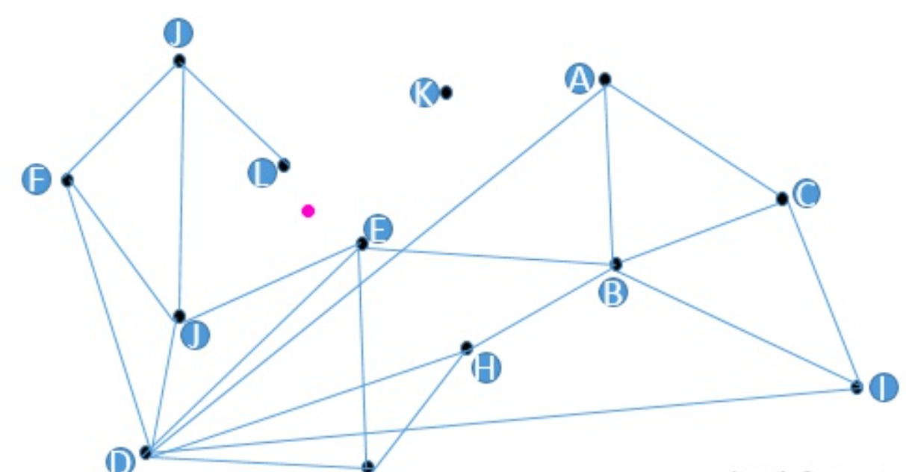
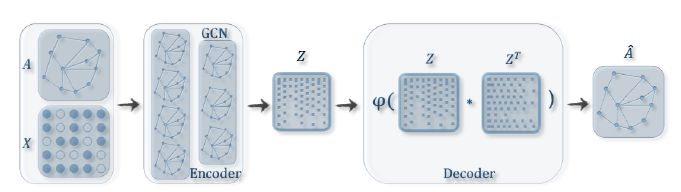
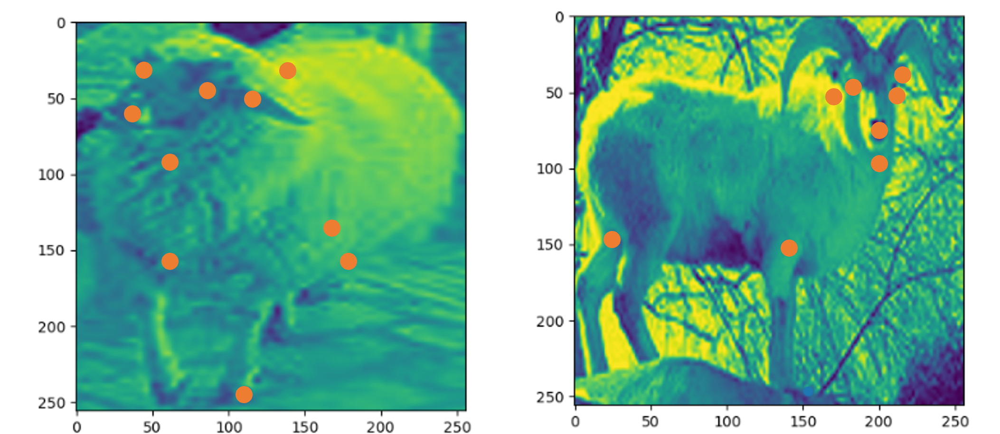
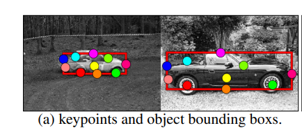
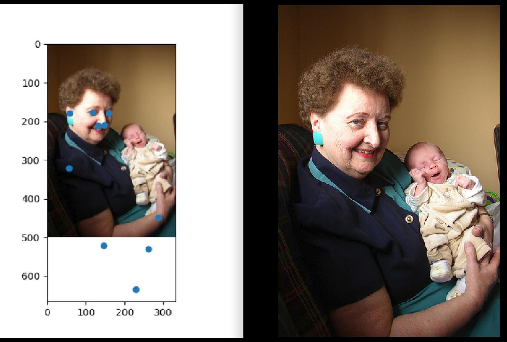
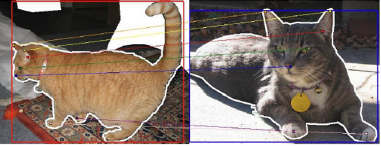
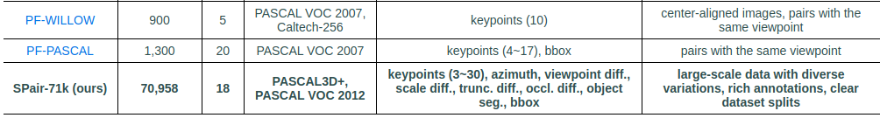
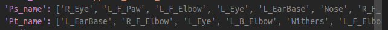

# 如何使用生成式模型重构图

## IDEA

使用GAN设计生成式模型,输入节点和特征,输出(生成)图的结构（邻接矩阵）.  

## motivation
#### 前人的图结构生成方式

 目前大部分工作没有考虑在特征空间上设计图的结构。现在graph的生成方式过于简单，基本为以下三种思路：

1. knn

2. 三角化

3. 全连接

![德勞內三角化- 维基百科，自由的百科全书](data:image/jpeg;base64,/9j/4AAQSkZJRgABAQAAAQABAAD/2wCEAAkGBxMUExYTFBQXFxYYGRwZGBcWFxgbGhYZFxYcGRkbFxgZHyoiGR4nHBkZIzMjKCstMDAwGCI2OzYvOiovMDoBCwsLBQUFDwUFDy0aFBotLS0tLS0tLS0tLS0tLS0tLS0tLS0tLS0tLS0tLS0tLS0tLS0tLS0tLS0tLS0tLS0tLf/AABEIAOAA4AMBIgACEQEDEQH/xAAbAAACAwEBAQAAAAAAAAAAAAAABAMFBgIBB//EAE8QAAIBAgMEBwQGBAsHAgcAAAECAwARBBIhBTFBUQYTImFxgZEyQlKhFDNicrHBFiOC0QckU1Rzg5KTorLhNENjs8LS8ER0FRcllLTi8f/EABQBAQAAAAAAAAAAAAAAAAAAAAD/xAAUEQEAAAAAAAAAAAAAAAAAAAAA/9oADAMBAAIRAxEAPwD7jRRRQFFFFAVw6gggi4OhHOu6KBKElD1bHT3GPEfCTzHzHnTtQzRBhY/6g8CDwNLx4nJ2ZCBYXDnQMBvPcRxFA9RSb40Gwj/WEi4ykWsdxLbgKPopb6w3+ytwv728/Sg6fGoDbNc8luxHiBurz6XyjkPkB+JqdIwosoAHICw9BUlAp9KPGOT0B/A0fTk945fvgr8zpTdeEUHtFJnBAaxnIfs+z5ru/ChMQQcsgCk6Bh7Lf9p7j6mgcooooCiiigKKKKAooooClsVOVsFF3bcPxJ7hRiJ8tgBdj7Kjef3AcTRhoMt2Y3Y7zw7gOQFB1hoMgte53kneSd5NT0UUBRRRQFFFQTzqgueOgA1JPIDjQT0o2NW5CgsRvC628TuHrXIhaTV9F+BT/nYb/AaeNMogAsAABuA0AoIP1rfAg83P5AfOsd/CVgDiMOMEsjmSaREB7IVbHOSwA1AVSSOQ7xW0xcpUaC7E2Ucyefdx8qz2wcOJsRJiT2kizQQEjVjmviJb/adVQd0PI0GC2F0ax2EzYGPaLwNEDIt4UaGWN29tSRmSzaNfNY23AitHm2vELPI5H8okUWJWw4lVMLjwAatV0h2U0yK0TBJ4iXhkIuA1rFXG8o47LDz3gVFsLGddF1kY6tgSssDn6qRfaS49kjgQLEEECxoM/huk2JZurjxGCkk0vHLHNhptecTuSKtU2vtC+X6Lh3biBipI28keDX1q3xUcE46qeJGv/u5lVgeeW9wfKquTobCFywSTQAWssUl0W3wxyZlXxUA99BOds4lR28BMT/wpYHH+J0/Cvf0kyi8mFxSf1Jf/AJRakv8A6ph13w41QftYeUDy6xXt+zep16XRqoaeKaAWJzumaOw4mWIsij7xB7qCUdL8KBd2kiH/ABoJo/8AOgryHpfs6W6jF4duBUyoPUMatNn7ShmXPDIkq/FGysPUGp54EcWdVYcmAI+dBXYPHRghVlR0Oisrhip4KxB1HI+VW1UuK6K4GQWfCQN/Upf1ApDA9EcIl41iMZXUNFJJGWU7j2GGo3H/AFoNTRVCnRlF9jEYpTz+kSP8pCwpZtnTIxCY/EOw90pA4H3rRi3maDT0VlThtprdvpWHyDW0uHIIHeySgCqPEdM8YDlgGFxb3IC4fr7EjeOssyA92ag+jUpLiTfIgzNx+FfvH8t9YD+Dfb+0sUJ/p0RREfKrRx5WLAsJE33IBA1A476+g4Qpl/V2y93Pjfv8aAw+Hy3JOZj7THj3DkO6maKKAooooCiiiggxM4QX3ncAN5J3AVHh4DfO+rn0UfCv7+Nc4YZz1h3bkHJefi34Wp2gKKKTbF30jGa283so8W/degpuk2Le2SE2mkbqITvyO4vJKRxCIL/skcautnYKOCJIoxlSNQijkFFhWX6NYc4mZ8W7HImaKAL2fabNO995zMFQbtIu+tQNnx7ygJ5t2j6tegkOKT41/tCs/tpTh5Dj4rsuULiY11zxr7Mqgb3j10HtKSNSFrRdQnwr6ComwER1MaX55QD6jWg6GSVAdHRgCDoQQRcEVH9GZfYYj7L9oeRvcetZrCYY4GcQKzLhpj/F9xSCXeYSDuRt6brEMvw1pfpDp9Ytx8SXI813j50HoxDj24z4ocw/I/KlWxKK2ZGGurxnQn7Sg65vxqxjkDAEEEHcRuNeugIsQCORoKfGdG8HORKYUzkaTR3STXiJEs3zpdtiYmP/AGfGvbTsYlBMthwDApIL8yzU8cCiP7ICufdutn8uB/Ed9MSYZFBYswA3nO376CpG1cbFpNgxINO3hZQ1+ZMcoQqB3FqT2l04wMYEkkpidN8cqPHIUJAbKjgFuB05CrkYVn3F0XmWYs3gL2Xzue4VmunuxosQsOBIZjNKt3ZmZo0Ttuy3OhyqRfcLjnQTnp5hJrdTI0oI9mBSXbS9iTYRDxIJ7qnhxWOmFooo8NHwJHWyMPA5EjPm9L/wf4VMOjbPKKGh7aNlH62J3YZjzZXDK37J0zWrVnAR7wgU817J9VtQUA6IJIQ2JZpyLECY9YARxC2EanwQeNaDC4RIxZFA4d+nfXBSRdQc6/C1g3k24+B9amgnVxccNCDvB5EcKCl6Gm8U3/usT8sQ4q2nwoJzKcr/ABDj3MPeFVPQn6iX/wB1iv8A8mStBQLYacklWFmG8cCOa8xTNK4uIkZl9tdV7+anuO7/APlSQSh1DDcR6dx76CaiiigKTxvayxfHfN9xfa9bgftU5SkGsjtysg8tT8z8hQN1HJIFBJNgNSTwqSkYx1rZz7CnsD4iPePdy9eVB6EaTVrqnBNxbvfkPs+vKqzphjWiw5jhsJpbxRfZJUlntyRAzeQHGtBWWwMX0mebEHVI1fDYf1/XyA/adVTwi43oL7ZeBSCKOGMWSNFRR3KLCm6gwcmaNG5qD6ip6AooooEdqbPjnieGQXRxY2NiORUjVWBsQRuIqu6ObQkzPhcQbzwgHPawmiOiSqO+xDDgwPAir+qXpDstpQksJC4iElomO43AzRvb3HAAPgDvAoHpMOQS8dgd5X3X8eR7x86lw04cciNCp3qeRpTYe01xEQkUFTqro3tRuujo1uIPrv41PioDfOntDh8Y+E/keFBJi0BRgxsLb+Vtb+W/ypPAEyASPw0C8ARvYg8Tw5Cu5ZRJkUey3aP3VI0I72sLdxqWLsysvBgHHiOy3/R60DdZPYK9fjJ8SdUivBF94kNMw7iFhXT4Gq823tEYeCWYi/VoWCjext2VHeTYedK9Edm9RhIYibtkDO3xSP23bzYmgS2zgZCgxEK5p8O8jRr/ACiMf1sN+GdQLcmVTrarzZuOjmiSaNsySKGU8wRcV7s/2SebMf8AEao8IfouLMB0gxJaSHgI59Wlj/bF5F71k7qDTUpicOb500Yejj4W/I8KbooM90Ia+HY88RiDY7xfEyGx760NZfob2IgfdlkmPg/XufmP8vfWooClMNo7p3hx4Pe/+JT603Sh+uHfGfkwt/mNA3RRRQFKbN9gH4izerEj5U3Smyvqo/uL+FB5je1aMe/e/cg9r1uB500otoN1LYXVnfvyjwT/APYtTdBR9KcZIkQihNp526qI78hYEtJbiEUM3kBxqx2bgUhiSGMWSNQijkFFhVLshfpGKlxR1SLNh8P5N+vkB+06qnhFxvWloFMBopT4GI8t6/Iim6Tl7Egfg9lbuPun5keYpygKKKKAooooMvtqI4WU45BeJgBi0F9VX2Z1HxINGHvJ9wA6OJwwDKQQRcEG4IOoIPEVLWX2b/EplwpFsPKT9GbhE+9sOeQtdk7gy8BcLTD9maQ+65C+DKub55j/AGe+mcRo8Z7yvky3/FRUDRkiUD2g+ZfvBVI/876kmkDCJhuLKR4FTQVe2z12Jw+GtdVJxMvcIiBEp+9Kcw/oTVlh5skAO8ouW3Nl7IHmQPWq3ooRKZ8Zv697RnnBDdI7EbwSZHH9JTp+u6u/ZJEn7VvZ+WbyoHsLFkRV5AC/Ow30nt7ZYxELR5ijaNHINTHIpzI4B3kMAbcd1WdFBU9HdpmeK7qEmQmOZAb5JVtmA7jcMDxVgatqzO2P4riFxg0ikCxYkcBraGbuylirHk4J9itNQZno0f4jC/Ji3rM1/kTWmrK9FDfZcPen+Zz++tVQFKJrMx+FFHmxJPyC+tTyyBQWJsALk1FgUIW7CzMcxHK+4eQsPKgZooooCk8A2WIX924P7JI/KnKrJjlSdeSlx4Mp/wCoNQM7OW0SX3lQT4tqfmarelOMkSIRwm08zdVEd+QsDmktxCKGbyA41cxjQeFZ3Y6/SMVLijqkWbD4fyb9fID9p1VB3Rcb0F1s3ApDEkMYskahFHIKLCm6KKCOaMMpUi4IsaXwshB6tz2huPxr8Xjz/wBacqDEwBxyI1DDep5ignopOPEEEJJox3H3X8OR+z+NOUBRRRQFIbX2bHiImhkBytxBsykG6sje6ysAQeBAp+igzHRvaD9bJhpyOvRVLECwmUEqsyjgGFrjXKysLnQ1B0oxDrAkMRyyyytBGfgLhhntxyIS37NWPSXZLyBJ4LDEwEtESbBwfbicj3HAA7iAeFYbY3TKDG40SxOAsMRZFlIS0s9g5OY2ORY8t/8AiGg+iu0eHiREAAVQkac8osAOOgqLq2KZVRi183WNZO38QGp7rW3aVDgcZhkuzYmJ5DvYyp6LroKcbbeGG/EQj+tT99B5FiJSSpEYYbwS2o5jTdU3WyjfGp+6+vowH40jiNs4JrZsTACNxE0YI8Del/0qwye1isO4+JZ4gfNS3zHoKCymeORTFIujgqUkFg4IsRyOnKqzoxOyZ8FKxaSADI7b5YGuInPNhlKMfiS+mYV5+mezHBU4zDEcQ0qfME1mOlPSvAxdXiocXBI8B+rWVGkeJyBLGmt2uACAdzIpva4oLzoK2bZ2BX4o0Y+CjMfnb1rXVgP4KNrJNs+AxhnaONYSALZTGBe5OmpN9+61bLqGf6wi3wLu/aPveGg8aDxT1pB/3YNx9sjcfuj5nw1eoooCiiigKQ2jHubgQUb7r6A+Rt6mn6jkQEEEXBFiO40FDtzHyDDRpCbT4jLFEd+RmW7SEcQihm/ZA40/gkigjSCJSRGoRVXUgKLDMdw86+NdGem2KlxLvPAqCFDFGZJTCkPWOCyvMyMAz2jGaw0QW319SgG0SoyJg4lOvtzTb+NwsYbx40F3eZuCJ43c+gsB6mjqJP5U+Sr+d6qE2Vjj9ZjlH9DhlQjwMjyV2OjZItJi8VJ/WiP/AJKrQWnVSjdIp+8n5qRSOM6QRQX6+SKMDeetSw8Q1mHoagfoZg2FpYjN/TySS/8AMY07gtgYWK3VYeFLfDEgPqBQV/6YYCRSEmWYcViVpb+SA1ANvsBeCDFSj4JIWj9Hlyked6v5sN7yHK3Mbj95eP411h8RmurDK43j8weIoKCbb+M0ybOcd806IB/dCQ/KuRtPGt7+Bh7meWUj1EV61VRuwAJOgGpJ4AUGYSPEG/W7Tit/wII0I83eSlXwxb9X9JxcpPvZsh8VESpcd5IFXt2mbTsoDxH4ji3cdF43OgmxmJiw0LyubIozMdSzHh3sxOgG8kgUGC6UdH4kjVGj62aUkRLiJZJ2OUXeRsxyoiAgmwO8DeRVds7oHDs6NcUE69ACuJWREdlQH62IMpClSDmXW4OhGXXWbEhkeSXGYhbSEAZL36mNO0kCncWzHM5G8gDdWtwkWVFU6kDXvPH53oKPC7Bwciho44SDY/UQHeLi/Y5V0ejcKm4w8B70jVG/skFT8qRwuGGEnWAgjDyG2HkXTqX3nDsfgO9L6aFfhrR5Jl3MrjkwKn+0tx/hoK3DwRKbGGM210iVZB4pazDvX0qzhw8RAZUSx4hV/dUM4kcWaJTyIk3HmDluDSbJNG1+yL8d+c8A24B+TcdxoLZwigkhVA3kgAVnembKcDiXdP1SwyHIRrIchy3HAXtpvNXeGhRrPcueBb3Txsu5T5VXdMgWgWMC/WzQxkc1Myl/8Aag96P7IjwMUUEShY7AMBwksAW78x399udX1RTRB1KncRb/AFFcYOQsgJ9oaN95TY/MUDFFFFAUUUUBSU36xsnuD2+8ncn5ny51PiJgiljwF7c+6uMHEVQA6sdWPNjqaDLzRFdpTi4tLBCwuLgFXljbMOKm6KR9od1Mw7EKXODk+juD2oGGeC51+quMgOtmQrvuQbWqTbMX8ewrG2V454GHxFhHKgv3dU/rVksZJysbSIOy/wAS8yOI5jn4igrk6SGKy42P6OdwlzZsOxvYWmsMl9NHC79L1oFcEAg3B1FuI7qVWf3JQATpzR78iefwn51Ut0cMN2wUnUHf1RXPAxvfWK4yX11Qrv1vag0dFZxOkZi7ONj+jnd1obPh21t9bYdXw0cLvsCa0EbggEEEHUEbiDxBoO6WxcGaxXR11U/iD3HjTNFBBh5g6hrW5g7wRoQfA0jj3MkghU2A7Tnly/8AO8d9TuwSQk+y4JPcyDX1X/JUWxU/VmVtGkOc34DgPAD8aB+KMKAqiwG4VkoZzjsQJFN8PCf1PFZJNxnbmq2IjHvHM24Kak2zimxkjYGBiqWBxMw91G3RRni7i9z7q/eFXyxJBGERbDRVUbybWAHp5AUC+CXMsSDkJXPj2lB7y1z+zVvSGxossKG9yVBJ78oFvIC3lT9AjtXARzxPFILo4sbEgjkVI1VgbEEaggVXdH9oOGbCYg3niUEPawniJssq8L3FmUbm7iKv6p+kOymmVXiYJiIiWhkIuFYjVXA1MbDRh4HeBQXFRyRhgVYXB0IPGq/YO1VxEefKUdSUliY3aKRbZkbnvBB4ggjQ1aUFTAxjkysbhranjwVvH3T+yeNKbdYNisFFfXPLN4iKIofnMtWO1ogUzfDqSN+X3vQa+KiqjByddtAMbXgwoB+y+ImINv8A7ag09KYUWaQfav8A2lB/G9N0phh+slPeo9EH76BuiiigKKKKBTHa5F5uP8Pa/Km6VxXtxfeP+RqaoKDpbZVw8lrmPExEf1jdST6SmrfEwZgNbMNQw3g/mO6qvptAz4HEhDZxEzKftIM6/NRVthZhIiuu51DDwYXH40EMUob9XIoDW1U6qw5rfeO7hQMKy/VvYfC3aXy1uPWppoVcWYd45g8weBqEGRN/bXmLBx4jc3jp4UA0r2s8VwdDlIYEeBsflWefZCQ3bBythSTcxtGzQMb3N4TYJe51Qrv1vatD/wDEY72BJb4ADm814V71sh3RhRzdtfRQfxoM9F0wSLs4xVgP8qrZ4G1t9ZYGPho4G+wJq/TaCMAUzODqCqsQR3G1jXrRSkWLR25dWx/66oG6OSQktg3WAnUoLmBjcnWA6Le51RlPO9qB/bryNEbJl1GrEX1OXRRfnxIpbbsxiWOJLSYiTsQxtogKgZnZR7iAgkm/AbyKz3Srp2cJDlx2GkikLLkMJEkUuVgWyOcuUgWOVgN+hOtO9DtpJiS2LWSNp5wAAXU9RECSkSoDmJFyWOl2PIAUGi2XgkwsIjzM7kku59uaVtWcgcSfICw3CnMPESc7+1wA3IDwHM8zXUOGCm5JZjvY7/Ach3CmaBTA6Bk+Fj6HtD5H5U3SWK7DCXhbK/3b6N+yb+TGnaAooooM3t3CvBL9OhUsQoXERqLmeJbkMoGpkjuxXmCy8QReYTFJIiyRsHRwGVlNwykXBBpissv8RmtoMJM+nAYedzu/o5CdPhb72gadluLHcayXQZLzY2Q7xMkHiIIV/wCqR619ZT+DztQTS3uJcTPIp+y0hy/4QKDV0ps/Vc/xkt5H2flavMYc1ox73tdycfXd68qcoCiiigKKKKBTG6ZG+Fx6Hs/nTdRTxB1KncQR61HgpCV7XtDst94b/Xf50EsqBgVIuCLEcwd9UnQZm+g4dHN3jTqnP2oSYz81q/qg6K2U4qIDSPEyefWhZr+sh9KC/pESNJ7JtH8Q3v8Ac5D7Xpzr2f8AWNk90e3333J+Z7rc6doFfoUeXLkUjfqL687nW/fXn0ID2WdfBj+BvTdUe0+kCRuYYlafEWB6mO11vuMrnsxL3ty0B3UFg0BAuZXAGpJy6DvNqzj7WknOTBZphqGxEjFYEtp2coBnPcvZ0N2G6mF2BLiO1j3V13jDR3EC90hOs572AXd2dL1pI0AAAAAGgA3ADgBQYnafQTDvGevH0md9OslvoRdiI1BtGum4a7rk0tsHZOHF8LNBFKFQPEHjRjLA24qzD24z2GF9eydM1q2q9qUnhGMo72a1/QWH7Rqj2js52usVlngYzYcnQEN7UbH4G1U+IO8UEuG6JYLJ+pRoVP8AISyxeRCMPSpT0ecW6vGYlAOBaOQeZlRmPrUmzNpJLGuJS4R9JUO+N1OVs3JkYFW8O6rugzv0DaKklcXBIvBZcMQfN45R/lpUYzaMAAbD4eVL+1HO6dWORDxnTz0rWUUFAu35QbPgsQo4svVSL5ZJMx/s1yel+FFzIZYgOM0E0Y8mZQD61aHClfq2y/YIunkN6+XpXQxLD2o2HepDD8j8qBTAdJMHNbqsVA99wWVCfS96dxmFSWNopFDo6lWVtQykWINJY2LDS6zQq/8ASQFtPNTWRVNlMWXBYd5HBIP0DPGARvDSoyRqddxYGgtYNqyYRJsPO2Z4YXkglY6zwxrftX3yR9lW55lb3iBP0Kw/0fA4aEC8giU5eV1Fyx4CsN0v6CY7GRRxdaIhnzJBLNLiD2QQXeZgMlg24A+1vr6V0Y2W2Hw0ULvndEVXfW7sBa5vqeWvKgfw0OUG5ux1ZuZ/IchTFFFAUUUUBRRRQFJzjI3WDcdHHcNzDw493hTlFByrAi41FZyCbqsfir+y+HhlUDmjSxv5/V1cGNo9UF04pxXvT/t9OVZPpPtiCLHYJ3ljRZFmifOwU2DRSJmB9kBkI1+Kg2ODiKoAfaOrHmx1NK7X2zDhlDTPlzGyKAWeRvhjRbs7dwBqpbbGIxOmDQJEf/VTKcp5dTDo0vHtEqu62a+lhsno/FCxk7UszAB55SGkYDhewCLv7KgDXdQIdVjMV7ZbCQfArA4mQfacaQDhZczfaWrnZezIoE6uGNY1uTZRvJ3sx3sTxJ1p6igKVxUxFlX223dw4se4fPdXkmJucqDM24n3V+8efcNfCu8NBluSbsfaY8bfgOQoOsPCEUKOHE7yeJPeTS20sMzAOmkiar381PcafooMecUsE30gaYechMSh/wBzN7KSnuYWRj3IeBrS4A2BQ70OXxG9fkRSW1tkCQMQAc6lZEYXWVWFirD/AM/OspsPpXFhZmweNmEciIoR5SR1kYLGMsx98KSpJ35L8bUH0Ois2ekTy/7Jh3m5SOeph4ah2BZhY3BVGGm+vRsbEy/7TiSFP+6woMSjuaW5kY6bwU37qB3anSHDQMEkkHWEXWJAXla3wxICx9KSbHY2bSGBYE/lcSczeKwRnXn2nXwqz2VseDDgrBEkYJu2VQCx5sd7HvNWFBnv0XSTXFSSYk/DIQIt4OkKWQ6jTNmI51byOkMe4KiiwCiw7gqj8BUeL2iiHLqznci6k+PLzqPDYR2YSTWzD2EHsp/3N30EmBhNzK4szcPgXgv5nvp6iigKKKKAooooCiiigKKKKArD9OugGG2hNBLK0gK9ghCAHTVwDcEjW+o4E91bilNoaKG+FlJ8L2PyJoKFuhGFG6GNu589/wC0G/Kuf0Nwv8yh8pG/Na1dFBkj0Jwh/wDR4de8l2+Vh+Ndf/L7Z5N3w0bd2Wy+l9fM1q6KDNfoHs21vocNuWSj9AtmfzKD+7FaWigzP6AbL/mOH/u1rr9AtmfzHDf3S/urSUUGcHQPZn8xw390n7qpcZ/Bns1sXBKsIjKKzZI+wjFGTKWUcQW8+N63tKILyseCqF82OZvlloFf/h8ifVym3wtr6Hh6V6WxI91D4fvzL+FWlFBV9ZiTuVB4/wCjH8K8+gTP9ZMQPhj0/wAX+lWtFAthMFHGLIoHM8T4mmaKKAooooCiiigKKKKAooooCiiigKjkQEEHUEWI7jUlFApgXOXIxuy9k9/I+Y19abpTExkESILsBYj4l5eI3jz51PFKGAZTcGgkooooCiiigKKKKCOaUKpY7gL1FgoyFu3tMczdxPDy3eVRK3WsD7im4+2w4/dHDmfCnqAooooCiiigKKKKAooooCiiigKKKKAooooCiiigKKKKApOXDkEulgT7Sn2W8eR7/wAacooFIsYpOVuw3wtx+6dzeVN1HJGGFiARyIuPSoPoIHss69wY29Degbopb6O/8q3on/bXhwl/akc+YH+UCg6nxKroTqdyjUnwA1qExtJ7Qyp8HFvvngO4evCp4cOieyoF9/M+J3mp6AooooCiiigKKKKAooooCiiigKKKKAooooCiiig//9k=)

以上的方式都是基于几何坐标上设计的图结构，但是在语义上反而造成反效果，在这种情况下生成的边结构和语义点之间的差距过大，而本身二阶点的匹配优化就需要更多的复杂度，从而出现吃力不讨好的情况。

#### 工作目标

我的工作的目的是设计一种生成图结构的方式，让图的二阶（边节点）的生成更加接近语义特征本身。这种方式生成的图结构能够包含语义的信息，这个模块可以结合到传统的匹配方法，令传统的方法在关键点空间变化较大的情况下依然有较好的匹配精度。

## 框架设计

目前的思路是设计编码器生成[1]

实验通过在图学习三大经典数据集：Cora, Citeseer, Pubmed上扔掉一些边来构造数据集，然后预测扔掉的边是否存在。评价指标是AUC和Precision. 对比方法是图谱方法和DeepWalk, 都是图学习领域的经典baseline. 

## 要解决的难点

1. 生成图需要真正graph的ground truth， 以往生成图的工作的方式是使用已有的图，随机去掉边节点得到的“残缺”图作为输入，输出的groundtruth是去除边之前的图结构。 但在图匹配(graph matching)中,的数据集从来就没有graph，都是点。的graph没有真正的ground truth，因此需要考虑一种合适的监督信号。
2. 如何定义图结构的groundtruth，设计一个准则，按照这个准则去生成graph，但这个准则和以往的Knn，三角化不同，要考虑到关键点的语义特征。
3. 图的二阶（边特征）和节点特征（语义特征）之间存在较大的差异，两者之间的特征联系较少。

## Loss

1. 考虑几何空间的变换，在几何上设计Loss。
$$
L_d = \sum_{ij} ||P'_s - P_t||_2\text{softmax}(M_{ij})\\
$$
2. 在图结构考虑图的同构性(isomorphism)
$$
L_{iso} = ||A-XBX^T||_2
$$

## 实验分析

1. 使用一阶特征计算距离（√）
2. 使用二阶特征相似度（×）

    

## 数据集问题

数据集使用了Pascal VOC[1]，数据集中将数据样本按照关键点分布按照难度划分为多个等级（easy,media, difficult). 数据集中存在超出边界点的问题。而数据集将大部分点超过边界的点设为difficult。在代码中设置了`filter_list()`函数将难以匹配的图像样本剔除了，此时模型的性能会有提升。

我之前的操作方案：并没有直接剔除了这些图像，而是将超出边界的点剔除，此时会造成模型精度的下降。

- 将点进行剔除后，会导致两个图像之间的点数量差异过大，会导致匹配性能下降。
- 剔除点后生成的图结构变化较大。

- SPair-71k

[1] Kipf T N, Welling M. Variational graph auto-encoders[J]. NIPS, 2016.

[2] B. Ham, M. Cho, C. Schmid, J. Ponce. Proposal Flow: Semantic Correspondences from Object Proposals.  IEEE Trans. on Pattern Analysis and Machine Intelligence (2017)

[3]Juhong Min, Jongmin Lee, Jean Ponce, and Minsu Cho. SPair-71k: A Large-scale Benchmark for Semantic Correspondence

## VAGE框架

对输入进行编码，输出平均值和方差，他输出的不是隐含变量的表示，而是变量的分布（$\sigma, \mu$),这个idea很不错，首先假设了变量的分布是高斯分布，因此可以用两个变量表示一个分布。 

## 自监督对比学习流程

数据增强：

1. 随机去除边
2. 随机mask节点上某些特征
3. 

## 整体的流程

各个位置的接口

数据库处理：输出一

输入： 一张图片

如何确定输入？

输入的节点特征：关键点的语义特征

输入的图结构：无，如何定义图结构？对于输入的图，可以是随机的

