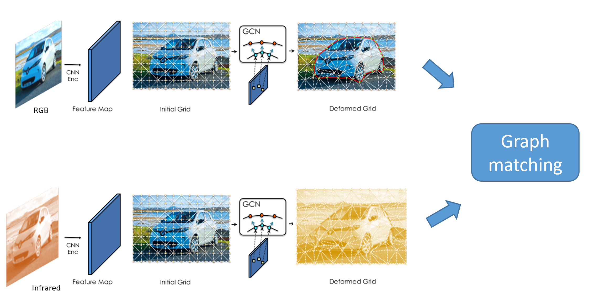

# 超像素图节点的图匹配工作

针对超像素的图匹配，在跨模态结构中，不同模态的图像特征的分布截然不同，可见光的有效边缘来自物体的物理边界，红外图像的边界来自热量变化明显的区域，以往的方法在于使用各种边缘检测算法提取共同的边缘，并在相同边缘的基础上进行特征表示。

跨模态匹配的两个主要难点：

- 同名点难以检测，不同模态像素梯度不相同，难以根据基于梯度的检测算法获得一致的同名点。
- 边缘不稳定，由于梯度不相似，物体的轮廓特征不相似。

针对第一点问题：在可见光和红外图像匹配的时候，会出现红外图像由于梯度较小，检测出的特征点远少于可见光图像。因此需要平衡两个图像之间的特征点数量。

针对第二点问题：在边缘不明显的情况下，如何不用梯度而直接预测目标的边缘？目前没有很好的算法能够锐化红外目标边缘的同时让边缘向可见光图像边缘拟合。

使用可变型网格[^1]可以保证能让特征点的数量一致，同时更加关注物体本身的几何机构特征而不是梯度，并且可以直接提取出节点和边，使用节点和边用于后续的图匹配可以实现端到端的跨模态匹配。

[^1]: Gao J, Wang Z, Xuan J, et al. Beyond fixed grid: Learning geometric image representation with a deformable grid[C]//European Conference on Computer Vision. Springer, Cham, 2020: 108-125.https://arxiv.org/pdf/2008.09269.pdf

