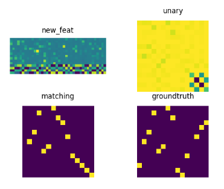
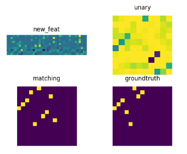
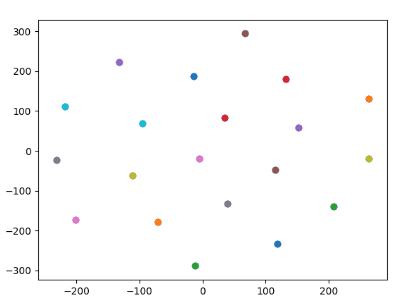
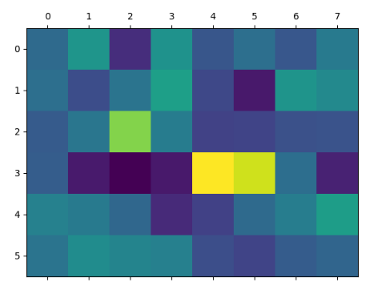

# 重新做用query匹配outlier的实验

之前做超图query的实验基本上宣告失败了， 网络更加倾向于学习伪造的outlier的匹配，导致实际的匹配点无法找到正确的匹配。出现过拟合现象。

## 重新利用query做outlier的匹配候选点

改用hungrain作为solver之后，all训练intersection测试，精度到达40%

增加query到6的时候，精度下降，到34%左右

oversmooth问题还是没有解决，在训练集上没有那么明显，但是在测试集上过平滑很明显。应该是测试集实际上没有真正的outlier所以就会过度平滑。

但是在all上测试的精度也不高，只有20左右。

将lr改为0.0001，intersection/u精度只有20

主要想法是新开赛道：主要在于几个方面：

1. 自监督或者无监督
2. 专门针对outlier
3. 生成图结构
4. 用深度学习做求解器

# EM的outlier识别器

设计网络鉴别outlier，然后对oulier去除后在做匹配

对于src的i个节点和tgt的n个节点，首先得到intra——graph的相似度ij和nm,再得到cross-graph的in个节点，计算了一个（i+n）x2的outlier分辨其是否为outlier并进行打分。

如何对outlier进行应用？

假设识别出outlier后，应该在对应，点，或者将outlier去掉。

如果是直接去掉，那么梯度无法反传，而且计算结果很难预测，

选取生成outlier匹配的点

直接使用scot做匹配计算结果，最后loss是matchingloss和outlierloss

用linear做一个错误点分类器，将其作为匹配矩阵的$\mu$

matching loss是交叉熵，分类loss也是交叉熵

训练集使用的是all， 有监督训练， 测试集先使用intersection做，然后再做all。

主要流程，通过相似度affinity关系，让网络识别出outlier，主要流程在pca的crossgraphconv中有实现：
$$
s  = F_1F_2^T , F_i \in R^{i \times d}\\
F_{emb1} = [F_1, sF_2] \in R^{i \times2d}\\
F_{emb2} = [F_2, s^TF_1] \in R^{i \times2d}
$$
在ot模型是用softmax做正负分类， 第一个为正样本，第二个为负样本的预测。

之前只用了一个值来作为正样本的可能，导致在计算交叉熵的时候总是报错，即使使用了relu的softmax后效果也不好，该方案会导致softmax后学到所有都是正样本的情况

# Over-smooth Problem

使用tansformer之后的oversmooth问题严重.

query生成之后直接使用L2归一化会导致很严重的平滑问题，而且query和原节点之间差异非常大，然后换成layernorm但是效果并不理想

还是会平滑。

- 计划使用relu强制一下，减少norm， 看看loss有没有问题

- 我觉得要对query的初始化做一些设定，比如选取可靠的target节点作为初始query。

静态特征和变量特征，静态特征+变量特征=每一个节点的特征，我认为每一张图有一个整体的特征：全局特征，将全局特征加上静态特征得到每一个节点的特征训练一个网络去选取节点。

- 在Loss上面做的改进：用对比Loss让query之间的距离增加，我感觉这个方案治标不治本。。

- 要做的实验：统计权重的特征值（参考王福东的pami）

使用了L1作为loss之后，可以在特征中明显看出他们是交叉的（呈格子状的），而且距离之间没有上限，导致特征之间往最远的地方无限拉开。

应该使用L2或者对比loss，用sqrt的时候出现nan了，展示放弃这个方案

使用exp(xTx)作为距离，在训练的时候效果不错，但是下面的query特征几乎没有变化，每一个样本都几乎一样的。测试的精度是32，这个loss的权重是有影响的，w=1的时候精度32，0.1的时候是14，此时会出现oversmooth

这一系列的实验说明直接用loss去约束距离是过于粗暴直接的，网络总是学到一个偷懒的方式，比如所有的query都长一样（oversmooth），或者是每一个样本学出来的query一样

应该要考虑使用选择的策略去选择outlier作为节点，如何判别一个节点是outlier？看他和其他节点的相似度，或者是求解方法（参考ZAC）

用迭代的方法求出outlier

feature visulization

两个图像之间的语义变换，特征变换，在给定的匹配关系中学习出变换：$F_i = T(F_j, M)$，同样的匹配关系也要学，凡是在确定变换之后，匹配关系可以直接通过相似度求得：$M(F_i,F_j)=max(d(F_i,F_j))$，同样的由$F_j = T(F_i,F_j, M^T)$

算法步骤：

首先初步预测匹配关系：$M= f(F_i,F_j)$

根据匹配关系计算特征变换：$F_i' = T(F_i,F_j,M)$

匹配Loss： $M->M_gt$

变换Loss： $F_i' -> F_j$

用RANSAC估算模型，首先需要有一个模型

假设1：大部分数据具有位置具有相似性

重新确定问题：在语义特征中匹配具有outlier的情况，目前图匹配算法无法识别outlier。

目标方程 
$$
\min f(X)=\min_X||A-XBX^T||^2_F - tr(X^TX)
$$
X是匹配矩阵，第一项是求令变换后的图边的权重最相似的匹配方案（二阶），第二项是令节点最相似的匹配方案（一阶）。

但是有可能有一些节点是outlier，那么如何识别outlier？

应该提出目标函数，变量Y是判定该节点是否为inlier，目标是符合上一个函数的最大值，因此上一个函数改写成

$$
\min f(X)=\min_X||A-D(X)BD(X)^T||^2_F - tr(X_u^TD(X))
$$

$$
\min g(Y) =
$$

- remove the **Softmax** to solve the over-smooth

(all of them)
