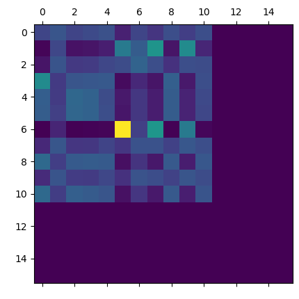
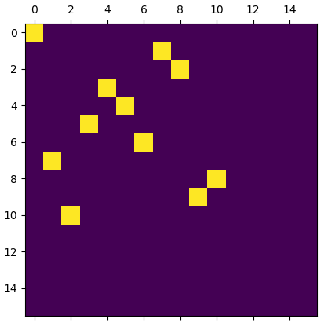
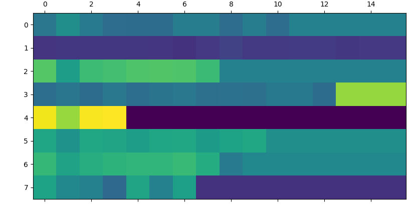
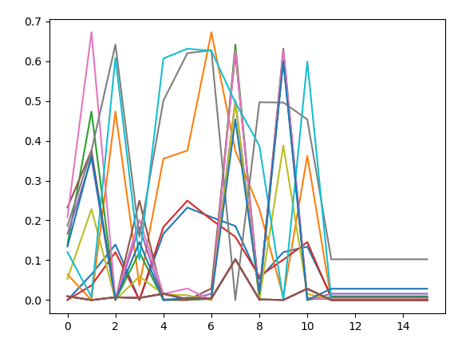
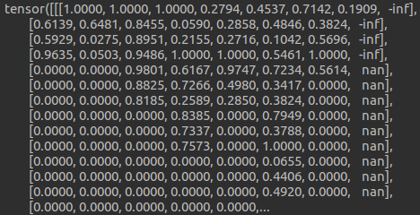
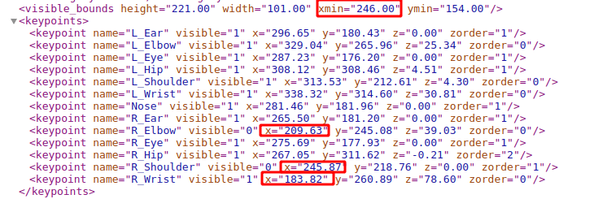
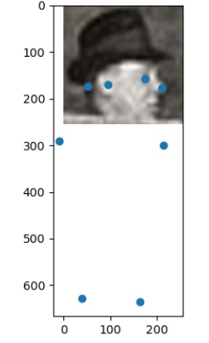
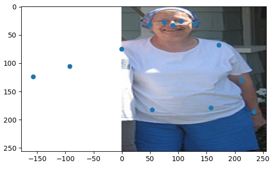
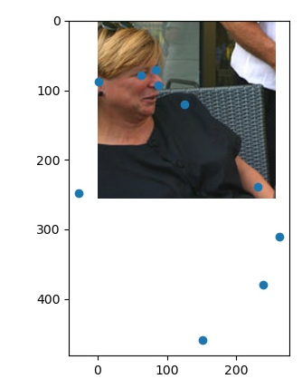

# 自监督图匹配

第一次网络输出的预测匹配矩阵P




损失的第一项的值, 纵轴(batch), 横轴(每一个点的距离值)



一开始,每一个图变换后的点距离各个点的误差值都很接近.

可视化结果:

源图的点分布

变换后的点分布

目标图的点分布


二阶误差项



二阶项的损失会导致梯度爆炸,无法继续训练

并不是梯度爆炸,而是使用了小于0的值开根号.

```
Function 'SqrtBackward' returned nan values in its 0th output.
```


修改了Loss的设计,并且对除以样本数得到平均loss.  但是梯度下降速度较慢. 很多不是保持线性下降的.

要把问题想清楚,这样训练的网络到底可不可以返传得到结果.


在训练了一定程度之后, 会有一列的结果出现-inf和nan




检查出结果原来是数据集标定的问题:

在样本的xml中,定义了每一个点的位置以及目标的boundbox边界

然而对图片进行resize时会将点减去最小的边界,这时候当标的点在bbox之外,坐标就会变为负数. 




效果如图下所示:





但是在网络中需要对关键的坐标插值提取特征, 为何之前的工作没有报错呢?

因为在网络插值中,对点进行了截取操作,超过边界的点会移到边界上.以下是截取操作的代码,这样保证了代码不会出错, 但是实际上这样会导致超出边界的点对应的特征是错误的特征. 

```python
x0 = torch.clamp(x0, 0, im.shape[2] - 1)
x1 = torch.clamp(x1, 0, im.shape[2] - 1)
y0 = torch.clamp(y0, 0, im.shape[1] - 1)
y1 = torch.clamp(y1, 0, im.shape[1] - 1)
```


为何我写的loss会出现这个问题, 因为我是使用了图(graph)的边二阶特征计算损失.

我的边特征定义为二维欧式空间的距离
$$
\phi(v_i,v_j) = \sqrt{(v_i - v_j)^\top (v_i - v_j)}
$$
在代码中,当出现负数的时候,会使开根结果变为`nan`

所以要对预处理代码进行更改.

