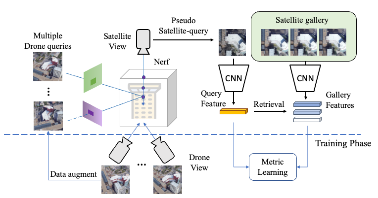

# 大视差图像匹配定位

## 任务背景

大视差图像匹配的难点：

1. 图像表观在视差较大的情况下，表观差异大导致query和reference之间难以直接用过特征进行相似度计算。

2. 对图像提取出全局语义特征难以表征地标建筑在视角上旋转、偏移等几何变化。

3. 无人机能够获取建筑的多个图像，但是目前没有方法能够较好地联合多个图像提升视觉定位精度。

   

## 技术路线
### Scene graph for multi-modal image retrieval

**任务背景：**目前的图像检索方法通过提取图像的global vector并计算相似度进行检索，global vector数据压缩程度高，但丢失了真实空间的几何关系。 目前全局特征之间的相似度通过向量内积计算得到，速度较快，但是不适用于图的相似度计算。

**相关工作：**

1）目前有较多通过deep image-based 的方法构建scene graph：
	[NeuralMotifs][rowan2018neural][1]基于目标检测对日常场景生成Scene Graph。通过预训练的目标检测框架在图像中检测语义目标并构建节点，同时建立节点之间的互动关系。
	[Deng][deng2022hierarchical]等人[2]针对scene graph上目标之间复杂细粒度的问题，设计了coarse-to-fine的层级式生成方式。

2）在将scene graph应用到retrieval上的工作：
	[Schroeder][schroeder2020structured]等人[3]提出对text query建模成graph，再使用GNN将graph映射到embedding space。通过与image特征计算triplet metric训练检索网络。
	[Wang][wang2020cross]等人[4]使用预训练生成网络将image和text建模成visual scene graph，并将graph的节点区分为object node和relationship node， 在匹配阶段计算两个graph的两种节点相似度矩阵，并将行最大值的平均数作为两个图之间的相似度。最终实现两个scene graph的相似度计算。该方法提出了一种快速计算图结构之间相似度的方法，可以适用于scene graph的检索框架。
	[Manh][manh2021]等人[5]认为除了匹配graph-level中局部的node和edge的相似度，还要考虑全局的vector-level之间的相似度，因此使用GNN将scene graph嵌入到global vector中，并计算vector之间的内积作为全局相似度。
	[Yoon][yoon2021image2image]等人[6]提出利用scene graph进行image-to-image检索。他们认为在包含复杂场景图像的检索中，复杂场景提取的全局特征难以表征其包含的复杂内容，因此通过对图像中的目标、目标的属性和目标之间的关系构建scene graph。并提出人为标注的场景图检索数据集。在检索框架中，首先使用目标检测方法提取目标作为节点并计算类别先验频率作为节点之间的关系构建scene graph，使用GNN将其生成全局graph vector。其次对图像生成text captions，并将其输入到深度网络得到text vector。通过对graph vector和text vector联合计算相似度，实现对scene graph的检索。

以上构造scene grpah的方法都是基于光学常用场景目标检测框架构造graph，因此难以迁移到跨模态任务。同时在遥感图像中，语义目标之间的关系比常用场景更加简单，因此可以考虑构建基于几何位置的连接边关系。

### Nerf  for retrieval

**问题背景：**

针对cross-view image retrieval任务，drone query 和 staellite reference之间存在较大的视角误差，从而导致检索存在挑战。目前已有的方法主要使用深度学习对单张斜视图像进行特征学习，考虑到无人机能够灵活地对建筑拍摄多张斜视图像，如何联合多张斜视图像提高定位精度是值得研究的方向。如果仅用单张斜视图像进行定位，会因为图像视角的随机变化导致提取的全局特征表达的不稳定（做实验可视化同一建筑在不同视角上的全局特征变化差异）。如何联合多张斜视视图构建稳定的特征并进行匹配是一个值得研究的问题。由于需要联合多张视图进行学习，数据量的需求比单张图像更多，而目前已有的数据库是为单张图像定位而设计的，其数据量难以满足多视图定位的需求，因此如何对已有的数据进行合理的数据扩增是提升检测进的的重要手段。

**技术路线：**

考虑到Nerf在新视角生成上的优势，我们使用Nerf对cross-view进行学习，对多张斜视图像生成正射新视图，以实现对卫星正射图的检索定位。同时利用任意位置新视图作为数据增广训练定位网络提升泛化性。整体框图如下所示：

**创新点：**

针对单张斜视图像存在全局特征不稳定并且和正视卫星图存在视差的情况，利用Nerf联合多张斜视图像生成稳定的正视新视角用于视觉定位。

针对目前单张匹配定位数据集难以满足多视图定位的需求，利用Nerf生成的任意位置新视角作为数据增广添加入训练集。

**相关工作：**

由于在生成用于定位的新视图过程中，无人机的位姿在长距离拍摄下是存在噪声的，而nerf需要精确的位姿作为输入，因此需要考虑在无位姿的情况下生成新视图。首先调研是否有相关结合多个无人机query去查询定位的方法。其次调研能够联合多个query图像的已有方案。

1）联合多query的查询方法：
	[MPC][andrei2022probabilistic][7]针对multi- query的情况，首先对image或者text进行embedding生成probabilistic embeddings，通过**Probabilistic composer**对生成的query embedding进行连个求解出联合特征。这里的multi-query是指存在较大差异的样本属性（猫+狗+球），对于相近的属性一般不用联合求解提升精度。
	[Xu][xu2020multimodal]等人[8]使用transdformer将多个query的信息进行相互传递，利用网络学习出联合的特征表示。应用于compositional retrieval。、

2）组合多个元素的新场景视图生成方法（Compositional Learning）：
	[Compositional GAN][samaneh2019compositional][9]使用对抗生成的方法对多个目标元素（如瓶子、桌子等）生成包含这些元素的新视图。
	[GIRAFFE][niemeyer2021giraffe][10]使用Nerf对多个图片元素生成包含这些元素的3D新视图。

3）使用nerf的新角度视图生成方法：
	[Moreau][moreau2022lens][11]等人使用Nerf对单个大型建筑场景生成新视图作为数据增广，使用生成数据提升训练数据集规模来提升深度定位SLAM的性能。该工作需要对整个gallery建筑场景进行三维表示，难以在城市规模下实现。
	[Nerf--][wang2021nerf--][12]将未知的相机位置和内参作为可学习参数，在仅输入图像的条件下，联合优化相机参数和三维场景表示。
	[Gnerf][meng2021gnerf] [13]针对Nerf--只能生成正面视图的限制，使用对抗生成的方式，在随机位置输入中生成任意位置的新视图。

4）适用于multi-query cross-view retrieval的数据集：
	[University-1652][zheng2020university1652][14]拍摄了72个学校建筑物，每个建筑包含多个无人机图像和一张卫星图，可以使用多个无人机图像生成正射图与卫星图进行检索匹配。

### Prompt tuning for insufficient data

多模态传感器的数据比传统光学数据规模小，目前没有类似google map类似的成熟数据平台。而且SAR和红外等传感器数据标定难度更高，导致数据量不足。导致依靠数据量的深度学习方法难以迁移到跨模态任务。 

[Zhu][zhu2023prompt][15]等人首先针对大参数模型在跨模态跟踪任务中训练成本大和难以迁移的挑战，提出了Prompt模块，将其他modal数据迁移并融合到RGB token中，再通过已经学习好的Transformer大模型进行跟踪预测。

## Reference
[zhu2023prompt]: 	https://arxiv.org/pdf/2303.10826	"Zhu, Jiawen, et al. "Visual Prompt Multi-Modal Tracking." arXiv preprint arXiv:2303.10826 (2023)."
[rowan2018neural]: https://arxiv.org/pdf/1711.06640.pdf	"Zellers, Rowan, et al. "Neural motifs: Scene graph parsing with global context." Proceedings of the IEEE conference on computer vision and pattern recognition. 2018."
[schroeder2020structured]: http://openaccess.thecvf.com/content_CVPRW_2020/papers/w8/Schroeder_Structured_Query-Based_Image_Retrieval_Using_Scene_Graphs_CVPRW_2020_paper.pdf	"Schroeder, Brigit, and Subarna Tripathi. “Structured query-based image retrieval using scene graphs.” Proceedings of the IEEE/CVF Conference on Computer Vision and Pattern Recognition Workshops. 2020."
[wang2020cross]: http://openaccess.thecvf.com/content_WACV_2020/papers/Wang_Cross-modal_Scene_Graph_Matching_for_Relationship-aware_Image-Text_Retrieval_WACV_2020_paper.pdf	"Wang, Sijin, et al. "Cross-modal scene graph matching for relationship-aware image-text retrieval." Proceedings of the IEEE/CVF winter conference on applications of computer vision. 2020."
[manh2021]: https://ebooks.iospress.nl/doi/10.3233/FAIA210049	"Nguyen, Manh-Duy, Binh T. Nguyen, and Cathal Gurrin. "A Deep Local and Global Scene-Graph Matching for Image-Text Retrieval." New Trends in Intelligent Software Methodologies, Tools and Techniques. IOS Press, 2021. 510-523."
[yoon2021image2image]: https://ojs.aaai.org/index.php/AAAI/article/view/17281/17088	"Yoon, Sangwoong, et al. "Image-to-image retrieval by learning similarity between scene graphs." Proceedings of the AAAI Conference on Artificial Intelligence. Vol. 35. No. 12. 2021."
[moreau2022lens]: https://proceedings.mlr.press/v164/moreau22a/moreau22a.pdf	"Moreau, Arthur, et al. "LENS: Localization enhanced by NeRF synthesis." Conference on Robot Learning. PMLR, 2022."
[deng2022hierarchical]: https://arxiv.org/pdf/2203.06907	"Deng, Youming, et al. "Hierarchical Memory Learning for Fine-Grained Scene Graph Generation." Computer Vision–ECCV 2022: 17th European Conference, Tel Aviv, Israel, October 23–27, 2022, Proceedings, Part XXVII. Cham: Springer Nature Switzerland, 2022."
[meng2021gnerf]: https://github.com/quan-meng/gnerf	" Q. Meng et al., “GNeRF: GAN-based Neural Radiance Field without Posed Camera,” in 2021 IEEE/CVF International Conference on Computer Vision (ICCV), Montreal, QC, Canada: IEEE, Oct. 2021, pp. 6331–6341. doi: 10.1109/ICCV48922.2021.00629."
[andrei2022probabilistic]: https://openaccess.thecvf.com/content/CVPR2022W/MULA/papers/Neculai_Probabilistic_Compositional_Embeddings_for_Multimodal_Image_Retrieval_CVPRW_2022_paper.pdf	"Neculai, Andrei, Yanbei Chen, and Zeynep Akata. "Probabilistic Compositional Embeddings for Multimodal Image Retrieval." Proceedings of the IEEE/CVF Conference on Computer Vision and Pattern Recognition. 2022."
[samaneh2019compositional]: https://arxiv.org/abs/1807.07560	"Azadi, Samaneh, et al. "Compositional gan: Learning image-conditional binary composition." International Journal of Computer Vision 128 (2020): 2570-2585."
[niemeyer2021giraffe]: https://m-niemeyer.github.io/project-pages/giraffe/index.html	"Niemeyer, Michael, and Andreas Geiger. "Giraffe: Representing scenes as compositional generative neural feature fields." Proceedings of the IEEE/CVF Conference on Computer Vision and Pattern Recognition. 2021."
[xu2020multimodal]: https://ieeexplore.ieee.org/abstract/document/10012544	"Y. Xu, Y. Bin, J. Wei, Y. Yang, G. Wang and H. T. Shen, "Multi-Modal Transformer with Global-Local Alignment for Composed Query Image Retrieval," in IEEE Transactions on Multimedia, doi: 10.1109/TMM.2023.3235495."
[zheng2020university1652]: https://arxiv.org/pdf/2002.12186	"Zheng, Zhedong, Yunchao Wei, and Yi Yang. "University-1652: A multi-view multi-source benchmark for drone-based geo-localization." Proceedings of the 28th ACM international conference on Multimedia. 2020."
[wang2021nerf--]: https://arxiv.org/abs/2102.07064	"Wang, Zirui, et al. &quot;NeRF--: Neural radiance fields without known camera parameters.&quot; arXiv preprint arXiv:2102.07064 (2021)."

[1] Zellers, Rowan, et al. "Neural motifs: Scene graph parsing with global context." Proceedings of the IEEE conference on computer vision and pattern recognition. 2018.

[2] Deng, Youming, et al. "Hierarchical Memory Learning for Fine-Grained Scene Graph Generation." Computer Vision–ECCV 2022: 17th European Conference, Tel Aviv, Israel, October 23–27, 2022, Proceedings, Part XXVII. Cham: Springer Nature Switzerland, 2022

[3] Schroeder, Brigit, and Subarna Tripathi. “Structured query-based image retrieval using scene graphs.” Proceedings of the IEEE/CVF Conference on Computer Vision and Pattern Recognition Workshops. 2020.

[4] Wang, Sijin, et al. "Cross-modal scene graph matching for relationship-aware image-text retrieval." Proceedings of the IEEE/CVF winter conference on applications of computer vision. 2020.

[5] Nguyen, Manh-Duy, Binh T. Nguyen, and Cathal Gurrin. "A Deep Local and Global Scene-Graph Matching for Image-Text Retrieval." New Trends in Intelligent Software Methodologies, Tools and Techniques. IOS Press, 2021. 510-523.

[6] Yoon, Sangwoong, et al. "Image-to-image retrieval by learning similarity between scene graphs." Proceedings of the AAAI Conference on Artificial Intelligence. Vol. 35. No. 12. 2021

[7] Neculai, Andrei, Yanbei Chen, and Zeynep Akata. "Probabilistic Compositional Embeddings for Multimodal Image Retrieval." Proceedings of the IEEE/CVF Conference on Computer Vision and Pattern Recognition. 2022.

[8] Y. Xu, Y. Bin, J. Wei, Y. Yang, G. Wang and H. T. Shen, "Multi-Modal Transformer with Global-Local Alignment for Composed Query Image Retrieval," in IEEE Transactions on Multimedia, doi: 10.1109/TMM.2023.3235495.

[9] Azadi, Samaneh, et al. "Compositional gan: Learning image-conditional binary composition." International Journal of Computer Vision 128 (2020): 2570-2585.

[10] Niemeyer, Michael, and Andreas Geiger. "Giraffe: Representing scenes as compositional generative neural feature fields." Proceedings of the IEEE/CVF Conference on Computer Vision and Pattern Recognition. 2021

[11] Moreau, Arthur, et al. "LENS: Localization enhanced by NeRF synthesis." Conference on Robot Learning. PMLR, 2022.

[12] Wang, Zirui, et al. &quot;NeRF--: Neural radiance fields without known camera parameters.&quot; arXiv preprint arXiv:2102.07064 (2021)

[13] Q. Meng et al., “GNeRF: GAN-based Neural Radiance Field without Posed Camera,” in 2021 IEEE/CVF International Conference on Computer Vision (ICCV), Montreal, QC, Canada: IEEE, Oct. 2021, pp. 6331–6341. doi: 10.1109/ICCV48922.2021.00629.

[14] Zheng, Zhedong, Yunchao Wei, and Yi Yang. "University-1652: A multi-view multi-source benchmark for drone-based geo-localization." Proceedings of the 28th ACM international conference on Multimedia. 2020.