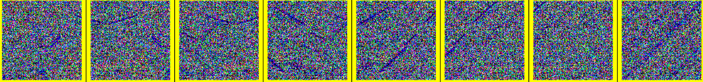

## 用扩散模型做生成训练

用网络做一个特征映射的任务，最终将不同模态的问题映射到相同的空间中，但是不同模态之间无法进行度量。

这时候我们是否可以假设SAR图像是对RGB图像之间的高斯加噪声的一个过程？

之前张岩的工作在增强样本环节对图像进行去噪，减少SAR和RGB之间的距离。此时我们可以用生成器对相同的随机过程进行不同的模态图像生成。这时使用两个网络对特征进行随机生成，最终目标就是生成相同目标的不同模态图像。

使用SAR加上噪声生成RGB图像，主要要挖掘出这个操作的难点，第一步尝试用SAR加上一定噪声得到完全零散的图像，然后用扩散模型生成RGB图像，最后比较生成的图像和对应原始图像之间的差距。

用已经训练好的模型跑一次，

再自己用SAR图像跑一次。

验证方法的优势，度量的距离关系

## 使用预训练的模型跑出来的结果比较差

- （已解决）SAR原图可视化也看不出东西，光学图像也比较混乱。是图像读取时出问题了，原因出在保存图片为tensor的时候就使用了归一化，导致SAR图像显示出现问题。

修改了图像数据集采样模式之后，得到的图像就比较正常。可以看出由于预训练的模型是用床做数据集的，因此生成的图像大部分是床的元素。导致SAR的变换只有其型没有实质内容。

说明了生成器非常依赖数据。第一要考量少样本生成图像的方法，第二是考量颜色差异造成的不同。第三点是SAR造成的噪声干扰。对SAR进行去噪可以一定程度减少模态之间的差异，但是由于SAR是通过量化对原始数据（4通道）进行转换得到的伪彩图像，因此在颜色和反射上表现的差异很大。

## 首先要确认问题到底是什么？

首先做的任务是SAR-RGB（异源图像）之间的匹配任务，目前表现就是精度较低。

首先要确定精度低的原因是什么？特征之间的相似程度？数据集之间的分布？类别之间（数据，比如水体的信息如何？）

确定所使用的指标是什么？

目前有的框架是样本增强的训练和对抗生成来减少模态之间的差异。

特征分布之间的差异，

图像表层之间的差异，

现有数据的信息：

完全对其的图像，每一张图像之间偏移（100像素）。

## 能否对已有方法的输出做可视化检测？

已有方法是前人的resnet，得到的特征在计算精度上效果较差，主要表现在精度较低。

## 验证方法指标的定义

除了检索精度 topk之外，还要考虑其他指标。

比如坐标的验证，计算匹配两张图片的MSE。（PSNR）

原有方法只

