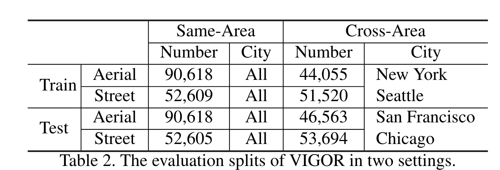
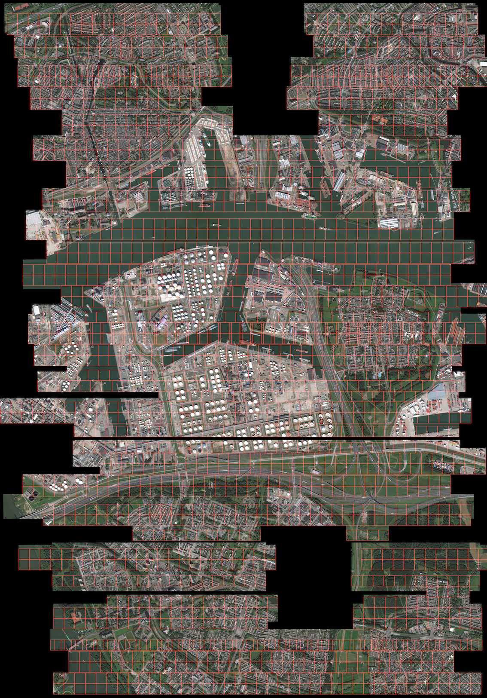

# 基于检索的多模态定位

## 调研背景

cross-view geo-localaization

## 数据集

**univeristy-1652** ：包含模拟地图生成的无人机图像、真实卫星图和真实地面图。

**CVUSA**：地面图像和卫星图片对，35.5k对用于训练，8.8k对用于测试. 所有地面图像都是全景图。

**SN6** ：包含完全对齐的SAR无人机图像和RGB卫星图，6k用于训练，2k用于测试。包含水体，建筑，绿植。

**VIGOR Dataset**：包含4个美国城市的图片，90.6k张密集划窗卫星图，23.8k地面全景图。

### related work
1. Each Part Matters: Local Patterns Facilitate Cross-view Geo-localization. https://arxiv.org/pdf/2008.11646v3.pdf

2. A Transformer-Based Feature Segmentation and Region Alignment Method For UAV-View Geo-Localization. https://arxiv.org/pdf/2201.09206v1.pdf

3. Joint Representation Learning and Keypoint Detection for Cross-view Geo-localization. https://zhunzhong.site/paper/RK_Net.pdf

   对在特征学习阶段通过bn提取每一个像素的权重，将提取到的点权重高的位置对应的特征加强，起到特征加强的作用。

4. Understanding Image Retrieval Re-Ranking: A Graph Neural Network Perspective.

   使用图网络在refine检索阶段特征，提升检索的精度。

5. https://www.sciencedirect.com/science/article/pii/S0924271621003221?via%3Dihub

   使用GIS提供建筑的footprint，结合SAR图像预测建筑的bbox，同时计算建筑的高度。通过回归的方式预测建筑在底图上的位置。

   

## 难点

- Changes in camera view point
- Lighting changes: Different modal
- Big data: World-scale localization
- hard to find fine localization
- End-to-end localization

- covered-reference image cost computation.

  ---

- 密集划场的Reference Image的庞大数据量增加了检索的难度。
- 模态的不一致导致提取相同特征的困难。
- 检索错误容易积累
- 无法利用多张图片的相关信息联合预测

solution：

需要构建稀疏的参考图像数据库，同时又能够得到较好的地理定位。

构造对抗学习和中间模态引导特征学习

构建基于reference image场景图的地点预测方法，在错误检索的情况能够估计精确定位。

构建基于query image场景图的联合预测方法，能够联合多个无人机图提升定位精度。

## solution

需要构建稀疏的参考图像数据库，同时又能够得到较好的地理定位。

构造对抗学习和中间模态引导特征学习

构建基于reference image场景图的地点预测方法，在错误检索的情况能够估计精确定位。

构建基于query image场景图的联合预测方法，能够联合多个无人机图提升定位精度。

具体操作：在对跨模态特征进行提取后，检索得到特征向量构成图的节点。

然后对图节点进行检索分类得到每一个节点之间的粗略位置。（做位置的回归），偏移的预测

参考场景图，将得到的特征作为图解点，构建场景图。

re-ranking

构建图节点，对初步检索的结果进行refine。

## 构建定位数据集

数据集之间不需要出现重叠

保存图像坐标，数据集crs位置，id，图像宽度

确定数据集的坐标是表示图像的中央位置。

图像之间的距离要考虑选取的度量方式：坐标点之间的几何距离，图像之间的iou。

构建的底图图像之间几乎没有重叠（目前存在少量bug，但不影响总体数据集分布情况）0