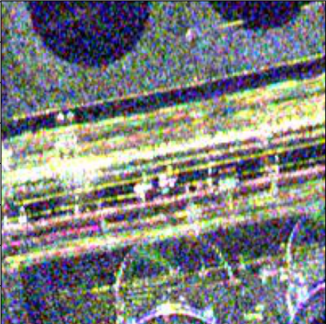

# 论文写作


## 主要贡献

辅助训练

跨模态 伪孪生网络

对抗学习


## 实验

精度（对比算法选择）

ablation 

filer-img retrieval exp


SSIM 图片之间计算像素差异


## 目前的问题

数据集有重复


如何把两个方法整合在一起

## 数据集

数据在Google和ByteDance上都有 路径是/home/zhangyan/ZyGradPro/data里面,

新修改到/data/zhangyan/SN6align200中，其中创建了软链接data到home目录下。


以后的数据集的路径都写成data下的路径，方便不同服务器之间同步。

```
args.data_path = Path.home() / args.data_path
```

图像数据转换都tensor之后，原本0-255的数值就变成浮点数了。

然后在图像处理的过程中，浮点数无法再转为PIL，然后使用guide filter。


有没有办法直接使用guide filter？


## 代码

这里面code是baseline的 然后code_Aux是辅助训练的 code_Adv是加对抗学习的


## 论文结构

#### intro

介绍跨模态检索的难点 光-SAR模态差异

难点： 颜色差异和细节纹理差异

#### related work


#### mtehod 对应论文章节

​	样本增强：通道替换、引导滤波

​	网络设计：伪孪生

​	训练策略：对抗学习

​	loss： 多向约束


## 写作部分

随机通道替换

20 RID 先提出

20 光-SAR 用 loss 没改  我们多了细节纹理，设计loss


伪孪生

20 RID 共享策略一样 

我们第一个用到光-SAR上面


对抗学习

第一 光SAR


## 关于样本分布的问题

在初始版本的时候，用伪模态图片辅助训练，而这些辅助训练目的是为了减少模态之间的差距，但是在测试阶段，没有用到伪模态。如果能够在测试阶段也能使用伪模态，是不是能更好地引导网络预测到对应的分类？在不改变网络的结构下，难以改变结果。加入了伪模态图片只能在训练阶段辅助，在测试阶段不一定能够提升精度（？）辅助模式相当于增加了一个人为先验，为网络在多模态下做检索提供了优化方向，我感觉越相似的“中间模态”，学出来的效果越好。要一种跟两个模态相交的特征。


## 论文流程

检索的核心特征之间的距离可以反映相似度。

 提取语义特征


图像之间之间距离不能表现特征之间的距离


对抗：让模态之间的差距消除

辅助：在理想状态下，只保留模态之间的特征


原图的光裁剪4000副

SAR的数量只有一半， 数据量可能不匹配，sar条带之间会有重复


在测试时候，label的


tsne的降维测试（test）


## TSNE效果分析

在特征之间的关系，可以看到不同模态特征之间的关系在分布上是区别很大的，几乎在Y轴的c两侧。因此要考虑将不同模态特征之间拉近，在同模态不同目标之间的距离拉远。


## 实验结果 SN6align200


| Method                                                      | top1      | Top5      | Top10     | Top20     | mAP       |
| ----------------------------------------------------------- | --------- | --------- | --------- | --------- | --------- |
| ResNet50 + tripletLoss                                      | 73.22     | 90.67     | 94.76     | 93.29     | 81.34     |
| ResNet50 + tripletLoss+ channelExchange                     | 89.39     | 96.63     | 98.13     | 98.93     | **92.70** |
| ResNet50 + tripletLoss+ Adv                                 | 80.42     | 93.29     | 96.31     | 98.31     | 86.15     |
| ResNet50 + tripletLoss+ Adv + channelExchange               | **89.43** | **96.63** | **98.45** | **99.02** | 92.66     |
| ResNet50 + tripletLoss+ Adv + channelExchange + GuideFilter | ...       |           |           |           |           |
| ResNet50 + tripletLoss+ Adv + channelExchange - normalize   | 0.04      | 0.22      | 0，44     | 0.89      | 0.36      |

这个精度再也恢复不了了。。为什么这个精度会这么高？

主要的提升点是辅助训练和对抗学习


sharelayer


specify number in adv-aux

| specify number | mAP   | Top1  |
| -------------- | ----- | ----- |
| 0              | 92.82 | 89.79 |
| 3              | 92.66 |       |
| 5              | 85.61 | 80.06 |

实验结果来看，共享权重效果更好。


## 使用生成器对训练集进行扩展

训练一个生成器用于网络的映射学习，提升网络对模态的鲁棒性


## 以往工作的优化目标（loss）

使用三元组，将特征之间的距离拉近，将目标之间的距离拉远。


## guide filter

经过guide filter的图像处理后的RGB图像，可以看到有一些地方不是完全对齐的，使用guideFilter之后n图下个变得模糊了，





## 训练结果


所有实验的数据集都是经过normalize后作为输入。没有归一化的效果都是非常差的。

base

FC: top-1: 62.66% | top-5: 85.61% | top-10: 91.25%| top-20: 95.83% | mAP:72.99%
POOL5: top-1: 56.57% | top-5: 82.77% | top-10: 88.99%| top-20: 93.92% | mAP:67.96%


 channel exchange

FC: top-1: 69.18% | top-5: 86.63% | top-10: 91.07%| top-20: 94.32% | mAP:77.02%
POOL5: top-1: 58.88% | top-5: 80.55% | top-10: 87.26%| top-20: 92.18% | mAP:68.65%


guide filter + channel exchange

FC: top-1: 68.52% | top-5: 84.99% | top-10: 89.12%| top-20: 92.63% | mAP:76.10%
POOL5: top-1: 55.11% | top-5: 77.44% | top-10: 84.55%| top-20: 89.34% | mAP:65.23%


guide filter + channel exchange + adversarial

FC: top-1: 57.37% | top-5: 79.62% | top-10: 85.83%| top-20: 90.10% | mAP:67.45%
POOL5: top-1: 44.89% | top-5: 71.45% | top-10: 79.71%| top-20: 85.97% | mAP:56.85%


**base (batch24)**

FC: top-1: 62.66% | top-5: 85.61% | top-10: 91.25%| top-20: 95.83% | mAP:72.99%
POOL5: top-1: 56.57% | top-5: 82.77% | top-10: 88.99%| top-20: 93.92% | mAP:67.96%


**channel exchange (batch 24)**

FC: top-1: 80.60% | top-5: 92.41% | top-10: 95.78%| top-20: 97.56% | **mAP:82.74**%
POOL5: top-1: 73.36% | top-5: 89.79% | top-10: 93.69%| top-20: 96.31% | mAP:80.75%


**channel exchange + guide filter(batch 24)**

FC: top-1: 74.60% | top-5: 90.41% | top-10: 93.52%| top-20: 96.94% | mAP:81.62%

POOL5: top-1: 67.90% | top-5: 87.03% | top-10: 92.10%| top-20: 95.56% | mAP:76.59%


**channel exchange + adv (batch 24)**

FC: top-1: 77.75% | top-5: 91.83% | top-10: 95.16%| top-20: 96.71% | mAP<u>:84.00%</u>

POOL5: top-1: 67.54% | top-5: 87.43% | top-10: 92.10%| top-20: 95.52% | mAP:76.42%


## TSNE 可视化

使用aux-adv的网络，对图像进行嵌入表示得到的特征，两个域的特征已经很相似了。1. TSNE, 2. 匹配对MSE统计和内积统计。

 

可视化分析：

在对匹配对进行i距离统计和降维后，可以看到特征之间的分布是嵌入到非线性流型中的，


## 将检索任务看成匹配任务

我们假设query的数量远小于gallery的数量，那么他就类似将源域的点匹配到目标域的点上。但是不一样的是，query是单独输入的，无法在query集合中找到有关匹配几何空间的信息。

但是我们可以构建单个样本上的几何变换，同时构建gallery上的集合空间拓扑结构。通过类似于scre-matching的方式，将用于视觉几何定位的离散检索任务转变成连续的空间定位任务，实现任务的高准确率。


这时候我们要构建一个数据集，除了视觉图片之外，还需要构建图片的信息：包括坐标，转角，水体，建筑比例等。


## 加入多个模态之间的loss

精度有所下降。

## guide Filter的问题

用guide filter会导致图像边缘变差，类似于做了高斯模糊。会让sar的特征丧失。要选择好一点的滤波器作为数据增强，或者使用diffusion作为数据增强。

主要表现是增加生成图像和目标图像之间的相似性。


## 可视化数据增强的特征嵌入

要验证数据增强能够减少两个模态之间的差距。

期望的效果是经过数据增强的样本的特征分布是介于两个模态之间。


