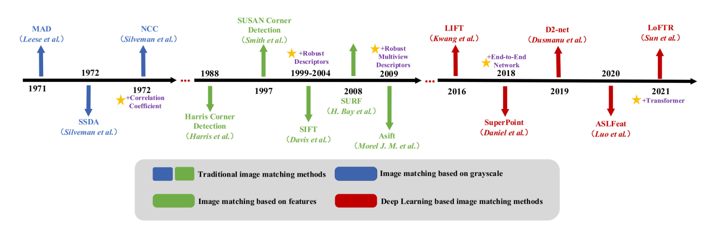

#  2022 面上基金项目

要把研究内容的重要性写出来，


（倒推分析：为啥要研究跨模匹配->寻找跨膜匹配重要的原因->匹配可将同一对象在不同视角上的信息进行像素上的对齐（为什么要对齐）->让同一像素位置具有不同模态的信息（整合信息）->不同模态的信息难以整合（目前世界研究的重点））。

## 主要修改的内容

三个方法的综述要改，“难，巧， 好” 主要要查近期的文章

近期的文章还没有解决的重点问题

- 开头要说明研究的重要性
- 最后的总结是简洁描述+解释，要突出创新性。


## 大致思路

- 研究背景和意义
  1. 提出问题的难度 
  2. 研究的重要性
  3. 面临的三大挑战：模态差异大，分辨率差异大，视角差异大
  4. 相关工作：模态一致性的工作，克服分辨率（无人机和卫星的匹配），视角差异的构建方法（3页）

- 研究目标和研究内容
  1. 简单表述要达到的目标，以及解决的难题
  2. 


## 研究内容的修改

第二个度量学习我觉得没太大必要，（或者讲的面太小了）目前的认为是：如果可以设计到模态一致性的特征，就相当于把特征映射到相同的特征空间中，那在特征空间中就相对容易实现一致的度量。


原本加上度量学习的内容，主要是因为现在特征很难一致，而且度量也不同。所以就想在各个方向都做研究，互相弥补。但是这样会觉得内容就很散，没有一条清晰的主线，或者说很难直接讲一致特征和度量学习联系起来。

## 国内文献：传统方法


### 描述算法

- 杨雪梅，龚俊斌，王鹏，等. 基于改进SIFT的SAR 图像与可见光图像配准[J].航天控制,2010,28(6):13-17.- 

> 算法对SIFT主方向的检测进行了优化，使用了特征点邻域内边缘局部极大值点的梯度方向作为主方向。

- 岳春宇，江万寿. 几何约束和改进 SIFT 的 SAR 影像和光学影像自动配准方法[J].测绘学报,2012,41(4)：570-576.

> 提出一种基于几何约束和改进SIFT的SAR影像和光学影像自动配准方法。首先根据影像间的几何关系进行影像粗纠正,消除影像间旋转和分辨率差异;然后基于主方向改进的SIFT特征提取方法提取SIFT特征并利用其结构性信息引入结构相似性指数(SSIM)作为相似性测度获得初始匹配,经过视差空间和角度特征空间聚类优化得到稳定同名匹配;

- 宋智礼，张家齐，熊亮，等. 利用风格迁移和特征点的多模态图像配准算法[J]遥感信息,2021,36(1):1-6.

> 由于多模态遥感图像在光谱成份上存在巨大的差异,传统图像配准算法在该类图像的配准中正确率非常低。针对这一难题,提出了一种利用风格迁移和特征点的图像配准算法。首先,利用卷积神经网络对基准图像的风格特征以及待配准图像的内容特征进行抽取并重新组合,得到一幅与基准图像差异性较小的生成图像;其次,通过图像分割的方法分离出待配准图像中没有明显纹理信息的部分,清除生成图像中多余的纹理;最后,使用加速鲁棒性特征(speed up robust features,SURF)算法提取特征点,进行图像配准。实验结果表明,与传统图像配准算法相比,该方法有效提高了多模态遥感图像配准的正确率和鲁棒性。


- 石聪聪,杨学志,董张玉,王守峰. 一种改进SIFT的SAR与可见光图像配准算法[J].合肥工业大学学报(自然科学版),2021,44(02):182-187+252.

> 出了一种基于非下采样Shearlet变换（non-subsampled shearlet transform,NSST）与改进的尺度不变特征变换（scale invariant feature transform,SIFT）结合的配准算法。该算法采用NSST变换来提取图像低频信息作为后续检测特征点的原始图像,在保证特征点提取数量的同时提升算法运行速度;选用Harris算子和指数加权平均值（ratio of exponentially weighted averages,ROEWA）边缘检测算法相结合的方法提取SAR图像特征点,改进传统SIFT算法在SAR图像特征点提取时鲁棒性较差的问题;

- 于丰. 基于SIFT与互信息的SAR与可见光图像的配准研究[D]. 西安电子科技大学.

> 提出了一种基于ROEWA-SIFT的SAR与可见光图像的配准方法,该方法利用一种改进的指数加权均值比(ROEWA)算子计算图像的梯度幅值信息与方向信息,并以此确定图像特征点的主方向以及描述符,为了提高描述符的独特性,构建了一组256维的特征描述符。


秦杰. 高分辨率SAR图像与可见光图像配准方法研究 [D]. 南京理工大学, 2019.

### 匹配算法


- 李姣.基于归一化互相关匹配的图像配准技术研究 [D〕.兰州：西北师范大学,2018.

> 本文提出了将猫群算法(CSO)和NCC算法相结合,来确定用于计算NCC的搜索窗口的大小和方向.利用猫群算法每一次优化产生的新的最优比例(s)和旋转角(θ),对NCC算法的搜索窗口进行转换和重采样,最大化适应度函数值,最终找到搜索窗口的最佳尺寸和方向.


## 尺度差异的论文

Hao Tang, Zhiao Huang, et al. 2020. Towards scale-invariant graph-related problem solving by iterative homogeneous graph neural networks. In NeurIPS. 

用于处理场景图的scale 差异


Victor Garcia Satorras, Emiel Hoogeboom, and Max Welling. 2021. E (n) equivariant graph neural networks. In ICML.

处理更加复杂的*isometric transformations* 不变性


Zhang, Zhiyuan, et al. "Rotation invariant convolutions for 3d point clouds deep learning." *2019 International Conference on 3D Vision (3DV)*. IEEE, 2019.使用距离和角度等低级旋转不变几何特征来设计用于点云学习的卷积算子，实现旋转不变性。


Fang, Yuan, et al. "Direction-induced convolution for point cloud analysis." *Multimedia Systems* (2021): 1-12.

通过构建一个方向集作为点集空间方向信息的基础，对于每个相邻点，将其方向信息投影到构造的方向集中，以获得与方向相关的权重数组，然后将其特征转换为规范有序方向集空间。之后，可以利用常规的图像卷积对点云数据的无序邻域区域进行编码。


Xu, Chuan, et al. "Multiview Image Matching of Optical Satellite and UAV Based on a Joint Description Neural Network." *Remote Sensing* 14.4 (2022): 838.


## 分辨率差异

Mao, Shunan, Shiliang Zhang, and Ming Yang. "Resolution-invariant person re-identification." *Proceedings of the 28th International Joint Conference on Artificial Intelligence*. 2019.

本文通过端到端 CNN 学习联合训练前景焦点超分辨率 (FFSR) 模块和分辨率不变特征提取器 (RIFE) 来学习对分辨率方差具有鲁棒性的表示。FFSR 使用完全卷积的自动编码器来放大人的前景，其中跳过连接是通过前景焦点训练损失学习的。 RIFE 采用两个由双注意力块加权的特征提取流来分别学习低分辨率和高分辨率图像的特征。这两个互补的模块是联合训练的，从而产生了强大的分辨率不变表示。

Ryu, Kwonyoung, et al. "Scanline Resolution-Invariant Depth Completion Using a Single Image and Sparse LiDAR Point Cloud." *IEEE Robotics and Automation Letters* 6.4 (2021): 6961-6968.

通过定义了一致性损失来学习到不同分辨率的特征表示。我们定义了来自不同扫描线分辨率的 LiDAR 测量的预测之间的一致性损失。


Zhang, Ziyue, et al. "Resolution-Invariant Person Reid Based On Feature Transformation And Self-Weighted Attention." *2021 IEEE International Conference on Image Processing (ICIP)*. IEEE, 2021.

在本文中，我们提出了一种新颖的双流网络，该网络具有轻量级分辨率关联 ReID 特征转换 (RAFT) 模块和自加权注意力 (SWA) ReID 模块，用于评估不同分辨率下的特征。 RAFT 将低分辨率特征转换为相应的高分辨率特征。 SWA 评估这两个特征以获得人 ReID 的权重因子。


Lai, Shun-Cheung, and Kin-Man Lam. "Deep Siamese network for low-resolution face recognition." *2021 Asia-Pacific Signal and Information Processing Association Annual Summit and Conference (APSIPA ASC)*. IEEE, 2021.

首先，使用共享分类器对从 HR 和 LR 面部图像对中提取的深度特征进行分类，显式缩小 HR 和 LR 深度特征之间的域差距。其次，在深度 Siamese 网络之上，使用新的损失函数，即交叉分辨率三元组损失，将匹配对拉得更远，同时在学习的特征空间中推动非匹配对。


Chen, Siwen, Huaiyu Wu, and Yang Chen. "Multi-Domain Image Super-Resolution Generative Adversarial Network for Low-Resolution Person Re-Identification." *2021 40th Chinese Control Conference (CCC)*. IEEE, 2021.

为了解决现实世界中总是存在各种低分辨率和尺度不匹配的问题，提出了一种多域图像到图像转换网络，称为多域图像超分辨率生成对抗网络（MSRGAN）来学习各种低分辨率域与高分辨率域的映射关系。 MSRGAN 可以确保传输的图像具有与目标域相似的分辨率。它还能够在翻译过程中保留来自低分辨率域的图像的身份信息。


Zheng, Wei-Shi, et al. "Joint Bilateral-Resolution Identity Modeling for Cross-Resolution Person Re-Identification." *International Journal of Computer Vision* (2021): 1-21.

该方法同时执行 HR 特定身份特征学习与超分辨率、LR 特定身份特征学习和人员 re-id 优化。我们还介绍了一种自适应集成算法来处理不同的低分辨率。


Zhang, Jun, et al. "Local-enhanced Multi-resolution Representation Learning for Vehicle Re-identification." *ACM Multimedia Asia*. 2021. 1-6.

一种有效的策略相当于利用图像超分辨率来处理分辨率差距。然而，现有方法对全局图像进行超分辨率处理，而不是对每个图像进行局部表示，从而导致背景和光照变化产生的噪声信息更多。

提出了一种局部增强的多分辨率表示学习（LMRL），通过结合局部增强的超分辨率（LSR）模块和局部引导对比学习（LCL）模块的训练来解决这些问题


Zhang, Guoqing, et al. "Deep High-Resolution Representation Learning for Cross-Resolution Person Re-Identification." *IEEE Transactions on Image Processing* 30 (2021): 8913-8925.

恢复低分辨率图像的分辨率并充分利用特征图的不同通道信息。然后，我们通过设计一个新颖的表示头 HRNet-ReID 来改进 HRNet，以提取区分特征。此外，还开发了一个伪孪生框架来减少低分辨率图像和高分辨率图像之间的特征分布差异。

## 图像匹配相关内容




## 异源模态匹配

Zhuang, J.; Dai, M.; Chen, X.; Zheng, E. A Faster and More Effective Cross-View Matching Method of UAV and Satellite Images for UAV Geolocalization. *Remote Sens.* **2021**, *13*, 3979. https://doi.org/10.3390/rs13193979

前人侧重于从图像的局部提取粗特征，而忽略了不同视图之间的关系，以及尺度和移位的影响。为了解决模态之间的差异，提出了一种基于多尺度块注意模块(MSBA)的局部模式网络。MSBA 将图像切割成不同比例的若干部分，应用self-attention使得特征提取更加高效。通过多分支结构提取不同视图的特征，该结构旨在使不同分支相互学习，从而使视图之间的关系更加微妙。


## 大视差特征

端到端匹配网络方法


与手工方法相比，使用深度神经网络学习计算局部特征描述符已证明可以显着改善视点和光照变化的不变性[x]。大多数方法[x]使用基于卷积的孪生模型在两幅图像中推断的共同感兴趣区域。这类方法使用分别使用相机位姿监督、对比损失监督或自监督的方法训练模型。为了进一步提高性能，一些方法提出联合学习检测和描述两张图像中的关键点，而 Germain 等人【x】则提出仅在一张图像中检测并在另一张图像中密集匹配描述符。


端到端网络将特征提取、特征描述和匹配过程整合到一个可以直接训练的网络架构中，可以让模型学习到整个匹配过程全局的优化接。LIFT首先提出了整合了特征提取、方向估计和描述的端到端模型。DeTone设计了自监督的SuperPoints在不同仿射变换下学习到一致的特征表示，随后提出了基于注意力机制的SuperGlue匹配稀疏特征点。而D2Net针对大视差中匹配图像中共同特征点少的情况，提出了先描述后检测的方案，令相同特征点的数量增加。近期的Loftr同样脱离特征检测，构建稠密的特征张量，并使用transformer让特征学习到稳定的几何信息。然而这类方法构建稠密的特征描述导致计算复杂度和空间复杂度巨大，同时难以适应非线性的视角变化。


Germain, Hugo, Vincent Lepetit, and Guillaume Bourmaud. "Visual Correspondence Hallucination." *arXiv preprint arXiv:2106.09711* (2021).


###### 参考文献年限

8-5-4-10-15


# 第一次开会

## 评分人的反馈

国内外调研不够充分，（我认为是写得不好，比如说有很多新的工作是在网络的基础上做创新的insight，但是我们写上去就是这个工作用了网络解决这个问题）让别人容易误会。


数据集问题：之前的数据集是机载SAR和卫星sar的数据集，跟无人机光学和卫星sar的数据集不一样。


分辨率还是要写一下，作为一个主要问题来讨论。


要说一下，在实验描述中选择有适应的区域。


## 本子的第一次过版

可行性分析要添加具体内容

研究方案和郭理顺思路

研究目标和张博士弄好

修改latex版本


## Latex版本的问题

标题的样式不一样，小了一级


@ARTICLE{9115075,  author={Ye, Mang and Shen, Jianbing and Shao, Ling},  journal={IEEE Transactions on Information Forensics and Security},   title={Visible-Infrared Person Re-Identification via Homogeneous Augmented Tri-Modal Learning},   year={2021},  volume={16},  number={},  pages={728-739},  doi={10.1109/TIFS.2020.3001665}}

@inproceedings{ye2021channel,
  title={Channel Augmented Joint Learning for Visible-Infrared Recognition},
  author={Ye, Mang and Ruan, Weijian and Du, Bo and Shou, Mike Zheng},
  booktitle={Proceedings of the IEEE/CVF International Conference on Computer Vision},
  pages={13567--13576},
  year={2021}
}

```
@ARTICLE{9115075,  author={Ye, Mang and Shen, Jianbing and Shao, Ling},  journal={IEEE Transactions on Information Forensics and Security},   title={Visible-Infrared Person Re-Identification via Homogeneous Augmented Tri-Modal Learning},   year={2021},  volume={16},  number={},  pages={728-739},  doi={10.1109/TIFS.2020.3001665}}


@inproceedings{ye2021channel,
  title={Channel Augmented Joint Learning for Visible-Infrared Recognition},
  author={Ye, Mang and Ruan, Weijian and Du, Bo and Shou, Mike Zheng},
  booktitle={Proceedings of the IEEE/CVF International Conference on Computer Vision},
  pages={13567--13576},
  year={2021}
}


@article{ma2020multispectral,
  title={Multispectral remote sensing image matching via image transfer by regularized conditional generative adversarial networks and local feature},
  author={Ma, Tao and Ma, Jie and Yu, Kun and Zhang, Jun and Fu, Wenxing},
  journal={IEEE Geoscience and Remote Sensing Letters},
  volume={18},
  number={2},
  pages={351--355},
  year={2020},
  publisher={IEEE}
}


@article{li2021deep,
  title={A deep translation (GAN) based change detection network for optical and SAR remote sensing images},
  author={Li, Xinghua and Du, Zhengshun and Huang, Yanyuan and Tan, Zhenyu},
  journal={ISPRS Journal of Photogrammetry and Remote Sensing},
  volume={179},
  pages={14--34},
  year={2021},
  publisher={Elsevier}
}


@article{baier2021synthesizing,
  title={Synthesizing optical and SAR imagery from land cover maps and auxiliary raster data},
  author={Baier, Gerald and Deschemps, Antonin and Schmitt, Michael and Yokoya, Naoto},
  journal={IEEE Transactions on Geoscience and Remote Sensing},
  volume={60},
  pages={1--12},
  year={2021},
  publisher={IEEE}
}


@article{merkle2018exploring,
  title={Exploring the potential of conditional adversarial networks for optical and SAR image matching},
  author={Merkle, Nina and Auer, Stefan and M{\"u}ller, Rupert and Reinartz, Peter},
  journal={IEEE Journal of Selected Topics in Applied Earth Observations and Remote Sensing},
  volume={11},
  number={6},
  pages={1811--1820},
  year={2018},
  publisher={IEEE}
}


@inproceedings{li2020infrared,
  title={Infrared-visible cross-modal person re-identification with an x modality},
  author={Li, Diangang and Wei, Xing and Hong, Xiaopeng and Gong, Yihong},
  booktitle={Proceedings of the AAAI Conference on Artificial Intelligence},
  volume={34},
  number={04},
  pages={4610--4617},
  year={2020}
}


@inproceedings{wei2021syncretic,
  title={Syncretic Modality Collaborative Learning for Visible Infrared Person Re-Identification},
  author={Wei, Ziyu and Yang, Xi and Wang, Nannan and Gao, Xinbo},
  booktitle={Proceedings of the IEEE/CVF International Conference on Computer Vision},
  pages={225--234},
  year={2021}
}


@article{yu2019high,
  title={High-performance SAR image matching using improved SIFT framework based on rolling guidance filter and ROEWA-powered feature},
  author={Yu, Qiuze and Zhou, Shan and Jiang, Yuxuan and Wu, Peng and Xu, Yong},
  journal={IEEE Journal of Selected Topics in Applied Earth Observations and Remote Sensing},
  volume={12},
  number={3},
  pages={920--933},
  year={2019},
  publisher={IEEE}
}


@article{xiang2018sift,
  title={OS-SIFT: A robust SIFT-like algorithm for high-resolution optical-to-SAR image registration in suburban areas},
  author={Xiang, Yuming and Wang, Feng and You, Hongjian},
  journal={IEEE Transactions on Geoscience and Remote Sensing},
  volume={56},
  number={6},
  pages={3078--3090},
  year={2018},
  publisher={IEEE}
}


@article{hughes2018identifying,
  title={Identifying corresponding patches in SAR and optical images with a pseudo-siamese CNN},
  author={Hughes, Lloyd H and Schmitt, Michael and Mou, Lichao and Wang, Yuanyuan and Zhu, Xiao Xiang},
  journal={IEEE Geoscience and Remote Sensing Letters},
  volume={15},
  number={5},
  pages={784--788},
  year={2018},
  publisher={IEEE}
}


@article{zhang2019registration,
  title={Registration of multimodal remote sensing image based on deep fully convolutional neural network},
  author={Zhang, Han and Ni, Weiping and Yan, Weidong and Xiang, Deliang and Wu, Junzheng and Yang, Xiaoliang and Bian, Hui},
  journal={IEEE Journal of Selected Topics in Applied Earth Observations and Remote Sensing},
  volume={12},
  number={8},
  pages={3028--3042},
  year={2019},
  publisher={IEEE}
}


@article{chen2019change,
  title={Change detection in multisource VHR images via deep siamese convolutional multiple-layers recurrent neural network},
  author={Chen, Hongruixuan and Wu, Chen and Du, Bo and Zhang, Liangpei and Wang, Le},
  journal={IEEE Transactions on Geoscience and Remote Sensing},
  volume={58},
  number={4},
  pages={2848--2864},
  year={2019},
  publisher={IEEE}
}

@article{xu2020mental,
  title={Mental retrieval of remote sensing images via adversarial sketch-image feature learning},
  author={Xu, Fang and Yang, Wen and Jiang, Tianbi and Lin, Shijie and Luo, Hao and Xia, Gui-Song},
  journal={IEEE Transactions on Geoscience and Remote Sensing},
  volume={58},
  number={11},
  pages={7801--7814},
  year={2020},
  publisher={IEEE}
}


@article{lowe2004distinctive,
  title={Distinctive image features from scale-invariant keypoints},
  author={Lowe, David G},
  journal={International journal of computer vision},
  volume={60},
  number={2},
  pages={91--110},
  year={2004},
  publisher={Springer}
}


@article{morel2009asift,
  title={ASIFT: A new framework for fully affine invariant image comparison},
  author={Morel, Jean-Michel and Yu, Guoshen},
  journal={SIAM journal on imaging sciences},
  volume={2},
  number={2},
  pages={438--469},
  year={2009},
  publisher={SIAM}
}


@inproceedings{lin2017feature,
  title={Feature pyramid networks for object detection},
  author={Lin, Tsung-Yi and Doll{\'a}r, Piotr and Girshick, Ross and He, Kaiming and Hariharan, Bharath and Belongie, Serge},
  booktitle={Proceedings of the IEEE conference on computer vision and pattern recognition},
  pages={2117--2125},
  year={2017}
}

@article{mao2019resolution,
  title={Resolution-invariant person re-identification},
  author={Mao, Shunan and Zhang, Shiliang and Yang, Ming},
  journal={arXiv preprint arXiv:1906.09748},
  year={2019}
}

@article{ryu2021scanline,
  title={Scanline Resolution-Invariant Depth Completion Using a Single Image and Sparse LiDAR Point Cloud},
  author={Ryu, Kwonyoung and Lee, Kang-il and Cho, Jegyeong and Yoon, Kuk-Jin},
  journal={IEEE Robotics and Automation Letters},
  volume={6},
  number={4},
  pages={6961--6968},
  year={2021},
  publisher={IEEE}
}

@inproceedings{zhang2021resolution,
  title={Resolution-Invariant Person Reid Based On Feature Transformation And Self-Weighted Attention},
  author={Zhang, Ziyue and Jiang, Shuai and Huang, Congzhentao and Da Xu, Richard Yi},
  booktitle={2021 IEEE International Conference on Image Processing (ICIP)},
  pages={1134--1138},
  year={2021},
  organization={IEEE}
}

@inproceedings{lai2021deep,
  title={Deep Siamese network for low-resolution face recognition},
  author={Lai, Shun-Cheung and Lam, Kin-Man},
  booktitle={2021 Asia-Pacific Signal and Information Processing Association Annual Summit and Conference (APSIPA ASC)},
  pages={1444--1449},
  year={2021},
  organization={IEEE}
}

@inproceedings{chen2021multi,
  title={Multi-Domain Image Super-Resolution Generative Adversarial Network for Low-Resolution Person Re-Identification},
  author={Chen, Siwen and Wu, Huaiyu and Chen, Yang},
  booktitle={2021 40th Chinese Control Conference (CCC)},
  pages={8353--8359},
  year={2021},
  organization={IEEE}
}

@article{zheng2021joint,
  title={Joint Bilateral-Resolution Identity Modeling for Cross-Resolution Person Re-Identification},
  author={Zheng, Wei-Shi and Hong, Jincheng and Jiao, Jiening and Wu, Ancong and Zhu, Xiatian and Gong, Shaogang and Qin, Jiayin and Lai, Jianhuang},
  journal={International Journal of Computer Vision},
  pages={1--21},
  year={2021},
  publisher={Springer}
}

@incollection{zhang2021local,
  title={Local-enhanced Multi-resolution Representation Learning for Vehicle Re-identification},
  author={Zhang, Jun and Zhong, Xian and Yuan, Jingling and Zhao, Shilei and Zhang, Rongbo and Feng, Duxiu and Zhong, Luo},
  booktitle={ACM Multimedia Asia},
  pages={1--6},
  year={2021}
}


@article{zhang2021deep,
  title={Deep High-Resolution Representation Learning for Cross-Resolution Person Re-Identification},
  author={Zhang, Guoqing and Ge, Yu and Dong, Zhicheng and Wang, Hao and Zheng, Yuhui and Chen, Shengyong},
  journal={IEEE Transactions on Image Processing},
  volume={30},
  pages={8913--8925},
  year={2021},
  publisher={IEEE}
}


@inproceedings{zhang2019learning,
  title={Learning two-view correspondences and geometry using order-aware network},
  author={Zhang, Jiahui and Sun, Dawei and Luo, Zixin and Yao, Anbang and Zhou, Lei and Shen, Tianwei and Chen, Yurong and Quan, Long and Liao, Hongen},
  booktitle={Proceedings of the IEEE/CVF International Conference on Computer Vision},
  pages={5845--5854},
  year={2019}
}


@article{csurka2018handcrafted,
  title={From handcrafted to deep local invariant features},
  author={Csurka, Gabriela and Humenberger, Martin},
  journal={arXiv preprint arXiv:1807.10254},
  volume={2},
  pages={1},
  year={2018},
  publisher={Jul}
}


@article{gauglitz2011evaluation,
  title={Evaluation of interest point detectors and feature descriptors for visual tracking},
  author={Gauglitz, Steffen and H{\"o}llerer, Tobias and Turk, Matthew},
  journal={International journal of computer vision},
  volume={94},
  number={3},
  pages={335--360},
  year={2011},
  publisher={Springer}
}


@inproceedings{salahat2017recent,
  title={Recent advances in features extraction and description algorithms: A comprehensive survey},
  author={Salahat, Ehab and Qasaimeh, Murad},
  booktitle={2017 IEEE international conference on industrial technology (ICIT)},
  pages={1059--1063},
  year={2017},
  organization={IEEE}
}

@inproceedings{wang2020learning,
  title={Learning feature descriptors using camera pose supervision},
  author={Wang, Qianqian and Zhou, Xiaowei and Hariharan, Bharath and Snavely, Noah},
  booktitle={European Conference on Computer Vision},
  pages={757--774},
  year={2020},
  organization={Springer}
}

@inproceedings{zhou2021patch2pix,
  title={Patch2pix: Epipolar-guided pixel-level correspondences},
  author={Zhou, Qunjie and Sattler, Torsten and Leal-Taixe, Laura},
  booktitle={Proceedings of the IEEE/CVF conference on computer vision and pattern recognition},
  pages={4669--4678},
  year={2021}
}


@inproceedings{yang2021self,
  title={Self-supervised geometric perception},
  author={Yang, Heng and Dong, Wei and Carlone, Luca and Koltun, Vladlen},
  booktitle={Proceedings of the IEEE/CVF Conference on Computer Vision and Pattern Recognition},
  pages={14350--14361},
  year={2021}
}

@inproceedings{germain2020s2dnet,
  title={S2Dnet: learning image features for accurate sparse-to-dense matching},
  author={Germain, Hugo and Bourmaud, Guillaume and Lepetit, Vincent},
  booktitle={European Conference on Computer Vision},
  pages={626--643},
  year={2020},
  organization={Springer}
}

@inproceedings{sarlin2020superglue,
  title={Superglue: Learning feature matching with graph neural networks},
  author={Sarlin, Paul-Edouard and DeTone, Daniel and Malisiewicz, Tomasz and Rabinovich, Andrew},
  booktitle={Proceedings of the IEEE/CVF conference on computer vision and pattern recognition},
  pages={4938--4947},
  year={2020}
}

@inproceedings{sun2021loftr,
  title={LoFTR: Detector-free local feature matching with transformers},
  author={Sun, Jiaming and Shen, Zehong and Wang, Yuang and Bao, Hujun and Zhou, Xiaowei},
  booktitle={Proceedings of the IEEE/CVF conference on computer vision and pattern recognition},
  pages={8922--8931},
  year={2021}
}

@inproceedings{caron2021emerging,
  title={Emerging properties in self-supervised vision transformers},
  author={Caron, Mathilde and Touvron, Hugo and Misra, Ishan and J{\'e}gou, Herv{\'e} and Mairal, Julien and Bojanowski, Piotr and Joulin, Armand},
  booktitle={Proceedings of the IEEE/CVF International Conference on Computer Vision},
  pages={9650--9660},
  year={2021}
}


@article{cordonnier2019relationship,
  title={On the relationship between self-attention and convolutional layers},
  author={Cordonnier, Jean-Baptiste and Loukas, Andreas and Jaggi, Martin},
  journal={arXiv preprint arXiv:1911.03584},
  year={2019}
}

@inproceedings{zhao2020exploring,
  title={Exploring self-attention for image recognition},
  author={Zhao, Hengshuang and Jia, Jiaya and Koltun, Vladlen},
  booktitle={Proceedings of the IEEE/CVF Conference on Computer Vision and Pattern Recognition},
  pages={10076--10085},
  year={2020}
}

@inproceedings{detone2018superpoint,
  title={Superpoint: Self-supervised interest point detection and description},
  author={DeTone, Daniel and Malisiewicz, Tomasz and Rabinovich, Andrew},
  booktitle={Proceedings of the IEEE conference on computer vision and pattern recognition workshops},
  pages={224--236},
  year={2018}
}

@inproceedings{sun2020circle,
  title={Circle loss: A unified perspective of pair similarity optimization},
  author={Sun, Yifan and Cheng, Changmao and Zhang, Yuhan and Zhang, Chi and Zheng, Liang and Wang, Zhongdao and Wei, Yichen},
  booktitle={Proceedings of the IEEE/CVF Conference on Computer Vision and Pattern Recognition},
  pages={6398--6407},
  year={2020}
}

@article{mikolajczyk2004scale,
  title={Scale \& affine invariant interest point detectors},
  author={Mikolajczyk, Krystian and Schmid, Cordelia},
  journal={International journal of computer vision},
  volume={60},
  number={1},
  pages={63--86},
  year={2004},
  publisher={Springer}
}


@inproceedings{yi2016lift,
  title={Lift: Learned invariant feature transform},
  author={Yi, Kwang Moo and Trulls, Eduard and Lepetit, Vincent and Fua, Pascal},
  booktitle={European conference on computer vision},
  pages={467--483},
  year={2016},
  organization={Springer}
}


```


## 第二版修改

- [x] 国内外现状问题的难度，现有的解决法案。拟提出xx方案，最后要凝练一下前人的问题并提出自己的解决方案。

- [x] 参考文献要中文的。例如雷达 电子信息 中国科学

- [x] 研究内容,克服xxx困难，解决xxx问题。

- [x] 研究内容写两段，**简述方案**

- [x] 关键科学问题：不要冒号， 关键科学问题放个xxx问题， ；分辨率不变特征表示；大视差下的语义场景匹配

- [x] 示意图改为应用与验证
- [x] 画图场景图
- [x] 场景图：要说明用语义分割可以解决grid无法和分辨率节藕的问题。图匹配放在场景图里面

- [x] Nerf：流程图Nerf可以放在前面，在写方案时候Nerf那部分放最后面（最难）；Nerf加上Grf的内容

- [x] 目标定位再画一个图（可能就不画了）
- [x] 张岩：研究方法和方案的可行性：研究问题具有挑战性；先说用到了的理论方法，研究方案是可行的，表明不同模态上理论上的可行性；感觉研究方案和路线没有说，大概要加的内容：描述具体的操作流程图（方法和路线的可行性）；再说目标是可行的

- [x] 张岩：图放在研究基础里面
- [x] 创新点要把Nerf单独写，然后图匹配（3）的创新点放在场景图（2）里面
- [x] 杨文：要把预期工作流程部分加进来（2022-2023年的工作计划）


3-5之前把Latex版本上交


## 参考文献的总结


模态不变方法：只能消除颜色差异、引入干扰、没有保留相同的结构特征信息；容易丢失各自模态的信息

分辨率不变方法：改变分辨率的方法要么损失信息要么引入噪声、没有与分辨率解耦

大视差问题：稀疏匹配在大视差下特征点丢失严重，稠密特征计算量复杂。


所有的方法的总结：


## 第三版

- [x] 国内外现状修改标题

- [ ] 现有问题要对应上,第三点在大视差的问题
- [ ] 大视差主要是做直接匹配，我们要生成正射施视图，动机还要连接起来，加几句。
- [x] 引入神经场的动机，可以解决的问题
- [x] 参考文献 去年的文章要引用一下，更换旧的文章
- [x] 找自然基金本子的主要作者，把大佬的文章加进去，国科大西交大北航
- [x] 研究内容图里面删掉时相变化，应用验证（删掉与）

- [x] 科学问题:模态不变的图像特征表示，分辨率不变的异源图像特征表示和匹配，（大视差图像匹配问题要修改）（不要问题）
- [x] 科学关键问题写少了，说现有方案不足（内容x2）

- [x] 研究方案：先放图，再说文字
- [x] 每一个模态都要对应的图
- [ ] 研究方案的扩充到3页半
- [x] 无人机方案的底图要更换


## 第四版

- [ ] latex 和word版本

还要再加几个图在可行性分析里面

研究内容的图箭头方向

- [x] 科学问题里面还要再细节点，参考xuenan的


图要拉大一点的

- [ ] 把群里面的话加进去，”一方面“那一段

- [ ] nerf的优势，速度 迁移


3.1.4 选址不止武汉，在内蒙古上的的家。大文

GPS改为GNSS

第一次出现对英文


- [x] 特色与创新修改一下


- [x] 60删了，加入可解释性

- [x] 否改成无


## 最终版

改成 SAR卫星影像
